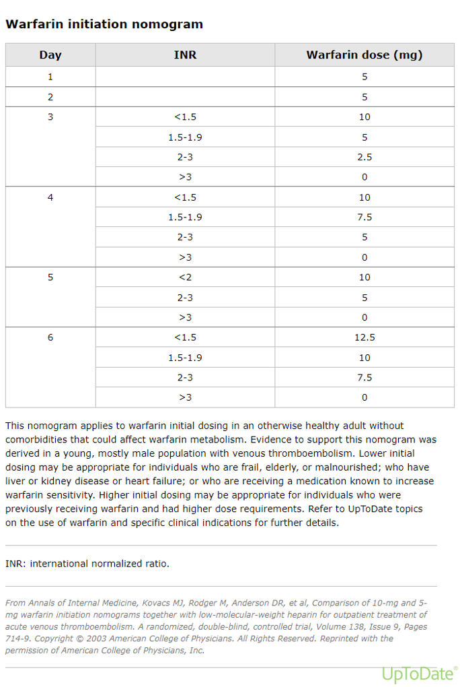
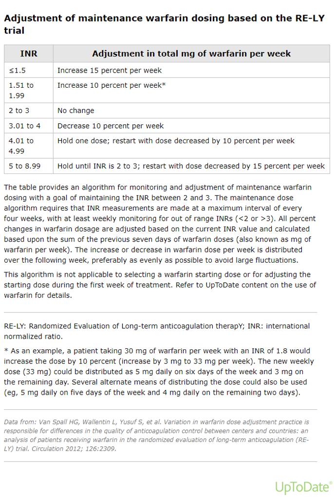
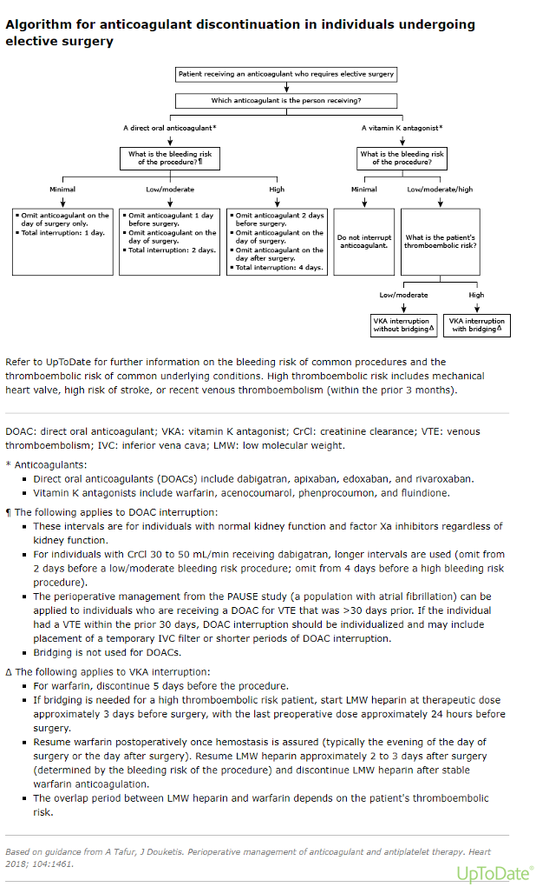
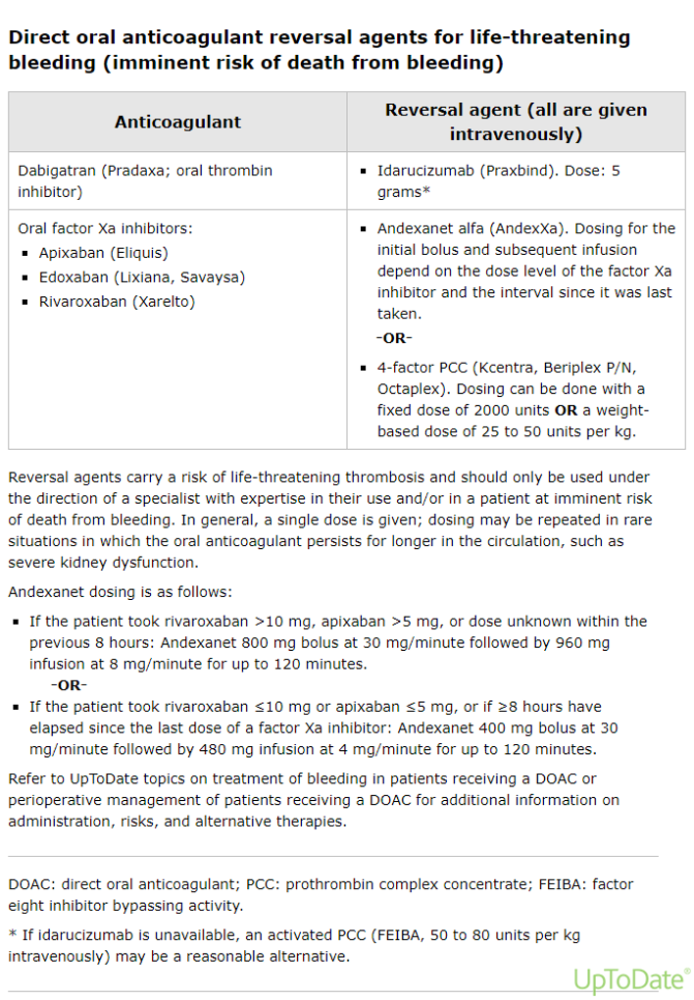
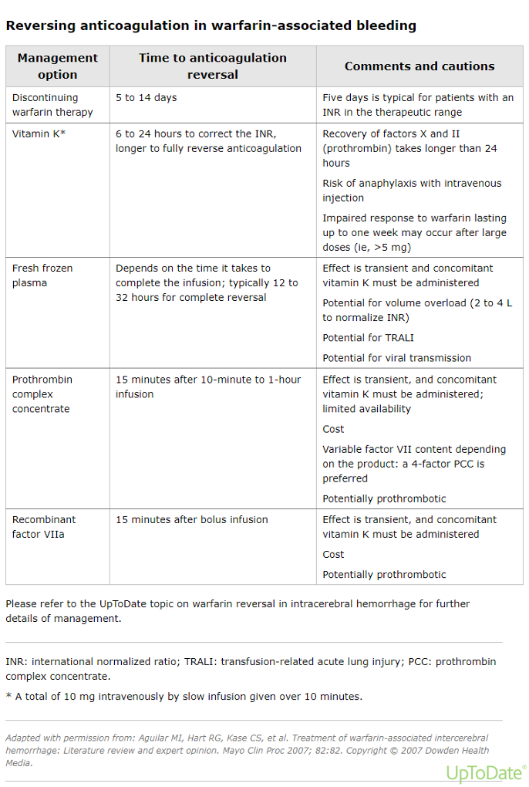
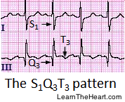
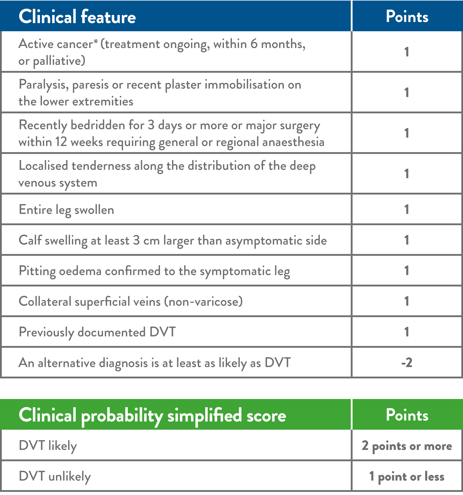
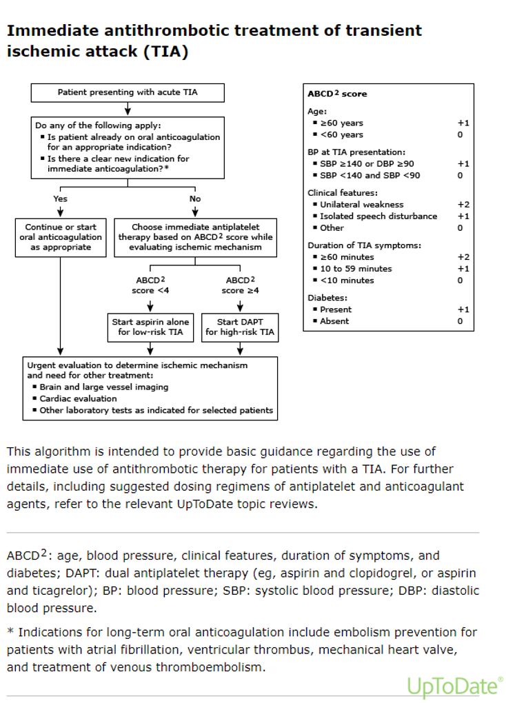

---
tags:
  - DOAC
  - hematology/warfarin
  - PE
  - TIA
  - hematology
  - VTE
  - drugs
  - DVT
---
==Anticoagulants work best in low-flow states with a high fibrin state, such as veins. Thats why you give anticoagulants (heparin, elliquis) after a DVT, PE to prevent clot propagation.==

==Anti-platelet work best in high-flow states, such as arteries. Here, only platelets can aggregate to endothelial damage. That's why you give antiplatelets (ASA) after a stent or suspected MI.==

Anticoagulants - think clots: DVT, PE.
Antiplatelets - think plaques: ACS, stents, etc.

Antiplatelet drugs are usually indicated in patients with atherosclerosis.
Anticoagulant drugs are mostly used in patients with atrial fibrillation, venous thromboembolism, or technical heart valves.

Monitoring anti coagulation effects

* warfarin - INR
* Heparin - PTT
	* MOA: antithrombin III activator
	* _antithrombotic effect of heparin is well correlated to the inhibition of factor Xa_

|     |     |
| --- | --- |
| **Anticoagulation Pathway** |     |
| ![[Neurosurgery/00_Neurosurgery_Mikolajewicz/content/Medicine/_resources/Anticoagulation.resources/Image 20230824 074754.jpeg]]![[Neurosurgery/00_Neurosurgery_Mikolajewicz/content/Medicine/_resources/Anticoagulation.resources/image.10.png]] | ![[Neurosurgery/00_Neurosurgery_Mikolajewicz/content/Medicine/_resources/Anticoagulation.resources/Image 20230824 075048.png]]![[Neurosurgery/00_Neurosurgery_Mikolajewicz/content/Medicine/_resources/Anticoagulation.resources/Image 20230824 075126.jpeg]] |

|                                                                                                                               |                                                                                                                                            |
| ----------------------------------------------------------------------------------------------------------------------------- | ------------------------------------------------------------------------------------------------------------------------------------------ |
| **Anticoagulation Pharmacology and Dosing**                                                                                   |                                                                                                                                            |
| ![[Neurosurgery/00_Neurosurgery_Mikolajewicz/content/Medicine/_resources/Anticoagulation.resources/Image 20230824 075348.png]]                                                         | ![[Neurosurgery/00_Neurosurgery_Mikolajewicz/content/Medicine/_resources/Anticoagulation.resources/Image 20230824 075502.png]]![[Neurosurgery/00_Neurosurgery_Mikolajewicz/content/Medicine/_resources/Anticoagulation.resources/Image 20230824 083444.png]] |
| ![[Neurosurgery/00_Neurosurgery_Mikolajewicz/content/Medicine/_resources/Anticoagulation.resources/image.1.png]]![[Neurosurgery/00_Neurosurgery_Mikolajewicz/content/Medicine/_resources/Anticoagulation.resources/Image 20231105 111902.jpeg]] | ![[Neurosurgery/00_Neurosurgery_Mikolajewicz/content/Medicine/_resources/Anticoagulation.resources/image.png]]                                                                                      |

<table width="841px" style="border-collapse:collapse;width:841px;"><colgroup><col style="width: 420px;"><col style="width: 421px;"></colgroup><tbody><tr><td style="border-color:#ccc;border-width:1px;border-style:solid;padding:10px;" colspan="2">
<a rev="en_rl_none" href="https://www-uptodate-com.myaccess.library.utoronto.ca/contents/warfarin-and-other-vkas-dosing-and-adverse-effects?search=warfarin+dose&amp;source=search_result&amp;selectedTitle=2%7E148&amp;usage_type=default&amp;display_rank=1">Warfarin Dosing</a>

Loading dose: warfarin 5 mg PO daily
</td></tr><tr><td style="border-color:#ccc;border-width:1px;border-style:solid;padding:10px;">
 
</td><td style="border-color:#ccc;border-width:1px;border-style:solid;padding:10px;">
 
</td></tr></tbody></table>

* * *

**[Anticoagulation and surgery](https://www-uptodate-com.myaccess.library.utoronto.ca/contents/perioperative-management-of-patients-receiving-anticoagulants?search=warfrain%20bridging&sectionRank=1&usage_type=default&anchor=H2126501&source=machineLearning&selectedTitle=1~150&display_rank=1#H31)**

* * *

AC discontinuation before elective surgery:

* warfarin:
	* Discontinue PrOD5
	* High VTE risk: bridge with LMWH PrOD3, and hold PrOD1
* DOAC:
	* Discontinue PrOD1
	* reduced renal function (CrCl 30-50): discontinue PrOD2-3 prior to procedure
	* no bridging required

AC reversal before urgent/emergency surgery
_always ask about AC and last dose in emergency setting_

* dabigatran: idarucizumab 5 g
* Xa inhibitors: andexanet alfa or PCC 2000 U (containing factors II, VII, IX, X)
	* apixaban, edoxaban, rivaroxaban
* warfarin
	* ==5-14 day reversal: discontinue warfarin==
	* ==6-24 h reversal: vitamin K==
	* ==12-32 h reversal: FFP (transfusion rate dependent)==
	* ==15 min: PCC (15-60 min infusion) or recombinant factor VIIIa (bolus infusion)==
		* transient effect
		* co-administer with vitamin K
		* C/i: HIT (heparin in PCC) - use FFP instead

AC restart after surgery:

* warfarin:
	* start LMWH POD2-3, and bridge to warfarin.
* others:
	* start POD2-3

POD: post-operative day, PrOD: pre-operative day

<table width="675px" style="border-collapse:collapse;width:675px;"><colgroup><col style="width: 246px;"><col style="width: 247px;"><col style="width: 182px;"></colgroup><tbody><tr><td style="border-color:#ccc;border-width:1px;border-style:solid;padding:10px;" colspan="3">
<b>Resources</b>

<u>AC discon</u><i>ation and surgery</i>
</td></tr><tr><td style="border-color:#ccc;border-width:1px;border-style:solid;padding:10px;">
 
</td><td style="border-color:#ccc;border-width:1px;border-style:solid;padding:10px;">
 
</td><td style="border-color:#ccc;border-width:1px;border-style:solid;padding:10px;">
 
</td></tr></tbody></table>

* * *

**VTE**

* * *

investigations

* History: recent surgery, immobilization, travel, malignancy, clotting disorder, unilateral leg swelling, calf tenderness, pleuritic chest pain, dyspnea, palpitations/dyspnea
* Physical
* Well's score (_see below_)
* CBC, electrolytes, creatinine, troponin, INR/PTT, d-dimer
* CXR, doppler U/S
* EKG
	* [S1S3Q3](https://www.healio.com/~/media/learningsites/learntheheart/assets/6/2/f/0/s1q3t3_ecg_pulmonaryembolism1.png) changes in PE  - acute right hear strain
		* large S wave in lead I, Q wave in lead III,  and  inverted T wave in lead III
		* occurs in about 10% of people with PE
* pulmonary angiogram (if suspected PE)

**DVT**
Management

* DOAC
	* rivaroxaban 15 mg PO BID or
	* apixaban 10 mg PO BID
* LMWH
	* dalteparin 200 U/kg subcutaneous OD or
	* enoxaparin 1 mg/kg subcutaneous q12h
* heparin (renal impairment)
	* IV unfractionated heparin infusion, bridge to warfarin (renal impairment)
* IVC filter (A/C c/i)
	* if anticoagulation contraindicated
	* consult hematology and interventional radiology
* Consults
	* hematology for follow up

**PE**
Management
_Unstable_

* SBP < 90 mmHg, refractory to IV fluid bolus
* consult ICU, cardiac monitoring
* consider tPA

_Stable_

* same as DVT above

<table width="480px" style="border-collapse:collapse;width:480px;"><colgroup><col style="width: 152px;"><col style="width: 180px;"><col style="width: 148px;"></colgroup><tbody><tr><td style="border-color:#ccc;border-width:1px;border-style:solid;padding:10px;" colspan="3">
<b>Resources</b>

<i>VTEs</i>
</td></tr><tr><td style="border-color:#ccc;border-width:1px;border-style:solid;padding:10px;">
 
</td><td style="border-color:#ccc;border-width:1px;border-style:solid;padding:10px;">
VTE risk

 
</td><td style="border-color:#ccc;border-width:1px;border-style:solid;padding:10px;">
 
</td></tr><tr><td style="border-color:#ccc;border-width:1px;border-style:solid;padding:10px;">
Wells DVT score

 
</td><td style="border-color:#ccc;border-width:1px;border-style:solid;padding:10px;">
Wells PE score
<blockquote>
Pulmonary Embolism Scores

Wells Criteria

DA PITCH

3

DVT signs and symptoms

3

Alternative Dx less likely

1.5

Previous DVT or PE

1.5

Immobilization

1.5

Tachycardia &gt;100

1

Cancer Hx

1

Hemoptysis

Low Risk group (score &lt;3) = 1.3% chance of PE

PERC Rule

SHARPEST

Swelling unilateral leg

Hemoptysis

Age &gt; 50

Recent Trauma or surgery

Previous DVT or PE

Estrogen

Sats On RA &lt; 95%

Tachycardia &gt;100

If no Criteria are positive &lt; 2% chance of PE
</blockquote></td><td style="border-color:#ccc;border-width:1px;border-style:solid;padding:10px;">
PE pharmacological options:
</td></tr></tbody></table>

* * *

**TIA**

* * *

**ABCD2 score:** risk assessment tool designed to improve the prediction of short-term stroke risk after a transient ischemic attack (TIA). The score is optimized to predict the risk of stroke within 2 days after a TIA, but also predicts stroke risk within 90 days

<table width="357px" style="border-collapse:collapse;width:357px;"><colgroup><col style="width: 227px;"><col style="width: 130px;"></colgroup><tbody><tr><td style="border-color:#ccc;border-width:1px;border-style:solid;padding:10px;" colspan="2">
<b>Resources</b>

<i>TIAs</i>
</td></tr><tr><td style="border-color:#ccc;border-width:1px;border-style:solid;padding:10px;">
 
</td><td style="border-color:#ccc;border-width:1px;border-style:solid;padding:10px;">
 
</td></tr></tbody></table>

