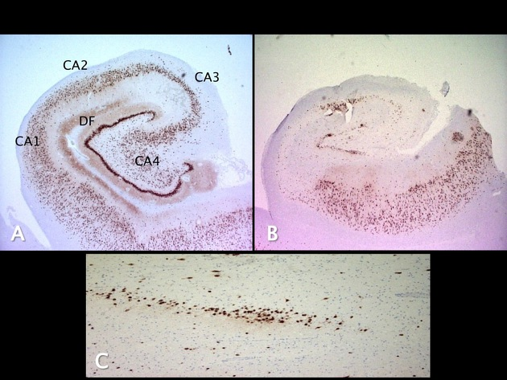
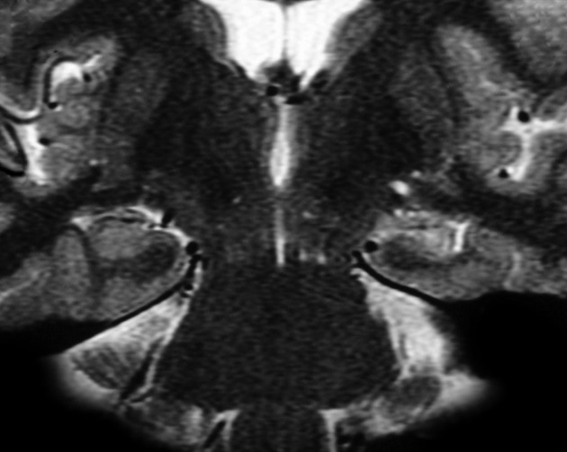
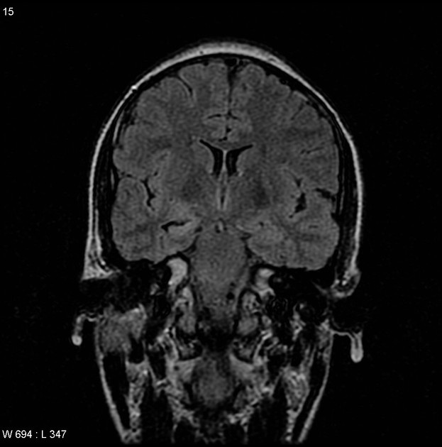
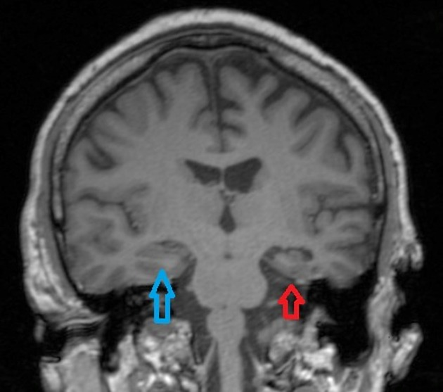

---
tags:
  - engel-rating-scale
  - temporal-lobe
  - hippocampal-sclerosis
  - mesial-temporal-sclerosis
  - epilepsy
  - ILAE-rating-scale
  - seizures
  - VNS-stimulation
---
### Background
* commonly referred to as **hippocampal sclerosis**
* most common association with intractable [temporal lobe epilepsy](https://radiopaedia.org/articles/temporal-lobe-epilepsy?lang=us)
* seen in up to 65% of autopsy studies, although significantly less in imaging.
- ==Treatment refractor epilepsy - 2 types of anti-epileptics for atleast 1 year==
### Pathophysiology
* the hippocampal formation is not uniformly affected
	* primary involvement:
		* the [dentate gyrus](https://radiopaedia.org/articles/dentate-gyrus?lang=us), and the CA1, CA4
		* to a lesser degree CA3 sections o
* Histologically there is neuronal cell loss, [gliosis](https://radiopaedia.org/articles/gliosis?lang=us), and sclerosis.
### Workup
* history and physical
* anti-epileptic serum levels
* MR imaging
* neuropsychological evaluation
	* patients with low average/baseline verbal memory carry lower risk of poster-operative decline in verbal memory
### MRI findings
* ==hippocampal atrophy==
* ==T2/FLAIR hyperintense hippocampal== signal
* dilation of ipsilateral temporal horn
* FDG-PET scan hypometabolism of ipsilateral temporal horn
* elevation of ipsilateroal middle fossa
* atrophy of ipsilateral fornix
### Surgical Management
* ==resection==
	* temporal lobectomy
		* 75-90% success cases
	* selective amygdalohippocampectomy
* ==disconnection==
* neuromodulation/==neurostimulation== (50% success rate)
	* RNS
		* 50% seizure reduction at 2 years
	* DNS
		* at 3 months - 40% reduction in seizure
		* at 2 years - 54% reduction in seizure
	* VNS (vagal nerve stimulation) - most evidence
### Outcome measures
* outcome measures
	* Engel rating scale
	* International league against epilepsy (ILAE) rating scale
* outcomes
	* 20% drug free, 40% still require anti-epileptic

![[Neurosurgery/NSx  Functional/_resources/Mesial_temporal_sclerosis.resources/image.1.png|500]]

<table width="376px" style="border-collapse:collapse;width:376px;"><colgroup><col style="width: 188px;"><col style="width: 188px;"></colgroup><tbody><tr><td style="border-color:#ccc;border-width:1px;border-style:solid;padding:10px;" colspan="2">
A: normal hippocampus

B: hippocampus sclerosis
<ul><li>loss of neurons (CA1, CA3, CA4)</li><li>CA2 spared</li><li>astrocytic gliosis</li><li>granular cell dispersion</li></ul>
 
</td></tr><tr><td style="border-color:#ccc;border-width:1px;border-style:solid;padding:10px;">
left-sided hippocampal sclerosis
</td><td style="border-color:#ccc;border-width:1px;border-style:solid;padding:10px;">
small right hippocampus with increased T2 signal
</td></tr><tr><td style="border-color:#ccc;border-width:1px;border-style:solid;padding:10px;">
volume loss in left temporal lobe / hippocampus
</td><td style="border-color:#ccc;border-width:1px;border-style:solid;padding:10px;">
 
</td></tr></tbody></table>

