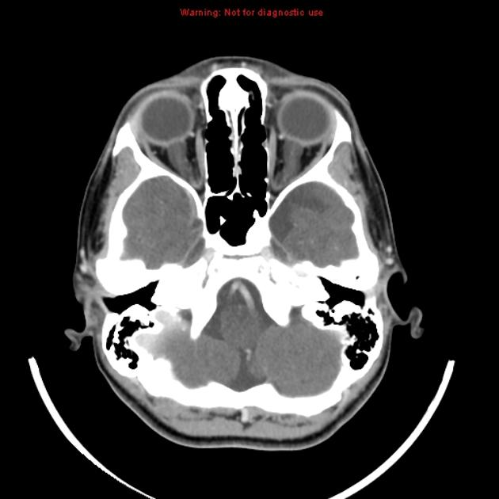
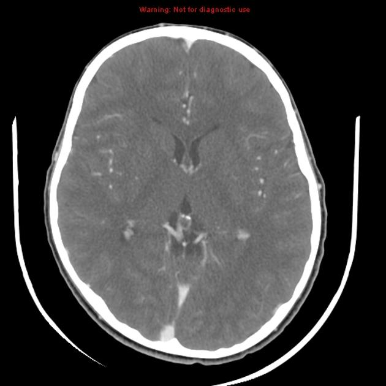
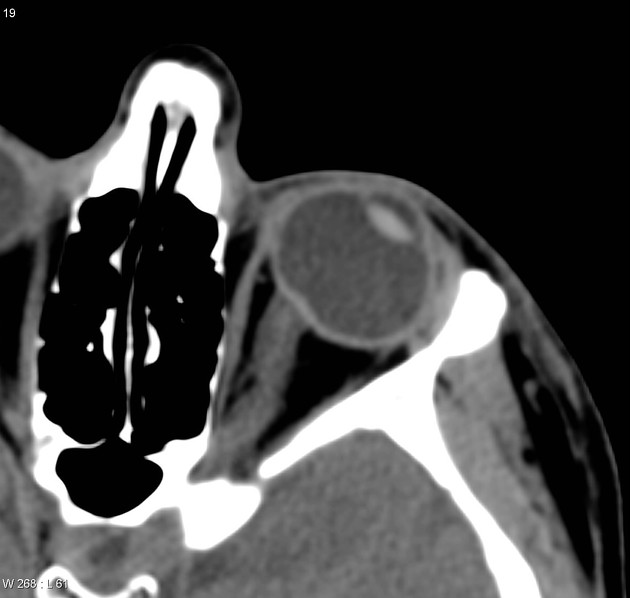
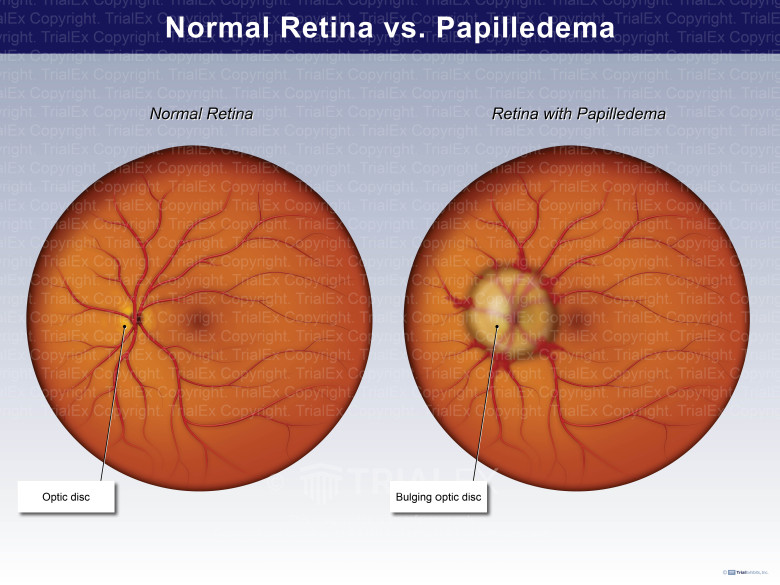
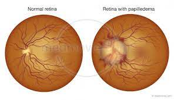
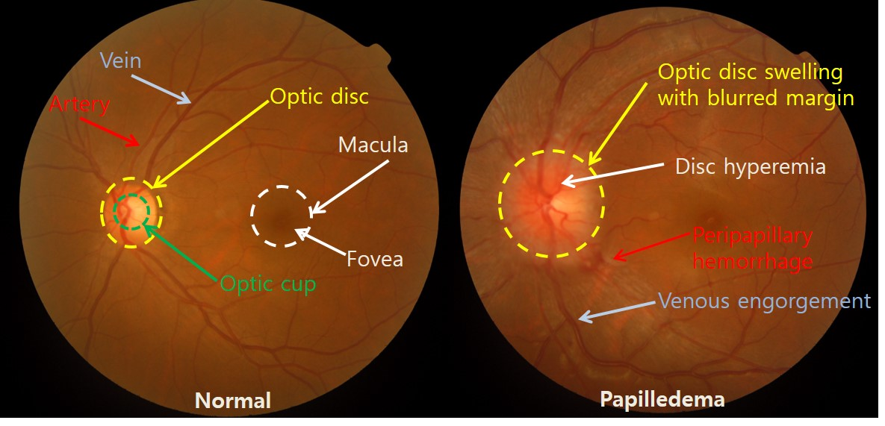

---
---
#ICP #monro-kellie-hypothesis #CPP #ICP-waveforms #papilledema
## Normal ICP
* between ==5-15 mmHg== (7.5-20 cm H2O)
* In children, different upper tolerated limits
	* 3 to 7 mmHg for young children 
	* 1.5 to 6 mmHg for term infants
* mmHg to cmH20 formula
	* 1 mmHg = 1.340 cmH20
	* ==Crude approx: mmHg x (4/3) = cmH20==
	* 1 cmH2O = 0.736 mmHg
## Cerebral perfusion pressure (CPP)
- CPP = MAP - ICP
- Maintain minimum CPP 40 mmHg in pediatric TBI
- Pediatric: CPP 40-50 mmHg
- Adult: CPP 50-60 mmHg
## [Monro-Kellie hypothesis](https://radiopaedia.org/articles/monro-kellie-hypothesis?lang=us) 
- explains the pressure-volume relationship
- essentially non-compressible components inside the skull
	
![[Image 20231124 085518.png|500]]![[Image 20231124 085615.jpeg|500]]

![[Image 20231124 085750.png|500]]

## ICP dependencies
* CSF production rate
* [intracranial compliance](https://radiopaedia.org/articles/intracranial-compliance?lang=us)
* outflow resistance
* intradural sinus pressure 
## Elevated ICP
### Presentation
* ==headache==
* drowsiness
* anorexia
* ==visual disturbances==
	* blurred vision: often first symptom
	* visual field loss: early finding
	* visual acuity preserved
	* [double vision](https://radiopaedia.org/articles/diplopia?lang=us)
	* "greying out of vision" a.k.a. transient visual obscurations
		* commonly occur with changes in posture
	* [papilledema](https://radiopaedia.org/articles/papilloedema?lang=us)
* neck/back pain
* ==[nausea and/or vomiting](https://radiopaedia.org/articles/investigating-nausea-and-vomiting-summary?lang=us)==
* convulsions
* [pulsatile tinnitus](https://radiopaedia.org/articles/pulsatile-tinnitus?lang=us)
* blackouts
* decreased [GCS](https://radiopaedia.org/articles/glasgow-coma-scale-1?lang=us)/coma
### Radiographic features
* effacement of ventricles, basal cisterns, CSF spaces
* brain herniation
* loss of grey-white matter differentiation
### Management
* verify ICP
	* check if waveform is present and adequate
* if using EVD transducer
	* verify transducer is levelled to tragus
	* ensure device is zeroed properly
	* if using ICP parenchymal monitor only, consider conversion to EVD
* check patient position
	* ensure ==HOB > 30 degrees==
	* neutral neck pposition
* ensure cervical collar is not too tight
* optimize sedation
	* titrate to goal RASS -4 to -5
	* ==propofol== at 50 mcg/kg/min
		* if ineffective, use larger doses for short periods (< 4 hours)
* optimize analgesia
	* titrate ==fentanyl== to RASS level -4 to -5
	* maximum dose 200 mcg/hr
* hyperosmolar therapy
	* ==mannitol 0.25-1.0 g/kg bolus (intermittent)==
	* ==hypertonic (3%) saline bolus (intermittent)==
	* labs
		* Na and serum osmolarity q4h-6h
		* check Cl
			* be cautious of hyperchloermic acidosis
			* serum Cl > 115 mEq/L
	* maximal hypertonic therapy
		* Na > 160 mEg/L or osmolality > 320 mosm/kg
* hyperventilation
	* target: ==mild hypocapnia (32-35 mmHg)==
		* pCO2 30-32 target if mild target not effective
* CT head
	* consider if ICP remains refractory
	* r/o mass lesion
* consider decompressive surgery
	* if ICP refractory
## ICP Waveforms
* P1: percussion wave
* P2: tidal wave
* P3: dicrotic wave
![[IMG_3916.PNG|500]]![[IMG_3917.PNG|500]]![[IMG_3918.PNG|500]]

## Figures

<table width="403px" style="border-collapse:collapse;width:403px;"><colgroup><col style="width: 188px;"><col style="width: 215px;"></colgroup><tbody><tr><td style="border-color:#ccc;border-width:1px;border-style:solid;padding:10px;" colspan="2">
<u>increased ICP</u>
<ul><li>optic nerves show increased girth with vertical tortuous courses</li><li>bilateral indentation of posterior sclera at optic disc</li><li>decreased size of frontal horns</li><li>sulcal effacement</li></ul></td></tr><tr><td style="border-color:#ccc;border-width:1px;border-style:solid;padding:10px;">
papilledema
<ul><li>tortuosity of the optic nerve sheath</li><li>flattening of the globe</li><li>intraocular protrusion of the optic nerve head.&nbsp;</li></ul></td><td style="border-color:#ccc;border-width:1px;border-style:solid;padding:10px;">
 
</td></tr></tbody></table>

![[Image 20231124 085658.png|500]]
