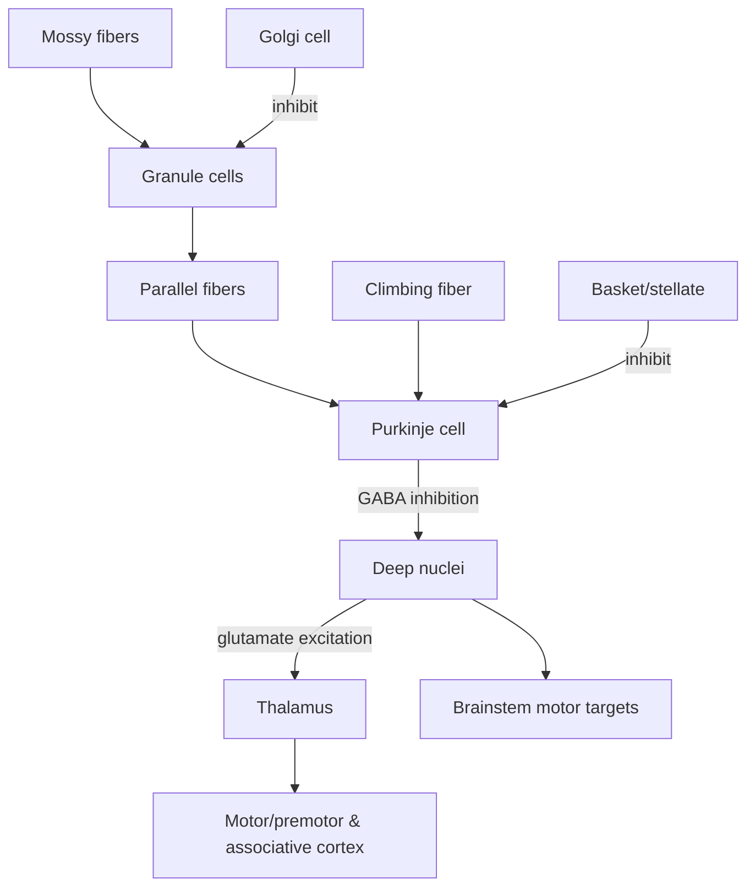

## Learning objectives

1. **Orient cerebellar macroanatomy**: lobes, fissures, vermis vs hemispheres, peduncles.
2. **Map functional divisions** (vestibulo-/spino-/cerebrocerebellum) to **deep nuclei** and **outputs**.
3. **Localize lesions + predict laterality** (ipsilateral vs contralateral depending on outflow/decussation).
4. Explain the **canonical microcircuit** (mossy vs climbing; Purkinje inhibition; deep nucleus output) and link it to ataxia/tremor and motor learning.

## High-yield overview

- The cerebellum lies in the posterior fossa and connects to the brainstem via **three peduncles**: **inferior to medulla**, **middle to pons**, **superior to midbrain**. 
	- **vermis** controls axial posture and gait 
	- **intermediate zone** performs online limb correction 
	- **lateral hemispheres** contribute to motor planning and timing. 
- Inputs arrive as **mossy fibres** (spinal/vestibular/pontine relay) and **climbing fibres** from the **inferior olive**. 
- The cortex outputs only via **Purkinje cells**, which are **GABAergic inhibitory** to deep nuclei and (in the vestibulocerebellum) directly to vestibular nuclei. Deep nuclei then drive **thalamocortical**, **rubral**, **vestibular**, and **reticular** pathways to refine movement and eye–head control. 
- Clinically, cerebellar signs are usually **ipsilateral**
	- May become **contralateral** if the lesion is **above the decussation of the superior cerebellar peduncle**.

---

## 1) Gross anatomy 

### Lobes 

- **Anterior lobe**
- **Posterior lobe**
- **Flocculonodular lobe**
### Fissures

- **Primary fissure**: **anterior vs posterior** lobe.
- **Posterolateral fissure**: separates **flocculus + nodulus** vs. posterior lobe
	- synonym **prenodular fissure** (common on the vermis terminology)
- **Horizontal fissure**: prominent on the surface

### Midline vs lateral 

- **Vermis (midline)** → axial/truncal control, gait/posture.
- **Intermediate/paravermal zone** → online correction of limb movement.
- **Lateral hemispheres** → planning/timing/sequence + cognition.
### Peduncles 

- **SCP** → midbrain
- **MCP** → pons
- **ICP** → medulla

> [!note] **Inputs and Outputs**  
>- **Middle = cortical plan IN** (pons → MCP)
>- **Superior = refined plan OUT** (deep nuclei → SCP)
>- **Inferior = body/vestibular "state" IN + some OUT** (ICP, especially vestibular/fastigial connections) 

## 2) Functional cerebellum map (cortex → nucleus → output)

### Deep nuclei (medial → lateral)

**Fastigial → (Globose + Emboliform = Interposed) → Dentate**

> [!note] Mnemonic: "**F**astigial, **G**lobose, **E**mboliform, **D**entate” — **FGED** from midline outward 

- **Fastigial**: primarily vermis-related outputs 
	- posture, gait; vestibular/reticular interactions.
- **Interposed nuclei** (globose + emboliform): intermediate zone outputs 
	- limb coordination; red nucleus and descending systems.
- **Dentate**: lateral hemisphere outputs 
	- motor planning and higher-order integration; thalamic relay to cortex.

| Deep nucleus            | Functional zone association              | Major inputs                                               | Major outputs                                                                                 | Lesion pattern (high-yield)                                                                                            |
| ----------------------- | ---------------------------------------- | ---------------------------------------------------------- | --------------------------------------------------------------------------------------------- | ---------------------------------------------------------------------------------------------------------------------- |
| Fastigial               | Vermis / vestibular-interfacing circuits | Purkinje cells of vermis & flocculonodular-related regions | Vestibular nuclei, reticular formation (and via thalamus to cortical systems in some schemes) | Truncal/gait ataxia, balance impairment, ocular motor issues                                                           |
| Globose (interposed)    | Intermediate (spinocerebellum)           | Purkinje cells of intermediate hemisphere                  | Red nucleus and motor control pathways; thalamic motor relays                                 | Ipsilateral limb ataxia, dysmetria, intention tremor tendency                                                          |
| Emboliform (interposed) | Intermediate (spinocerebellum)           | Purkinje cells of intermediate hemisphere                  | Similar to globose as interposed complex                                                      | Similar: limb incoordination and dysmetria                                                                             |
| Dentate                 | Lateral hemisphere (cerebrocerebellum)   | Purkinje cells of lateral hemisphere                       | Thalamus (motor/premotor), brainstem motor planning targets                                   | Limb ataxia with impaired movement decomposition; potential cognitive-affective changes with posterior/lateral lesions |
### Core mapping table 

| Functional unit     | Dominant cortex territory                                                              | Deep nucleus emphasis                             | Main targets                                                                      | Core function / clinical signature                                                                           |
| ------------------- | -------------------------------------------------------------------------------------- | ------------------------------------------------- | --------------------------------------------------------------------------------- | ------------------------------------------------------------------------------------------------------------ |
| Vestibulocerebellum | Flocculus + nodulus (± uvula)                                                          | Fastigial and direct Purkinje → vestibular nuclei | Vestibular nuclei, reticular formation → vestibulo-/reticulospinal; VOR circuitry | Balance + gaze stability; lesions → nystagmus, truncal instability, "vestibular-like" complaints             |
| Spinocerebellum     | Vermis + intermediate zone (classically anterior lobe + vermis; also posterior vermis) | Vermis → fastigial; intermediate → interposed     | Reticular/vestibular nuclei; red nucleus; VL thalamus → motor cortex              | Posture/gait + online error correction; vermis → truncal/gait ataxia; intermediate → ipsilateral limb ataxia |
| Cerebrocerebellum   | Lateral hemispheres (main bulk of posterior lobe)                                      | Dentate                                           | SCP → decussation → VL thalamus → motor/premotor cortex; some to red nucleus      | Planning/timing/sequence; lesions → dysmetria, decomposition, intention tremor, dysdiadochokinesia           |

**Key nuance**: The flocculonodular lobe is a classic exception where cerebellar cortical output can go directly to vestibular nuclei, bypassing deep nuclei. 

## 3) Peduncles: "what runs where" 

### Inferior cerebellar peduncle (ICP)

Two functional components:

- Corpus restiforme (restiform body): 
	- Mainly afferents (e.g., dorsal/posterior spinocerebellar, cuneocerebellar, olivocerebellar, trigeminocerebellar)
	- Conceptually: "body/face state in".
- Juxtarestiform body: 
	- heavy vestibulocerebellar traffic + fastigial ↔ vestibular nuclei connections.

### Middle cerebellar peduncle (MCP / brachium pontis)

- Massive pontocerebellar afferent system
	- cortex → pontine nuclei → contralateral MCP → cerebellum.
- "Motor cortex asks the cerebellum for help via pons; the answer returns via SCP."

### Superior cerebellar peduncle (SCP / brachium conjunctivum)

- Main efferent pathway from deep nuclei (especially dentate and interposed).
- ==Decussates== in caudal (lower) midbrain at the level of the inferior colliculi (Wernekink commissure). 
- Also carries ventral/anterior spinocerebellar tract afferents 
	- teaching point: =="double-crossing" explains ipsilateral signs==.

| Structure | Predominant direction                       | Key tracts (high-yield)                                                       | Clinical/surgical relevance                                                                                           |
| --------- | ------------------------------------------- | ----------------------------------------------------------------------------- | --------------------------------------------------------------------------------------------------------------------- |
| ICP       | Mostly afferent (plus vestibular efferents) | Dorsal spinocerebellar, cuneocerebellar, olivocerebellar, vestibulocerebellar | Vulnerable in far-lateral/foramen magnum approaches; links to vestibular symptoms                                     |
| MCP       | Afferent                                    | Pontocerebellar fibers                                                        | CPA/retrosigmoid region adjacency; <br>implicated in vascular lesions (AICA territory)                                |
| SCP       | Mostly efferent                             | Dentatothalamic / cerebellorubral outputs; ventral spinocerebellar afferents  | Key structure in lesions causing severe limb ataxia/tremor; <br>surgical awareness near superior cerebellum/tentorium |

---

## 4) Laterality rules 

### Why cerebellar signs are usually ipsilateral

- ==Cerebellar outflow crosses in the SCP==, then influences systems that cross again (e.g., corticospinal), producing a net ipsilateral effect at the limb.
- Exception: lesions above SCP decussation (e.g., certain midbrain lesions) can produce contralateral cerebellar signs. 

> [!trick] "Cerebellar signs are usually ipsilateral; they flip if the lesion is above the SCP decussation."

---
## 5) Cerebellar cortex microcircuit 

### 3 layers 

- ==Molecular== layer (outer)
	- parallel fibres
	- inhibitory interneurons
- ==Purkinje== cell layer (middle)
	- single row of cell bodies
	- GABAergic inhibitory to deep nuclei/vestibular nuclei targets.
	- the **only output** of cerebellar cortex
- ==Granule== cell layer (inner)
	- mossy fibre synapses
	- Golgi cells

| Layer     | Main elements                                                  | Key synapses to know                                  | Exam pearl                                                                       |
| --------- | -------------------------------------------------------------- | ----------------------------------------------------- | -------------------------------------------------------------------------------- |
| Molecular | Parallel fibers; Purkinje dendrites; basket/stellate cells     | Parallel fiber → Purkinje; basket/stellate → Purkinje | Many-to-one convergence from parallel fibers supports “context-rich” integration |
| Purkinje  | Purkinje somata                                                | Purkinje → deep nuclei (inhibitory)                   | **Cortical output is inhibitory** (a recurring exam anchor)                      |
| Granular  | Granule cells; Golgi cells; mossy fiber rosettes (“glomeruli”) | Mossy fiber → granule; granule → parallel fibers      | Granule cells are extremely numerous—supports pattern expansion/encoding         |

### One‑output rule

- Purkinje cells are the only output of cerebellar cortex.
- ==Purkinje output is inhibitory== (GABAergic) to deep nuclei and—in vestibulocerebellum—directly to vestibular nuclei. 

### Two main afferent systems

- ==Mossy fibres (majority)==: synapse on granule cells → parallel fibres → Purkinje.
- Climbing fibres: 
	- arise from inferior olive
	- powerful direct input to Purkinje
	- associated with complex spikes and teaching/error signals. 
### Deep nuclei are active integrators, not passive relays

- Receive excitatory collaterals from mossy/climbing fibres + inhibitory Purkinje input.
- Provide the ==major cerebellar output (classically excitatory) to thalamus/brainstem targets==. 

### Plasticity / motor learning

- Cerebellum supports error-based learning
	- ==mismatch== between ==intended== movement (pontine input) and actual ==performance== (spinal/vestibular feedback) drives climbing fibre teaching signals
	- This produces ==synaptic plasticity== (classically LTD at parallel fibre–Purkinje synapses) that reshapes deep nuclear output and improves future movements (e.g., VOR adaptation).

### Numbers (use cautiously)

- Cerebellar granule cells make up ~70–80% of neurons in the brain 
- Typical parallel fibre synapses per Purkinje cell are on the order of ~100,000–200,000
- Complex spike rate is typically ~0.5–1.5 Hz at baseline
	- inferior olive activity shows rhythmicity/oscillations often below ~10 Hz, but that does not mean each olivary neuron fires 10 spikes/sec continuously.


### Canonical microcircuit diagram 




Tip: if you remember only one polarity rule—Purkinje inhibits and deep nuclei excite—you can reason through many “what happens if” questions (e.g., loss of Purkinje inhibition initially disinhibits deep nuclei, but the clinical syndrome is still incoordination because the system loses calibrated timing/error correction).

---

## 6) Vascular anatomy 

### The three cerebellar arteries

- PICA: 
	- supplies inferior cerebellum/tonsil/inferior vermis 
	- contributes to posterior-inferior hemispheric surface.
- AICA: 
	- anteroinferior cerebellum
	- often supplies regions near the CPA, including relationships to CN VII/VIII region and flocculus
	- supplies MCP commonly.
- SCA
	- superior cerebellum and superior vermis
	- can supply deep structures (including dentate territory).

**Practical note:** cerebellar arterial territories overlap and vary

### PICA segmentation

PICA divided into **five segments**:

1. Anterior medullary
2. Lateral medullary
3. Tonsillomedullary
4. Telovelotonsillar
5. Cortical 

Proximal PICA segments: more closely related to ==medullary== perforators.
Distal PICA segments: more ==cortical==. 

Surgical tolerance to sacrifice depends on segment, branches, and individual anatomy.

### Venous drainage

- Cerebellar venous drainage is via superficial and deep veins to dural venous sinuses and deep venous collectors. 
	- **Bridging veins** to transverse/sigmoid/petrosal sinuses 
	- The **superior petrosal venous complex** (often colloquially “petrosal vein”)
		- sacrifice vs preservation decisions can have consequences 
			- venous congestion, cerebellar edema, cranial neuropathies

---
## 7) CPA + 4th ventricle relationships

- The ==lateral recess of the 4th ventricle== 
	- extends laterally between the inferior cerebellar peduncle and the peduncle of the flocculus
	- opening via the foramen of Luschka
	- a choroid plexus tuft often protrudes here. 
- The ==pontomedullary sulcus==
	- runs along the pons–medulla junction 
	- ends just medial to the foramen of Luschka/lateral recess
	- CN VII arises near the lateral end of this sulcus. 
- The ==flocculus== 
	- projects into the CPA
	- near the CN VII/VIII region and the lateral recess/foramen of Luschka.

---

## 8) Clinical localization

### Bedside signs to elicit

1. **Speech**: scanning dysarthria
2. **Eyes**: nystagmus; saccades; pursuit; VOR as relevant
3. **UL coordination**: finger–nose–finger; RAM; rebound
4. **LL coordination**: heel–shin
5. **Gait**: base, tandem, turns
6. **Truncal**: sitting balance/titubation

### High-yield localization table

| Lesion site                           | Signature deficits                                                   | Key associations                                                                       |
| ------------------------------------- | -------------------------------------------------------------------- | -------------------------------------------------------------------------------------- |
| Vermis / fastigial                    | Truncal/==gait ataxia==, titubation, axial instability               | Midline tumours, vermian infarcts; <br>often bilateral axial signs                     |
| Flocculonodular (vestibulocerebellum) | Nystagmus, impaired gaze stability, imbalance/vertigo-like symptoms  | VOR adaptation; <br>direct vestibular nucleus connections                              |
| Intermediate zone / interposed nuclei | Ipsilateral ==limb ataxia==, dysmetria, intention tremor             | "Online correction" circuitry <br>(rubral/thalamic channels)                           |
| Lateral hemisphere / dentate          | Dysmetria, decomposition, dysdiadochokinesia; planning/timing issues | Thalamocortical motor planning loops                                                   |
| SCP outflow (near/above decussation)  | Marked ataxia; laterality depends on level                           | Above SCP decussation → contralateral signs                                            |
| Cerebellum + CPA/brainstem            | Ataxia + cranial nerve findings                                      | Think vascular (AICA/PICA territory) or CPA mass; <br>know Luschka/flocculus landmarks |

---

## 9) Posterior fossa deterioration 

**Core physiology:** posterior fossa has limited compliance → cerebellar infarct/hemorrhage can deteriorate due to:

- Edema/mass effect
- 4th ventricle/aqueduct compression → obstructive hydrocephalus
- Brainstem compression

**Timing:** deterioration is often within the first few days but can occur **after >72 hours**; prolonged monitoring is justified in high-risk cases. 

**EVD vs decompression 

- CSF diversion alone can create dangerous pressure gradients  
	- risk of **upward transtentorial herniation**
	- many recommend addressing posterior fossa mass effect directly.
- More recent evidence syntheses suggest the risk of clinically significant deterioration after EVD may be **lower than historically assumed** when drainage is controlled and patient selection is appropriate
	- EVD is increasingly viewed as reasonable initial therapy for hydrocephalus in selected patients, while decompression remains critical for severe mass effect/brainstem compression. 

## 10) Beyond "motor": cognition/affect and postoperative syndromes

### Cerebellar Cognitive Affective Syndrome (CCAS)

- Cerebellar lesions can cause deficits in **executive function, visuospatial processing, language**, and **affective regulation**
	- blunting → disinhibition spectrum.
- High-yield localization concept
	- **posterior lateral cerebellum** (cognitive loops) 
	- **vermis** (limbic/affective integration).

### Posterior fossa syndrome / cerebellar mutism (post‑tumour resection)

- Syndrome of **mutism** with neurobehavioral/cognitive changes
- clinically relevant in posterior fossa tumour surgery counseling and post-op monitoring.

## 11) High-yield questions

### "Why are cerebellar signs usually ipsilateral?"

- Outflow crosses via **SCP**, then influences pathways that cross again (e.g., corticospinal), netting ipsilateral effect
- above SCP decussation can flip laterality.

### "Mossy vs climbing fibres—what's the difference?"

- **Mossy**: contextual sensorimotor information → granule → parallel fibres → Purkinje.
- **Climbing**: inferior olive teaching/error signal → powerful Purkinje input → complex spikes → plasticity.

### "Name deep nuclei and function"

- **Fastigial**: axial/posture; vestibular/reticular outputs.
- **Interposed (globose+emboliform)**: online limb correction; rubral/thalamic outputs.
- **Dentate**: planning/timing; thalamocortical output.

### "CPA relationship that helps intraoperatively."

- Foramen of Luschka + choroid plexus tuft and the flocculus provide consistent landmarks near CN VII/VIII and the lateral recess. 

---

## 12) Ultra‑high‑yield "one diagram" to redraw from memory

```text
Inputs:
  Mossy (+) → Granule → Parallel fibers (+) → Purkinje (–) → Deep nuclei → outputs
  Climbing (+) (inferior olive) → Purkinje (–) → Deep nuclei → outputs

Rules:
  Purkinje = only cortical output; inhibitory (GABA).
  Vestibulocerebellum can output directly to vestibular nuclei (exception).
  SCP decussates in caudal midbrain (inferior colliculus level).
```

---

## Discrepancies / clarifications flagged from the added notes

### A) Terminology (not truly a conflict, but worth standardizing)

- Your "**prenodular fissure**" ≈ "**posterolateral fissure**" usage is acceptable; they are listed as synonyms in medical glossary references. ([The Free Dictionary Medical Dictionary](https://medical-dictionary.thefreedictionary.com/fissura%2Bposterolateralis?utm_source=chatgpt.com "Fissura posterolateralis | definition of fissura posterolateralis by Medical dictionary"))  
    **Action:** in viva, say "**posterolateral (prenodular) fissure**" once to show you recognize both.

### B) Vestibulocerebellum output pathway (appears contradictory until clarified)

- 2006 notes emphasize **fastigial** (and vestibular complex).
- 2016 notes emphasize **direct flocculonodular output to vestibular nuclei bypassing deep nuclei**.  
    **Resolution:** both are correct—vestibulocerebellar outflow is **both** via **fastigial** and **direct Purkinje→vestibular nuclei**, with the direct route being a classic exception. ([NCBI](https://www.ncbi.nlm.nih.gov/books/NBK545251/?utm_source=chatgpt.com "Neuroanatomy, Cerebellar Dysfunction - StatPearls - NCBI Bookshelf"))

### C) Quantitative physiology statements (need softening)

- "Granule cells ≈ 70% of all CNS neurons" depends on denominator and source; modern summaries commonly cite **~70–80% of brain neurons** in cerebellum. ([Human Protein Atlas](https://www.proteinatlas.org/humanproteome/brain/cerebellum?utm_source=chatgpt.com "The human brain - cerebellum - The Human Protein Atlas"))
- "Purkinje receives ~0.5 million synapses" is higher than many standard estimates (often **~100k–200k** parallel fibre synapses; varies by method/species). ([ScienceDirect](https://www.sciencedirect.com/topics/biochemistry-genetics-and-molecular-biology/purkinje-cell?utm_source=chatgpt.com "Purkinje Cell - an overview | ScienceDirect Topics"))
- "Inferior olive cells fire ~10 spikes/sec" risks mixing **population oscillation frequency** with **single‑cell firing**; complex spikes are typically **~0.5–1.5 Hz** baseline, and IO rhythms are often **<10 Hz** but individual spiking is lower/irregular. ([PMC](https://pmc.ncbi.nlm.nih.gov/articles/PMC4729836/?utm_source=chatgpt.com "Climbing Fiber Regulation of Spontaneous Purkinje Cell Activity and Cerebellum-Dependent Blink Responses - PMC"))

**Action:** keep numbers as "order of magnitude" and focus on principles.

### D) SCP decussation wording

- "Fibres decussate completely" can be interpreted too absolutely. The **major efferent bundle** of SCP decussates at inferior colliculus level (good viva point). ([IMAIOS](https://www.imaios.cn/en/e-anatomy/anatomical-structures/decussation-of-superior-cerebellar-peduncles-1553805840?utm_source=chatgpt.com "Decussation of superior cerebellar peduncles - e-Anatomy - IMAIOS"))  
    **Action:** say "**most cerebellothalamic/rubral efferents decussate in caudal midbrain**."

### E) Posterior fossa hydrocephalus management statement (true historically; now debated)

- 2016 notes: "ventricular drainage alone can be dangerous → upward herniation."
- Current evidence syntheses suggest the risk of clinical deterioration after EVD may be **less than traditionally feared** when drainage is controlled and patients are selected appropriately; EVD is not necessarily contraindicated. ([PMC](https://pmc.ncbi.nlm.nih.gov/articles/PMC12733857/?utm_source=chatgpt.com "External Ventricular Drainage for Hydrocephalus Following Cerebellar Infarction: A Scoping Review - PMC"))  
    **Action:** present this as "traditional caution + evolving evidence," and keep it conceptual in exams.

### F) "PICA segments can often be sacrificed" statement (context-dependent)

- The **5‑segment scheme** is well-established. ([Lippincott Journals](https://journals.lww.com/neurosurgery/abstract/1982/02000/microsurgical_anatomy_of_the_posterior_inferior.4.aspx?utm_source=chatgpt.com "Neurosurgery"))
- The claim that distal segments "can often be sacrificed" is **not universally safe**; depends on collaterals, dominant trunks, and branch pattern.  
    **Action:** reframe as "proximal segments are perforator‑rich; distal are more cortical—risk differs by segment and anatomy."

---


