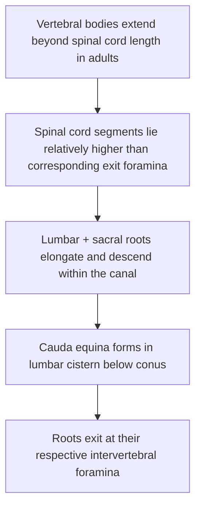

> [!summary] Thoracolumbar spine anatomy 
> 
> - **T4–T5 danger zone:** **narrow pedicles + narrow canal** → high **cord/instrumentation** risk.
>     
> - **T11–L2 junction:** rapid shift in **facet orientation + pedicle trajectory** → **CT-plan**, don’t assume “always medial.”
>     
> - **Conus:** usually **L1–L2** but adult range **mid-T12 → upper-L3** → LP classically **L3–4/L4–5**.
>     
> - **DRG:** often **intraforaminal**; **L5 commonly foraminal** → key for **TF approaches/foraminal stenosis** pain risk.
>     
> - **Adamkiewicz:** usually **single, left**, most often **T8–L1** (peak **T9–T11**) → no universal “safe level.”
>     
> - **LP layers:** supraspinous → interspinous → **ligamentum flavum** → epidural → dura → arachnoid → CSF.
>     
> - **Foramen boundaries:** roof/floor **pedicles**; anterior **body/disc**; posterior **facet complex** (± LF).
>     
> - **LLIF/transpsoas:** **L4–5** = highest **lumbar plexus** risk → corridor discipline + neuromonitoring.
>

## Table of Contents

- [[#High-yield vertebral level anatomy T1–L5]]  
- [[#Ligaments discs and the posterior tension band]]  
- [[#Neural foraminal and segmental anatomy]]  
- [[#Vascular supply and venous plexuses]]  
- [[#Surgical corridors and key anatomic risks]]  
- [[#Royal College style questions vignettes mnemonics]]  
- [[#Key labeled images and primary references]]

## Summary

### Thoracic levels
- the tight “risk triangle” is **narrow canal + small mid-thoracic pedicles + spinal cord dependence on variable segmental inflow**.
- **T4–T5** tend to have the narrowest pedicles (many <5 mm) and among the narrowest canal diameters,
### Thoracolumbar junction
- anatomy transitions **rapidly**: facet orientation changes (thoracic asymmetry is common; junctional transverse orientation can be highly variable), pedicle angulation shifts, and major vascular variants become clinically relevant. 
### Neural localization
- **Conus medullaris**: 
	- “usually L1–L2,” but in adults can range **mid T12 to upper L3**
	- a central reason lumbar puncture is classically done below L2 (e.g., L3–4 / L4–5). 
- **Dorsal root ganglia (DRG)**: 
	- lumbar DRGs are frequently intraforaminal
	- L5 is often foraminal (with a minority intraspinal), which matters for transforaminal approaches and foraminal stenosis patterns. 
### Vascular risk
- the canonical structure is the ==artery of Adamkiewicz==
	- most often ==left-sided==, most often T9–T11, and the majority arise T8–L1*
	- true distribution spans higher and lower levels, explaining why “one safe level” cannot be assumed in tumor, deformity, or aortic work. 

## Vertebral level anatomy T1–L5

### Thoracic vs lumbar
### **Thoracic vertebrae (T1–T12)** 
- defined by rib articulations and a relatively smaller canal compared with lumbar
- the mid-thoracic region is where canal and pedicles can be most unforgiving for instrumentation.

### **Lumbar vertebrae (L1–L5)** 
- emphasize load-bearing: 
	- larger bodies/endplates
	- thicker pedicles
	- more ==sagittal facet orientation== (with important transitions at the junction and at L5–S1)

### Bony landmarks and level-specific pearls (T1–L5)

**T1–T3 (upper thoracic transition)**
- Pedicles width: are relatively ==wide at T1== and then ==narrow toward T4==
- Pedicle angulation: thoracic pedicle ==medial angulation== is maximal at upper levels. 
- Facet orientation: ==oblique==, and thoracic asymmetry can be normal 

**T4–T6 (classic “danger” region)**
- Pedicle isthmus width can be at its minimum around T4–T5, with a large fraction <5 mm (implant selection and breach risk). 
- Canal dimensions can also be narrow here 
	- another reason to ==anticipate cord vulnerability== during correction/deformity work
- ==Spinous processes angulate more caudally== through mid-thoracic (relevant to midline exposure and level counting). 

**T7–T10 (mid/lower thoracic)**
- Thoracic pedicle chord length values often support somewhat longer screws than upper thoracic; 
	- morphometry studies explicitly note a practical shift in accommodated screw length. 
- Segmental vascular relevance grows as you approach the thoracolumbar junction 
	- radiculomedullary variability becomes clinically salient. 

**T11–T12 (thoracolumbar transition)**
- ==Pedicle angles can become neutral== or even “outward” by T11–T12 in some datasets
	- “always medialize thoracic screws” is not universally safe. 
- Junctional facets can be highly variable in transverse orientation—expect variability and do not overgeneralize.

**L1–L5 (lumbar hallmark patterns)**
- Meta-analytic lumbar morphometry shows ==pedicle width increases caudally== 
	- e.g., ~7.5 mm at L1 to ~14.6 mm at L5 as pooled means
	- conceptually ==“bigger going down”==. 
- Lumbar pedicle ==medial angulation increases from L1 to L5 ==in CT-based analyses
	- notable jump at L5 in some populations 
- Endplate and canal dimensions generally enlarge toward lower lumbar, consistent with the transition from cord to cauda equina and greater bony load bearing. 

### Facet joint orientation

- In the transverse plane, T1–T11 facets show anterior inclination roughly 25°–30° from the frontal plane. 
- Facet orientation
	- T12–L2 facets: oriented closer to the midsagittal plane (~25.9°–33.9°)
	- L3–L5 facets:  oriented farther away (~40.4°–56.3°). 
- The thoracolumbar junction can show highly variable transverse orientation 
- Sagittal-plane “verticality” increases caudally (approx 150° at T1 to 170° at L5), reinforcing that facet planes are not simply ==“coronal thoracic vs sagittal lumbar”== but shift continuously. 

A CT study focusing on **T8–L1** (sagittal-plane facet angle relative to a posterior body reference line) found mean angles around **165° (T8–T9)** trending down toward **~161° (T12–L1)**, again emphasizing subtle but real junctional changes. 

### Pedicle/screw anatomy and operative-relevant measurements

**How to interpret numbers
- “Pedicle width” may mean (definitions vary by study):
	- outer cortical diameter vs inner cancellous diameter vs isthmus width—**definitions vary by study**. 
- “Chord length” approximates the maximal in-bone path from posterior entry toward anterior body cortex along the pedicle axis; it informs screw length selection and breach risk. citeturn16view0turn18view0

**Operative-relevant measurement table (typical values; note population + method variability)**  
Thoracic values below are CT morphometry (T1–T12) from one large dataset; lumbar chord/angle examples are CT-based (L1–L5) from a large dataset, while lumbar pedicle widths are pooled meta-analysis values. citeturn16view0turn18view0turn15view0

| Level | Pedicle width (mm) | Medial pedicle angle (deg, transverse plane) | Chord length / screw path (mm) | Practical instrumentation note |
|---|---:|---:|---:|---|
| T1 | 9.27 ± 1.01 | 35.4 ± 2.21 | 30.30 ± 2.11 | Upper thoracic: large medial angulation; shorter chord length. |
| T2 | 7.5 ± 1.13 | 26.21 ± 4.12 | 32.30 ± 3.24 |  |
| T3 | 6.0 ± 1.23 | 20.01 ± 2.22 | 33.21 ± 2.64 |  |
| T4 | 4.5 ± 0.93 | 19.06 ± 3.12 | 36.5 ± 2.26 | **Classic narrow pedicle level** (many <5 mm). |
| T5 | 5.0 ± 1.12 | 16.0 ± 2.12 | 37.83 ± 3.24 | Narrow pedicles remain common. |
| T6 | 5.5 ± 0.74 | 14.38 ± 2.24 | 39.84 ± 3.58 |  |
| T7 | 6.0 ± 1.16 | 11.82 ± 2.38 | 40.07 ± 4.03 |  |
| T8 | 6.32 ± 1.56 | 12.29 ± 2.11 | 40.64 ± 3.29 |  |
| T9 | 6.28 ± 1.32 | 11.21 ± 2.33 | 39.54 ± 2.88 |  |
| T10 | 6.54 ± 1.12 | 8.7 ± 2.38 | 40.11 ± 3.45 |  |
| T11 | 7.84 ± 1.33 | −2.3 ± 7.34 | 36.21 ± 4.08 | Angle may shift outward in some patients. |
| T12 | 8.31 ± 1.83 | −9.8 ± 2.39 | 34.24 ± 3.33 | Transitional anatomy; confirm trajectory carefully. |
| L1 | ~7.51 (pooled mean) | 12.68 ± 2.54 (range 7.6–17.1) | ~49.18 (trend value) | CT series suggests L1 may fit smaller screws vs lower lumbar. |
| L2 | ~8.23 (pooled mean) | (increases vs L1) | (increases toward L3) |  |
| L3 | ~9.71 (pooled mean) | (increases vs L2) | 50.92 ± 2.86 (45.2–56.6) | Peak chord length in one large CT dataset. |
| L4 | ~11.52 (pooled mean) | (increases vs L3) | (decreases vs L3) |  |
| L5 | ~14.58 (pooled mean) | 28.23 ± 3.87 (20.5–36.0) | 47.63 (decreases vs L3) | Marked medial angulation; trajectory constraints (iliac crest). |

**What examiners often want you to say (explicitly)**
- In one thoracic CT dataset, **T4: ~76%** and **T5: ~62%** of pedicles were <5 mm (not accepting a 4.0 mm screw with 1.0 mm “clearance” assumption). citeturn16view0  
- The same dataset suggests (as a practical guide) **25–30 mm** screws often fit from **T1–T6 and T11–T12**, whereas **30–35 mm** screws may fit from **T7–T10**—but this is not a substitute for CT plan. citeturn16view0  
- Lumbar CT morphometry can show wide population variability; one large CT series found L1 transverse pedicle diameter mean ~5.8 mm (range ~3.7–7.8) and L5 mean ~13.6 mm (range ~10.7–16.6), illustrating why “one screw size fits all” is an unsafe assumption. citeturn18view0  
- For MIS lumbar pedicle screw fixation, a CT-guided study recommends limiting screw projection on lateral view to about **≤85%** of vertebral body length at **L1**, **≤80%** at **L2–L4**, and **≤75%** at **L5** to balance purchase and anterior breach risk. citeturn22view0

## Ligaments discs and the posterior tension band

This section is high-yield because examiners commonly turn an imaging finding (“thickened yellow ligament,” “posterior disc herniation,” “stenosis”) into a structure-based surgical question.

### Intervertebral discs (thoracic/lumbar)
- The intervertebral disc includes **annulus fibrosus**, **nucleus pulposus**, and **cartilaginous endplates**. citeturn20search6  
- Discs comprise roughly **~25%** of vertebral column length and support (are supported by) the longitudinal ligaments. citeturn21search6turn21search12  
- Surgical anatomy cue: posterolateral herniation patterns are influenced by posterior longitudinal ligament geometry (thin/variable constraints), frequently invoked when discussing cauda equina compression patterns. citeturn23view0

### Anterior longitudinal ligament
- The **anterior longitudinal ligament (ALL)** spans from the cranial base region to the sacrum in standard descriptions and helps resist **hyperextension** while contributing to anterior stability. citeturn21search11turn21search12  
- Surgical relevance: **ALL release** concepts (particularly in deformity and certain interbody strategies) are based on these constraints; the key fact is *it is a major anterior stabilizer*. citeturn21search12turn19search17

### Posterior longitudinal ligament
- The **posterior longitudinal ligament (PLL)** runs **within the canal** along posterior vertebral bodies and discs (axis to sacrum in standard descriptions) and contributes to stability; it is frequently discussed in relation to posterior disc herniation patterns and (pathologically) ossification. citeturn21search4turn3search6  
- Exam phrasing that scores points: **PLL is more strongly associated with the discs than the vertebral body** in many descriptions, and it is clinically relevant because pathology here can cause canal compromise. citeturn3search2turn21search4

### Ligamentum flavum
- **Ligamentum flavum (LF)** connects adjacent **laminae** along the posterior canal and is a key component of the posterior canal wall. citeturn21search3turn23view0  
- In the lumbar region, LF hypertrophy/thickening is a major contributor to stenosis; imaging studies report millimeter-scale thicknesses (often several mm) and show age/degeneration relationships. citeturn1search10turn1search14turn21search9  
- Microanatomic surgical nuance: classic anatomic work describes superficial and deep components and specific laminar insertions—an oral-exam “bonus detail” when discussing flavectomy and avoiding dural injury. citeturn21search16

### Interspinous and supraspinous ligaments
- During lumbar puncture, the “needle path” classically traverses **supraspinous ligament → interspinous ligament → ligamentum flavum → epidural space → dura → arachnoid** to reach subarachnoid space—this sequence is frequently examined. citeturn23view0  
- These ligaments form part of the **posterior tension band**; iatrogenic disruption (especially when combined with facet/pars violation) is a recurrent stability discussion point in oral exams. (Specific numeric stability thresholds are **unspecified** here because they depend on pathology, extent of bony resection, and construct choices.)

## Neural foraminal and segmental anatomy

### Cord termination, conus medullaris, and cauda equina
High-yield “must say” facts:
- In standard adult descriptions, the spinal cord terminates around **L1–L2** (conus medullaris), with variability. citeturn24view0turn23view0  
- In a large adult MRI series (n≈500), the **mean** conus position was **lower third of L1**, with a **range from middle third of T12 to upper third of L3**. citeturn25view0  
- In a StatPearls summary, younger patients/children may terminate lower (example statement: child around upper border of L3), reflecting development-related ascent. citeturn24view0  
- The cauda equina consists of descending nerve roots within the lumbar cistern; descriptions include lumbar roots and sacral roots as part of this bundle, and it is clinically central to CES localization and urgency. citeturn23view0turn24view0

**Mermaid flowchart: cord termination variability (development → adult range)**  
(Conceptual model; data supported by cited adult MRI distribution and general adult/child termination statements.) citeturn24view0turn25view0turn23view0
```mermaid
flowchart TD
A[Early life: cord ends relatively lower] --> B[Growth mismatch: vertebral column elongates more than cord]
B --> C[Child: conus may be around upper L3 (example reference point)]
C --> D[Adult typical: conus ~L1–L2]
D --> E[Adult observed range: mid T12 body to upper L3 body]
E --> F[Below conus: cauda equina roots descend to their foramina]
```

### Spinal segments vs vertebral levels in the thoracolumbar region
In adults, vertebral column growth outpaces cord growth, so **spinal cord segments do not align one-to-one with vertebral levels**—anatomically explaining why lumbar and sacral roots descend within the canal before exiting. citeturn24view0turn23view0turn4search4

**Mermaid diagram: concept map (segment-to-vertebra mismatch)** citeturn24view0turn23view0turn4search4


### Nerve root exits and dorsal root ganglia
- Spinal nerves exit via the **intervertebral foramen**; in thoracic/lumbar regions, the named nerve generally exits below its corresponding vertebra (e.g., L4 nerve via L4–L5 foramen). citeturn24view0turn2search4  
- DRGs (spinal root ganglia) are highly relevant for foraminal stenosis and transforaminal surgery because they are pain-generating structures and are often located **within the foramen**.
  - In a 2025 anatomic/morphologic analysis, most lumbar DRGs were intraforaminal; for **L5**, ~94% were foraminal and a minority (~6%) intraspinal in that series. citeturn2search1  
  - Another anatomic/MRI-correlated study reported L5 DRG distributions that included substantial intraforaminal proportion and smaller intraspinal/extraforaminal proportions (method-dependent), reinforcing that “DRG is always intraforaminal” is false. citeturn2search5

### Foraminal boundaries and clinically relevant “extra structures”
The classic foraminal boundaries are a frequent oral-exam prompt (especially when discussing foraminal stenosis surgery):
- **Roof/Floor:** pedicles (superior and inferior).  
- **Anterior:** vertebral body + disc/annulus.  
- **Posterior:** facet joint/zygopophyseal complex (and capsule) ± ligamentum flavum contribution to the posterior-lateral canal/entry. citeturn2search4turn23view0  

A thoracic-focused review emphasizes that **foraminal ligaments** can partition the thoracic intervertebral foramen (e.g., corporopedicular and transforaminal ligaments) and are anatomically close to the exiting nerve root—relevant to thoracic foraminal decompression and endoscopic/transforaminal concepts. citeturn2search8

## Vascular supply and venous plexuses

### Segmental arterial supply and radiculomedullary variability
The high-yield framework:
- The spinal cord is supplied by longitudinal vessels (anterior and paired posterior spinal arteries) with segmental reinforcement via radicular/radiculomedullary arteries (terminology varies across texts). citeturn3search1turn24view0turn3search9  
- True radiculomedullary contributors are **relatively few and variable**—a key reason spinal cord ischemia risk is procedure- and level-dependent (aortic surgery, deformity correction, tumor resection). citeturn3search9turn26view0

### Artery of Adamkiewicz (AKA): typical levels and variability
This is one of the most testable thoracolumbar vascular facts.

Meta-analysis (n≈5,400 subjects across ~60 studies) key points:
- AKA present in ~**84.6%** of cases. citeturn26view0  
- Usually **single** (~87%). citeturn26view0  
- **Left-sided** origin in ~**76.6%**; right-sided ~23.4%. citeturn26view0  
- **Most commonly between T8 and L1** (~89%). citeturn26view0  
- Most frequent vertebral levels in pooled estimates: **T9 (~22%)**, **T10 (~22%)**, **T11 (~19%)**, then T12 and L1 tailing. citeturn26view0  
- Pooled mean diameter ~**1.09 mm** (with study-to-study variation). citeturn26view0  

Clinically, StatPearls summaries used for quick review commonly state “most often left, T8–L2, typically T9–T11,” underscoring the same concept for bedside recall (but meta-analysis gives the more defensible numbers). citeturn0search2turn26view0

**Labeled image note:** the meta-analysis includes labeled angiographic figures demonstrating AKA at different levels (useful for oral exam image interpretation practice). citeturn26view0

### Venous plexuses (Batson) and epidural bleeding relevance
High-yield surgical anatomy points:
- The vertebral venous system/plexus is clinically important for **hematogenous spread** and for **intraoperative epidural bleeding**; modern reviews emphasize practical surgical correlations. citeturn3search0turn3search20  
- A key property repeatedly highlighted in clinical/anatomic discussions: the spinal venous system is **valveless**, facilitating bidirectional flow patterns (relevant to metastasis theories and pressure-related engorgement). citeturn24view0turn3search20

## Surgical corridors and key anatomic risks

This section is organized by approach rather than pathology, matching the way oral examiners often probe: *“Describe your approach, identify what you’ll see in layers, and name two key anatomic risks.”*

### Posterior midline (laminectomy, decompression, posterior instrumentation)
**Core corridor**
- Midline exposure: spinous processes → laminae → medial facet complex; LF forms the posterior canal wall until resected. citeturn23view0turn21search3  
- Pedicle screw entry points and trajectories vary by level (upper thoracic vs lower thoracic vs lumbar). The entity["organization","AO Surgery Reference","aofoundation operative technique site"] provides level-specific entry point guidance and diagrams that are high-yield for “talk me through pedicle screw insertion.” citeturn3search3turn3search15  

**Key anatomic risks (posterior)**
- Medial breach: neural injury (cord in thoracic; cauda equina roots in lumbar) and dural violation. citeturn16view0turn23view0  
- Lateral breach: pleura/rib-related structures in thoracic; psoas/segmental vessels depending on level and trajectory. citeturn16view0turn19search6  
- Wrong-level surgery risk amplified by thoracic spinous angulation variability (clinical practice frequently relies on imaging confirmation). citeturn16view0

### Posterolateral thoracic (transpedicular, costotransversectomy, lateral extracavitary)
These approaches exist largely because **posterior laminectomy alone for thoracic ventral pathology historically carried unacceptable neurologic morbidity**, and the goal is to reach ventral pathology with minimal cord manipulation. citeturn19search7

**Transpedicular (thoracic disc / ventral canal access)**
- Corridor concept: partial pedicle/facet resection to access ventral canal/disc while limiting cord retraction. citeturn19search7  
- Key risks: segmental vessels, nerve root injury, dural tear/CSF leak; level-dependent pleural proximity. citeturn19search7turn19search6

**Costotransversectomy / lateral extracavitary spectrum**
- Increased lateral trajectory achieved by removing rib head/neck portion and transverse process elements, expanding access to lateral canal/foramen/vertebral body. citeturn19search6  
- Key risks often emphasized in complication-focused reviews include pleural violation (pneumothorax), lung injury, CSF leak, and neurologic injury—exact frequencies are **unspecified** here because they vary by pathology, extent, and series, but the risk list is consistently taught. citeturn19search6turn19search2

### Lateral lumbar (transpsoas LLIF/XLIF; OLIF corridor concepts)
The lateral transpsoas approach is exam-relevant because it turns anatomy into patient outcomes: **lumbar plexus position in psoas changes by level**, with **L4–5** often highest risk.

- A classic anatomy study mapped lumbar plexus relationships and found **L4–5** posed the highest iatrogenic risk, including a quantitative observation that the anterior edge of the plexus can approach distances that challenge cage placement without retraction. citeturn19search8  
- A JNS Spine anatomical study explicitly frames **L4–5** as the “greatest risk” level for neural injury in minimally invasive transpsoas approaches. citeturn19search20  
- Review-level summaries of the lateral transpsoas approach emphasize complications such as neural injuries, psoas weakness, and thigh sensory symptoms. citeturn19search0

**Key anatomic risks (lateral/transpsoas)**
- Lumbar plexus/femoral nerve elements (motor and sensory deficits). citeturn19search8turn19search20  
- Segmental vessels and sympathetic chain depending on oblique vs transpsoas corridor and level; sympathetic injury patterns are discussed in modern narrative reviews. citeturn19search1

### Anterior lumbar (ALIF) and thoracolumbar anterior approaches
Anterior approaches are tested for **vascular + autonomic plexus** risks.

- A comparative/anatomic discussion of ALIF risk emphasizes that major vascular injury risk exists and can be higher than some lateral alternatives; venous injuries are often highlighted, with level-dependent differences (e.g., L4–5 vs L5–S1). citeturn19search13  
- Injury to autonomic plexuses is a classic oral exam question: a 2025 JNS Spine anatomic paper specifically addresses the **superior hypogastric plexus** in relation to **L5–S1 ALIF**, reflecting ongoing surgical anatomy focus. citeturn19search5  

The entity["organization","AO Foundation","orthopedic trauma and spine org"] thoracolumbar approach overview pages are useful for the “which side and why” style question (e.g., right vs left thoracic approach decisions depending on anatomy/targets), though **final side selection is anatomy- and pathology-dependent**. citeturn4search15

## Royal College style questions vignettes mnemonics

### High-yield bullets (rapid recall)

- **Thoracic pedicles**: narrowest commonly around **T4–T5**; many pedicles at those levels may be <5 mm in some populations. citeturn16view0  
- **Thoracolumbar facets**: thoracic asymmetry can be normal; **T12–L2** closer to midsagittal plane than lower lumbar; junctional transverse orientation can be highly variable. citeturn10view0turn9view0  
- **Conus**: typical ~**L1–L2**, but adult MRI range **mid T12 → upper L3**. citeturn24view0turn25view0turn23view0  
- **AKA**: ~**76.6% left**, ~**89% between T8–L1**, most common around **T9–T11** (pooled data). citeturn26view0  
- **Lumbar plexus risk (LLIF/transpsoas)**: **L4–5** often highest risk level. citeturn19search8turn19search20  
- **MIS lumbar screw length (lateral fluoroscopy heuristic)**: do not exceed ~**85%** VB length at L1, **80%** at L2–L4, **75%** at L5 (study recommendation). citeturn22view0

### Common exam questions / vignettes with answers

**Vignette:** A patient develops acute paraplegia after thoracoabdominal aortic aneurysm repair; MRI suggests anterior cord syndrome. What vascular structure is classically implicated, and where do you expect it?  
**Answer:** Disruption of dominant anterior radiculomedullary supply—classically the **artery of Adamkiewicz**, most often left-sided and most commonly arising between **T8–L1** (frequently T9–T11), but variable. citeturn26view0turn0search2

**Vignette:** You are asked why thoracic laminectomy alone for a central calcified thoracic disc is historically problematic.  
**Answer:** Posterior laminectomy alone does not address the ventral lesion without cord manipulation; historically it carried high neurologic morbidity, motivating alternative corridors (e.g., transpedicular/costotransversectomy/transthoracic strategies). citeturn19search7turn19search6

**Question:** In an adult, what is the acceptable range of conus termination you should recall when choosing an LP level?  
**Answer:** Adult conus can range from **mid T12 vertebral body to upper L3**, with mean around lower L1 in a large MRI series; therefore LP is classically below L2 (e.g., L3–4/L4–5). citeturn25view0turn23view0turn24view0

**Vignette:** You perform a midline LP. Name the layers traversed in order after skin.  
**Answer:** Supraspinous ligament → interspinous ligament → ligamentum flavum → epidural space → dura → arachnoid → subarachnoid space. citeturn23view0

**Vignette:** After a transpsoas lateral interbody fusion at L4–5, the patient has new anterior thigh numbness and hip flexor weakness. What anatomic structure is most likely affected, and why is this level higher risk?  
**Answer:** Lumbar plexus/femoral nerve elements within/adjacent to psoas; L4–5 is a high-risk level because plexus position relative to the disc/corridor increases risk during dilation/retraction. citeturn19search8turn19search20turn19search0

**Vignette:** After L5–S1 ALIF, a male patient reports retrograde ejaculation. What structure is classically implicated?  
**Answer:** Injury to autonomic pathways near the anterior lumbosacral junction (often discussed with the superior hypogastric plexus/hypogastric nerves in ALIF anatomy). citeturn19search5turn19search13

**Question:** Name the key foraminal boundaries you must identify when describing foraminal stenosis decompression.  
**Answer:** Pedicles superior/inferior; vertebral body/disc anterior; facet joint complex posterior (with regional contributions from ligamentous structures). citeturn2search4turn23view0

### Mnemonics (useful, but keep them anatomically honest)

- **Foraminal boundaries (“PP-FD”)**: **P**edicle (roof), **P**edicle (floor), **F**ront = vertebral body/disc, **D**orsal = facet complex. (Mnemonic; structure boundaries supported by standard foraminal descriptions.) citeturn2search4turn23view0  
- **Adamkiewicz “T9–11, Left”**: shorthand for the *most common* levels/side—always add “but variable, usually T8–L1.” citeturn26view0turn0search2  
- **Thoracic pedicle danger memory hook:** “**T4–T5 = tiny**” (captures frequent narrow isthmus finding; still requires CT confirmation). citeturn16view0  

## Key labeled images and primary references

Below are high-yield, labeled/diagram-rich sources that align with operative anatomy and exam interpretation. (Links are via citations.)

- Pedicle screw entry points and trajectories (thoracolumbar; diagrams): entity["organization","AO Surgery Reference","aofoundation spine guidelines"] technique pages for thoracic and lumbar pedicle screws. citeturn3search3turn3search15  
- Approach atlas overview (thoracolumbar; images and approach selection prompts): AO thoracolumbar “all approaches” overview. citeturn4search15  
- Thoracic pedicle + canal morphometry tables (instrumentation planning; level-by-level numeric data): CT study with tables including pedicle width, angles, chord length, canal diameters. citeturn16view0  
- Lumbar pedicle CT morphometry including chord lengths, angles, and ranges (population variability illustrated; includes figures): large CT-based study. citeturn18view0  
- “Optimal” lumbar screw length concept with CT and fluoroscopic diagrams (excellent for oral exam reasoning about anterior breach risk): CT-guided evaluation with figures and the 85/80/75% heuristic. citeturn22view0  
- Adamkiewicz meta-analysis with labeled angiographic examples (great for “identify the vessel” style questions): includes DSA figures at multiple levels. citeturn26view0  
- Cauda equina + conus overview with labeled images and LP layer sequence (rapid exam review): StatPearls cauda equina chapter with figures (conus, filum, cauda equina). citeturn23view0  
- Thoracic intervertebral foramen anatomy review (foraminal ligaments and relationship to nerve root; includes figures): citeturn2search8  
- Facet orientation quantitative “anchor” abstract (numbers often cited in spine biomechanics discussions): large 3D dataset summary. citeturn10view0  
- Conus medullaris adult MRI distribution (high-yield range statement; classic reference): citeturn25view0