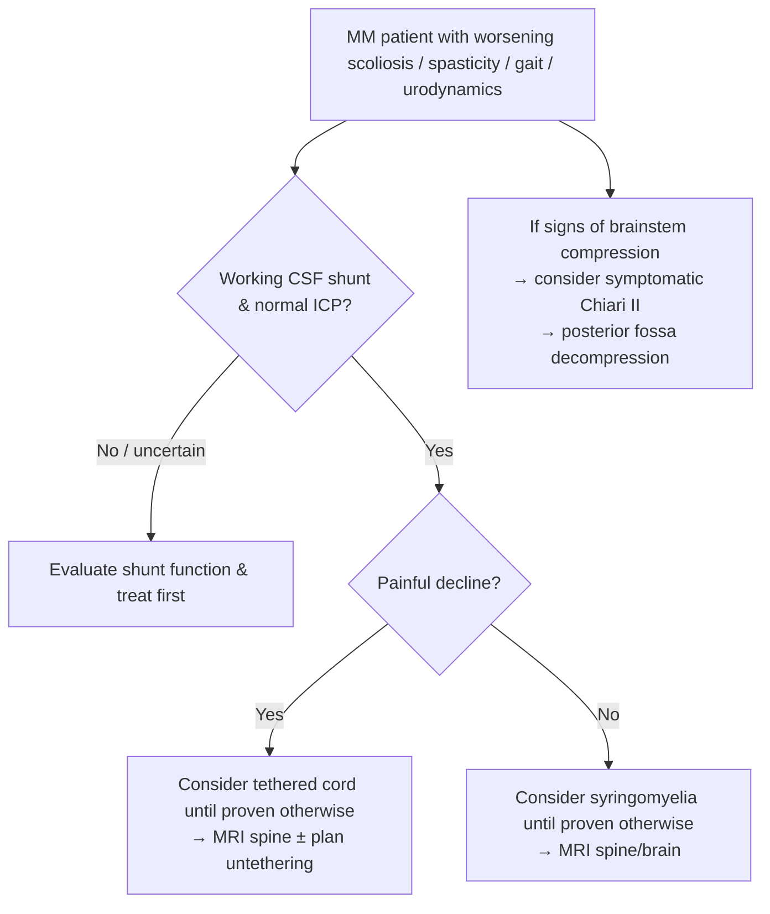

> [!summary] Lipomyelomeningodysplasia review
> 
> - **Lipomyelomeningocele** = subcutaneous **lipoma** traversing **midline fascial/osseous/dural defect** and merging with an **abnormally low, tethered conus/placode**.
> 
> - Symptoms arise from **cord tethering (growth spurts)** + **progressive fat deposition (rapid weight gain)** → progressive neuro/urologic decline.
> 
> - **Best test: MRI lumbosacral spine** (fat is **T1 hyperintense**; confirm extent with **fat-sat**); demonstrates **low conus** + lipoma/placode anatomy.
> 
> - **Cutaneous stigmata are common**; neuro exam may be **normal in up to 50%** (skin lesion only presentations occur).
> 
> - **Always document baseline bladder status**: **pre-op urologic evaluation/urodynamics**.
> 
> - **Tx = untethering + subtotal lipoma debulking + placode neurulation + watertight duraplasty**; **cosmetic excision alone** does **not** prevent deficits and can compromise definitive repair.
> 
> - **Timing:** surgery at **~2 months** of age (or **at diagnosis** if presenting later).
> 
> - Post-op outcomes (peds series): **~19% improve**, **~75% stable**, **~6% worsen**; **foot deformities** may progress regardless.
> 
> - Adult tethered cord imaging cutoffs: conus **below L2** + **filum >2 mm = pathologic** (normal **<1 mm**).
>  

## Definitions & Scope

- Lipomyelomeningodysplasia
    - Umbrella for dorsal spinal dysraphism with lipoma (i.e., Lipomyeloschisis) causing [[Tethered cord syndrome]] and/or compression.
- Clinically important lipoma-related dysraphisms (cause progressive dysfunction via tethering/compression)
    - (Intra)dural lipoma
    - Lipomyelomeningocele
    - Fibrolipoma of the filum terminale
- Key anatomic concept (lipomyelomeningocele)
    - Subcutaneous lipoma → passes through midline defect (lumbodorsal fascia + neural arch + dura) → merges with abnormally low, tethered cord/placode.
    - Subtypes: terminal, dorsal, transitional.
- Epidemiology pearls
    - Lipomas account for ~20% of covered lumbosacral masses.
    - Asymptomatic lipomas of the filum terminale on MRI: ~0.2–4%.

### Lipoma-related dysraphisms

| lipomyeloschisis spectrum              | Defining feature                                                                                                          | Why it matters                                                  |
| -------------------------------------- | ------------------------------------------------------------------------------------------------------------------------- | --------------------------------------------------------------- |
| **(Intra)dural lipoma**                | Intradural fat mass                                                                                                       | Can tether/compress cord                                        |
| **[[Lipomyelomeningocele]]**           | **Subcutaneous lipoma** traverses **midline fascial/osseous/dural defect** and merges with **low tethered conus/placode** | Classic dysraphic lipoma; surgical detethering/debulking        |
| **Fibrolipoma of the filum terminale** | Fatty/thickened filum tethering conus                                                                                     | Imaging cutoff: **>2 mm** (adult) suggests pathologic tethering |

![[Neurosurgery/Spine/_resources/Lipomyelomeningodysplasia.resources/Image 20231118 142643.jpeg]]
## Outline

- Core problem: dysraphic lipoma → tethering (worse during growth spurts) ± compression (fat deposition, worse with rapid weight gain).
- Presentation buckets
    - Cutaneous stigmata/back mass
    - Bladder dysfunction
    - Foot deformity/orthopedic issues
    - Neuro deficits can be subtle; exam may be normal.
- Workup essentials
    - MRI lumbosacral spine + baseline urology/urodynamics.
    - Plain LS spine x‑rays for bony dysraphism/segmentation anomalies.
- Management essentials
    - Early surgery: untether + reduce lipoma bulk + reconstruct placode + dural closure.
    - Expect stabilization > improvement; foot deformities may still progress.
### Presentation

| Symptom/sign/finding                                    |                                             Value |
| ------------------------------------------------------- | ------------------------------------------------: |
| Presenting with **back mass**                           |                                           **56%** |
| Presenting with **bladder problems**                    |                                           **32%** |
| Presenting with **foot deformities/paralysis/leg pain** |                                           **10%** |
| **Neuro exam normal** (often "skin lesion only")        |                                     **Up to 50%** |
| MRI: fat signal                                         | **T1 hyperintense** (confirm extent with fat-sat) |
| Surgery outcomes                                        |          **19% improve / 75% stable / 6% worsen** |
### Adult vs. pediatric 

| Childhood vs adult tethered cord (Pang & Wilberger, 1982) | Childhood                                          | Adult                                                               |
| --------------------------------------------------------- | -------------------------------------------------- | ------------------------------------------------------------------- |
| Pain                                                      | Uncommon                                           | Common (**~86%**), often peri-anal/perineal, diffuse/bilateral      |
| Foot deformities                                          | Common early; progressive cavovarus/club foot      | Typically absent                                                    |
| Progressive spinal deformity                              | Common (scoliosis)                                 | Uncommon (**<5%**)                                                  |
| Motor deficits                                            | Gait abnormalities/regression                      | Leg weakness presentation common                                    |
| Urologic symptoms                                         | Dribbling, delayed toilet training, UTIs, enuresis | Frequency/urgency/incomplete emptying, stress/overflow incontinence |
| Cutaneous stigmata                                        | **80–100%**                                        | **<50%**                                                            |
| Aggravating factors                                       | Growth spurts                                      | Trauma/stretch maneuvers, spondylosis, disc herniation, stenosis    |

## Diagnosis & Workup

- Dx: Lipomyelomeningodysplasia (dysraphic lipoma) causing [[Tethered cord syndrome]] ± compressive symptoms.
- Best test: MRI lumbosacral spine
- Rule-out:
    - In patients with prior [[Myelomeningocele]] closure + decline: shunt malfunction/↑ICP, syringomyelia, symptomatic Chiari II malformation
- Key imaging:
    - Low conus (adult tethered cord: below L2)
    - Lipoma signal: T1 hyperintense (confirm with fat suppression)
    - Filum diameter: <1 mm normal, >2 mm pathologic (adult criteria)
### Clinical evaluation

- History: back mass/skin lesion, gait regression, leg pain, foot deformity, bladder/bowel symptoms.
- Exam:
    - Cutaneous markers: fatty pad, dimple, port-wine stain, hypertrichosis, dermal sinus, skin appendage
    - Neuro: sacral sensory loss is a common abnormality; exam may be normal (≤50%)
- Urology: pre-op urologic evaluation for any deficit; consider cystometrogram/urodynamics even if "continent".
### Imaging approach

|Modality|Utility|Key limitations|
|---|---|---|
|**Plain LS x‑ray**|Detects **spina bifida** and bony anomalies (fusion/sacral defects; may see segmentation anomalies)|No soft-tissue definition|
|**[[MRI]]**|Defines **lipoma**, **placode**, **low conus**, associated anomalies; best pre-op planning|Needs appropriate sequences (include fat-sat)|
|**Myelogram/CT myelogram**|Demonstrates **low conus** when MRI not feasible|Filum "diameter" can vary with contrast concentration; inferior soft-tissue detail|
|**Ultrasound** (neonate)|Screening for dysraphism/mass when seen at birth (before posterior element ossification)|Limited beyond early infancy|

![[Neurosurgery/Spine/_resources/Lipomyelomeningodysplasia.resources/image.png|500]]
## Management

- **Tx:** surgical **detethering + subtotal lipoma debulking + placode reconstruction + duraplasty**
- **Indication:**
    - **At ~2 months of age** (or **at diagnosis** if presenting later)
    - Progressive neuro/urologic/orthopedic symptoms attributable to tethering/compression
- **Contraindication:**
    - **Cosmetic excision of subcutaneous fat pad alone** (does **not** prevent neurologic decline; can make definitive repair **difficult/impossible**)
- **Timing:** **~2 months** (peds) | adult: symptom-driven after appropriate workup

> [!checklist] Operative priorities for lipomyelomeningocele 
> 
> - **Goal 1:** **Release tethering** of conus/placode.
> 
> - **Goal 2:** **Reduce bulk** of lipoma (avoid neurologic injury → **subtotal** resection typical).
> 
> - Key steps (conceptual)
> 
>     - Mobilize subcutaneous mass to deep fascia; work from **normal dura** via intact arch exposure.
> 
>     - Identify/section constricting **fibrovascular band** (releases "kink"/constriction).
> 
>     - Open dura/arachnoid around tethered conus; **preserve dorsal roots**.
> 
>     - **Untether** cord/placode; consider neuromonitoring.
> 
>     - **Debulk** lipoma as safely possible; **leave some fat** to avoid placode injury.
> 
>     - Re-form placode into "closed neural tube" concept; **pial closure**.
> 
>     - **Watertight dural closure** (primary if possible; **duraplasty** if tension).
>  

### Expected outcomes & follow‑up

- **Outcome (peds series, post-op):** **~19% improve**, **~75% unchanged**, **~6% worsen**.
- **Orthopedic:** foot deformities may **progress** despite surgery.
- **Complication:** **CSF leak ~15%** reported (tethered cord/MM context).
- **Long-term:** retethering can recur, especially around **adolescent growth spurts**; monitor for new pain, gait change, urologic decline, scoliosis progression.

### Decision pathway

## Pitfalls & Red Flags

> [!warning]
> 
> - **Pitfall:** 
> 	- treating the **subcutaneous fat pad cosmetically** without addressing intradural tethering → does **not** prevent decline; can compromise definitive surgery.
> 	- skipping baseline **urodynamic/urologic documentation** → post-op change cannot be interpreted.
> 	- in [[Myelomeningocele]] patients, calling it "tethered cord" without confirming **shunt function/ICP**.
> 
> - **Red flag:** 
> 	- new/worsening **bladder dysfunction** (especially recurrent UTIs or new retention/incontinence pattern).
> 	- progressive **gait deterioration**, new LE weakness/atrophy, or new sacral sensory loss.
> 	- progressive **scoliosis** (benefit of untethering is greatest when curvature is **mild**).
> 
> - **Complication:** 
> 	- **CSF leak** (reported ~**15%** in tethered cord/MM context).
>  

## Self-test 

> [!question] Self‑Test
> 
> - Define **[[Lipomyelomeningocele]]** anatomically (what layers/defects does the lipoma traverse, and what does it attach to?).
> 
> - What are the **2 major mechanisms** producing symptoms in lipomyelomeningocele?
> 
> - What is the **best test** for diagnosis and operative planning?
> 
> - Name **5 cutaneous stigmata** that should trigger evaluation for occult dysraphism.
> 
> - At what **age** is surgical treatment typically recommended for lipomyelomeningocele (if diagnosed in infancy)?
> 
> - In adult tethered cord, what conus level is abnormal, and what **filum diameter** is considered pathologic?
> 
> - In a previously ambulatory **MM** patient with worsening gait and scoliosis, what must you **check first**, and how does **pain** change the leading diagnosis?
> 
> - What are the typical expected post-op outcomes (improve vs stable vs worse) after surgery for lipomyelomeningocele?
>  

### Answer key

- Define [[Lipomyelomeningocele]] anatomically
    - Subcutaneous lipoma that passes through a midline defect in:
        - Lumbodorsal fascia
        - Vertebral neural arch (spina bifida defect)
        - Dura
    - Merges with / tethers an abnormally low cord and becomes attached to the dorsal surface of the placode 
- 2 major mechanisms producing symptoms (lipomyelomeningocele)
    - Tethering of the spinal cord (esp. during growth spurts)
    - Compression from progressive fat deposition (esp. during rapid weight gain) 
- Best test (Dx + operative planning)
    - MRI spine (lumbosacral)
        - Demonstrates low conus and lipomatous mass
- 5 cutaneous stigmata → evaluate for occult dysraphism
    - Fatty subcutaneous pad / lipoma
    - Midline dimple(s)
    - Port‑wine stain / hemangiomatous lesion
    - Abnormal hair / hypertrichosis
    - Dermal sinus opening
    - _(Also acceptable: skin appendage/skin tag/tail)_ 
- Typical recommended age for surgery (diagnosed in infancy)
    - ~2 months of age (or at diagnosis if presenting later) 
- Adult tethered cord: abnormal conus level + pathologic filum diameter
    - Low conus medullaris: below L2
    - Thickened filum terminale
        - Normal <1 mm
        - >2 mm = pathologic 
- Previously ambulatory [[Myelomeningocele]] patient with worsening gait + scoliosis
    - Check first: working shunt + normal ICP (rule out shunt malfunction / raised ICP) 
    - Effect of pain on leading diagnosis
        - Painful: treat as tethered cord until proven otherwise
        - Painless: treat as syringomyelia until proven otherwise
    - Also consider brainstem compression / symptomatic Chiari II as an etiology 
- Typical post‑op outcomes after lipomyelomeningocele surgery
    - Improve: ~19%
    - Stable/unchanged: ~75%
    - Worse: ~6%
    - Foot deformities often progress regardless

