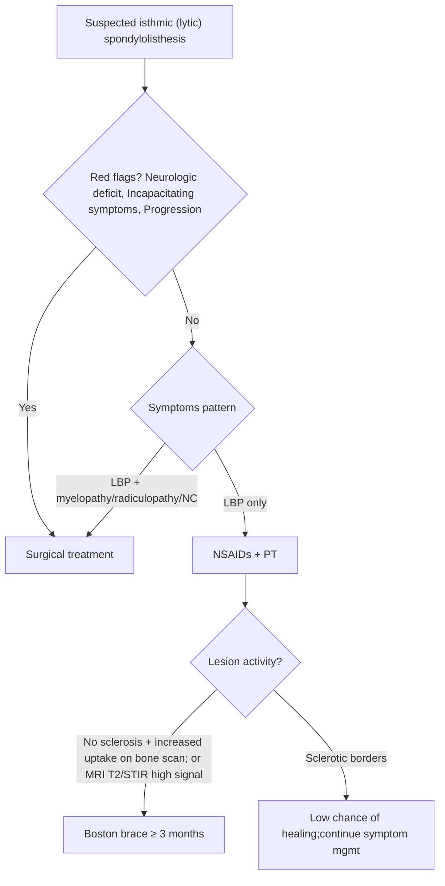

> [!summary] Spondylolisthesis Review
> 
> - **Isthmic (lytic) spondylolisthesis = pars interarticularis defect (spondylolysis)** → slip requiring **instrumentation and/or fusion** when operative
> 
> - **Most common level: L5 on S1**; next most common **L4 on L5**
> 
> - **Disc herniation at the listhesis level is rare**; MRI may show a **"pseudodisc"** mimicking HLD
> 
> - Slip-related radiculopathy typically affects the root **exiting below the pedicle** of the slipped vertebra (e.g., **L4–5 slip → L4 root**)
> 
> - **Isthmic spondylolisthesis rarely causes central canal stenosis** (only anterior VB shifts)
> 
> - Active pars lesions (**no sclerosis** + **↑ uptake bone scan** or **MRI T2/STIR high signal**) may heal with **Boston brace ≥ 3 months**
> 
> - **Surgery is reserved** for **neurologic deficit**, **incapacitating symptoms**, or **progression** of slip
> 
> - **Gill procedure** = radical root decompression + **total facetectomy** → usually **follow with fusion**
> 
> - **High-grade reduction (III–IV)**: radiculopathy risk **~50%** (some permanent) + possible **cauda equina**; stop if stimulation threshold ↑ **50%** above baseline
>  

## Definitions & Scope

- **Definition:** 
	- **Spondylolisthesis** = anterior subluxation of one vertebral body on another
	- **Isthmic (lytic) spondylolisthesis** = **pars interarticularis defect (spondylolysis)**
- **Most common levels:** **L5 on S1**; next **L4 on L5**
- **Key pathoanatomy:**
    - If radiculopathy occurs, compression tends to involve the nerve **exiting below the pedicle** of the slipped upper vertebra (example: **L4–5 slip → L4 root**)

## Outline

- **Etiology & risk**
    - Adolescents/teens: repetitive lumbar hyperextension in sports 
	    - girls: gymnasts/softball pitching
	    - boys: football
- **Clinical syndromes**
    - Many cases asymptomatic
    - symptomatic patients may have **LBP** ± **radiculopathy**/**neurogenic claudication** from foraminal compression
- **Imaging pearls**
    - True disc herniation at listhesis level is rare; MRI "roll-out" may appear as **pseudodisc**
    - Herniated disc is more common at the level **above** the listhesis
    - Active pars lesion: **↑ uptake bone scan** or **T2/STIR high signal** → may heal with rigid orthosis
- **Classification & grading**
    - **Meyerding** grading by % sagittal slip
    - Spondylolisthesis types include **dysplastic**, **isthmic**, **degenerative**, **traumatic**, **pathologic**
- **Management**
    - Conservative: 
	    - **LBP only → NSAIDs + PT**
	    - active lesion without sclerosis → **Boston brace ≥3 months**
    - Operative: 
	    - **reserved** for **neurologic deficit**, **incapacitating symptoms**, or **progression**
	    - Operative pearls: **Gill procedure + fusion**; caution with **high-grade reduction** (neurologic risk)

### Classification

| Types of spondylolisthesis     | **Key descriptor**                                                                            |
| ------------------------------ | --------------------------------------------------------------------------------------------- |
| Type 1: Dysplastic             | Congenital; upper sacrum or arch of L5 permits slip                                           |
| Type 2: Isthmic (pars-related) | Associated with athletic/repetitive trauma; may include elongated pars or acute pars fracture |
| Type 3: Degenerative           | Long-standing intersegmental instability; usually L4–5; **no pars break**                     |
| Type 4: Traumatic              | Fractures in areas other than pars                                                            |
| Type 5: Pathologic             | Generalized/local bone disease (e.g., osteogenesis imperfecta)                                |

| **Meyerding grading (sagittal slip %)** | **% subluxation (AP diameter of VB)** |
| --------------------------------------- | ------------------------------------- |
| Grade I                                 | **<25%**                              |
| Grade II                                | **25–50%**                            |
| Grade III                               | **50–75%**                            |
| Grade IV                                | **75%–complete**                      |
| Spondyloptosis                          | **>100%**                             |

![[Neurosurgery/Spine/_resources/Lytic_(Isthmic)_Spondylolisthesis.resources/image.1.png|500]]
## Diagnosis & Workup

### Clinical pattern

- **Dx:** Isthmic (lytic) spondylolisthesis 
- **Best test:** lumbosacral spine x-rays (identify slip) 
- **Rule-out:** disc herniation above level; pseudodisc at level 
- **Key imaging:** Meyerding % slip grading
- **Pattern:** symptoms often resemble **neurogenic claudication**; true radiculopathy can occur
- **Localization rule:** slip-related compression tends to involve the root **exiting below the pedicle** of the slipped vertebra
- **Adolescents:** cessation of sports for several months usually leads to resolution; surgery sometimes done if unwilling to discontinue athletics
### Imaging strategy

- Slip level & grading 
	- **Best test:** x-ray grading via **Meyerding** 
	- **Rule-out:** misinterpretation of pseudodisc as HLD 
	- **Key imaging:** **L5 on S1** most common, then **L4 on L5**
- Active pars lesion (healing potential) vs chronic defect 
	- **Best test:** bone scan or MRI showing **T2/STIR high signal** 
	- **Rule-out:** chronic defect with **sclerotic borders** 
	- **Key imaging:** active lesion findings support trial of rigid orthosis
- Neural compression (radiculopathy/claudication) 
	- **Best test:** MRI (impingement on neural structures; loss of CSF signal on T2) 
	- **Rule-out:** incidental/asymptomatic abnormalities (up to **33%** in ages 50–70 without back-related symptoms) 
	- **Key imaging:** MRI is poor for visualizing bone

![[Neurosurgery/Spine/_resources/Lytic_(Isthmic)_Spondylolisthesis.resources/image.png|700]]

### Differential diagnosis

| Differential                        | Distinguishing clue                             | Key imaging pearl                                                   |
| ----------------------------------- | ----------------------------------------------- | ------------------------------------------------------------------- |
| Disc herniation at listhesis level  | **Rare** at level of slip                       | MRI may show **pseudodisc** mimicking HLD                           |
| Disc herniation **above** listhesis | More common than at listhesis level             | Evaluate adjacent level carefully                                   |
| Degenerative spondylolisthesis      | **No break in pars**; usually **L4–5**          | Commonly incidental/asymptomatic (epidemiology context)             |
| Central canal stenosis              | Isthmic slip **rarely** causes central stenosis | If central stenosis dominates, look for other contributors (VERIFY) |
## Management

### Nonoperative

- Activity modification / sport cessation
	- **Indication:** adolescent/teen athletes with symptomatic spondylolisthesis from repetitive hyperextension 
	- **Contraindication:** unwillingness to discontinue athletics (may prompt surgery)
	- **Timing:** several months
- Rigid orthosis (e.g., **Boston brace**) 
	- **Indication:** **no sclerosis** + **↑ uptake bone scan** or **MRI T2/STIR high signal** (active lesion) 
	- **Contraindication:** **sclerotic borders** (little chance of healing) 
	- **Timing:** **≥ 3 months**
- NSAIDs + PT 
	- **Indication:** **LBP only** 
	- **Timing:** first-line symptom management
- TLSO + prolonged PT 
	- **Indication:** pediatric patients with symptoms (nonoperative option) 
	- **Timing:** **6–9 months**

### Operative 

- Surgical treatment 
	- **Indication:** **neurologic deficit**, **incapacitating symptoms**, or **progression** of slip 
	- **Contraindication:** active lesion likely to heal in rigid orthosis when no red flags 
	- **Timing:** urgent if deficit/progression; otherwise after conservative trial 
- Gill procedure** + fusion 
	- **Indication:** nerve root compression requiring radical decompression (e.g., far-lateral compression) 
	- **Contraindication:** decompression alone when **total facetectomy** performed (iatrogenic instability risk) 
	- **Timing:** when operative decompression is required
    - **Key operative concept:** removal of loose posterior elements + **total facetectomy**; usually followed by **posterolateral or interbody fusion**; fusion may be enhanced by internal fixation (e.g., **transpedicular screw-rod**)
- Reduction + instrumentation + fusion 
	- **Indication:** selected cases; **grade I–II** reduction has low nerve root injury risk 
	- **Contraindication:** high-grade reduction when neurologic risk unacceptable 
	- **Timing:** gradual reduction with neuromonitoring
    - **Complication:** high-grade (**III–IV**) reduction → radiculopathy in **~50%** (some permanent) + potential **cauda equina** (root stretch/distraction)
    - **Tip:** intra-op stimulation/EMG during reduction; **stop** if stimulation current requirement increases **50% above baseline**

| **Reduction of spondylolisthesis  (risk + monitoring)** | **Key point**                                                                             |
| ---------------------------------------------------------- | ----------------------------------------------------------------------------------------- |
| Grade I–II reduction                                       | Low risk of nerve root injury                                                             |
| Grade III–IV reduction                                     | Radiculopathy risk **~50%** (some permanent); may cause **cauda equina** from distraction |
| Intra-op mitigation                                        | Stimulate nerve + EMG; stop if stimulation threshold ↑ **50%** above baseline             |
### Decision pathway (source-supported)

## Pitfalls & Red Flags

> [!warning]
> 
> - **Pitfall:** 
>   - Misreading MRI **pseudodisc** at listhesis level as true disc herniation
>   - Assuming **central canal stenosis** is from an isthmic slip (central stenosis is **rare** in isthmic)
>   - Expecting healing in lesions with **sclerotic borders** (usually well-established; little chance of healing)
>   - Performing radical decompression (Gill/total facetectomy) without stabilization; Gill is typically followed by **fusion**
>   - Progression can occur without surgery but is **more common following surgery**
> 
> - **Red flag:** 
>   - **Neurologic deficit** or **incapacitating symptoms** → operative pathway
>   - **Progression of spondylolisthesis** → operative pathway
>   - High-grade reduction without careful neuromonitoring; radiculopathy risk **~50%** and possible **cauda equina**
> 
>  

## Self-test

> [!question] Self‑Test
> 
> - Define **isthmic (lytic) spondylolisthesis** in one line (anatomic defect + consequence).
> 
> - What are the **two most common slip levels**?
> 
> - In an **L4–5 spondylolisthesis**, which root is typically compressed and why?
> 
> - What is an MRI **"pseudodisc"** and why is it a pitfall?
> 
> - Meyerding **Grade III** corresponds to what % slip?
> 
> - Which imaging findings suggest an **active pars lesion with healing potential**?
> 
> - List Greenberg indications where **surgery is reserved** in isthmic spondylolisthesis.
> 
> - What are the defining steps of the **Gill procedure**, and what must usually accompany it?
> 
> - What is the neurologic complication risk of **high-grade reduction**, and what intra-op stop-rule is suggested?
>  

### Answer key

1. Define isthmic (lytic) spondylolisthesis:  
    Pars interarticularis defect (spondylolysis) → allows anterior subluxation (“slip”) of the involved vertebral body on the one below.
    
2. Two most common slip levels:  L5 on S1 (most common), then L4 on L5.
    
3. In an L4–5 spondylolisthesis, which root is typically compressed and why?  
    L4 root—compression tends to involve the root exiting below the pedicle of the anteriorly subluxed upper vertebra, typically from upward displacement of the superior articular facet of the level below + disc material (± fibrous/inflammatory mass).
    
4. MRI “pseudodisc” and why it’s a pitfall:  
    A disc that “rolls out” as it is uncovered at the level of the listhesis, creating MRI findings that mimic a true herniated disc—pitfall because true HLD at the level of the listhesis is rare.
    
5. Meyerding Grade III = what % slip? 50–75%.
    
6. Imaging findings suggesting an _active_ pars lesion with healing potential:  
    No sclerosis + increased uptake on bone scan and/or MRI high-signal changes on T2WI or STIR.
    
7. Indications where surgery is reserved (isthmic spondylolisthesis):  
    Neurologic deficit, incapacitating symptoms, or progression of the spondylolisthesis.
    
8. Gill procedure: defining steps + what must usually accompany it:  
    Radical nerve root decompression with removal of loose posterior elements and total facetectomy; it is most usually followed by fusion (posterolateral or interbody), often with internal fixation to improve fusion rate.
    
9. Neuro complication risk of high-grade reduction + intra-op stop-rule:  
    High-grade (III/IV) reduction carries radiculopathy risk (e.g., L5) in ~50% (some permanent) and may cause cauda equina syndrome from root stretch/distraction; suggested monitoring: stimulate the nerve with EMG recording during gradual reduction and stop if the stimulation current requirement rises ≥50% above baseline.