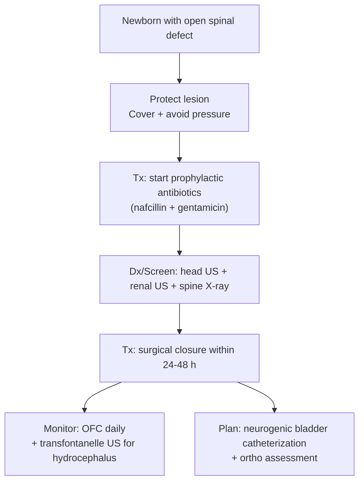

See also [[Lipomyelomeningodysplasia]]

> [!summary] Myelomeningocele Review
> 
> - **Myelomeningocele (MMC)** = **open spina bifida** with **exposed neural placode** and **no skin covering**.
> 
> - **Incidence ~1/1000 live births**; among the **most common CNS congenital anomalies**.
> 
> - Deficit severity tracks **anatomic level**: **above L3 → non-ambulatory**, **S1–L3 → assisted ambulation**, **below S1 → independent ambulation**.
> 
> - **Neurogenic bladder ~90%** → early urology plan + **clean intermittent catheterization**.
> 
> - Strong associations: **Chiari II malformation (>95%)** and **hydrocephalus (80–95%)** → **serial head circumference + cranial US**.
> 
> - Prenatal screening: **↑ maternal serum AFP**, **↑ amniotic AFP + AChE**, fetal US **lemon sign** (± **banana sign**).
> 
> - Sac rupture → **CSF leak/meningitis** risk → early **prophylactic antibiotics** (**nafcillin + gentamicin**).
> 
> - **Definitive Tx:** **postnatal closure within 24–48 h**.
> 
> - **Prenatal fetal MMC repair**: **↓ shunt need**, **↑ motor outcomes**, but **↑ preterm labor/uterine dehiscence**.
>  

## Definitions & Scope

- **Definition:** **Myelomeningocele (MMC)** = **open neural tube defect** with herniation of **meninges + spinal cord/neural tissue** through a vertebral defect
    - **Key anatomic hallmark:** **neural placode** (flat plate of exposed neural tissue) with **raw dorsal surface** representing tissue that should be internal
- **Scope within spina bifida**
    - **Open spina bifida:** MMC (no skin covering; infection/CSF leak risk)
    - **Closed dysraphism:** skin-covered lesions (e.g., meningocele/lipomyelomeningocele) 

| Feature         | Myelomeningocele (MMC)                                        |
| --------------- | ------------------------------------------------------------- |
| Defect type     | **Open neural tube defect**                                   |
| Tissue involved | **Meninges + spinal cord/neural placode**                     |
| Skin covering   | **Absent** (**no skin cover**)                                |
| Immediate risks | **CSF leak**, **meningitis/ventriculitis**, trauma to placode |

![[Neurosurgery/Spine/_resources/Myelomeningocele.resources/image.5.png|300]]

## Outline

- Epidemiology
    - ~1/1000 live births
    - Most common nervous system anomaly
- Presentation
    - Back mass: sac-like cystic structure with thin, partially epithelialized tissue
    - CSF leak risk: sac rupture → CSF leak ± meningitis
    - Neurologic deficit: flaccid paralysis + sensory loss below lesion
    - GU/bowel dysfunction: ~90% → constant urinary dribbling ± relaxed anal sphincter
    - Cognition: normal intelligence ~75%
- Key associations
    - Chiari II malformation: >95% (major mortality driver)
    - Hydrocephalus: 80–95%
- Functional prognosis (high-yield)
    - Ambulation correlates with lesion level (see tables)

| **Associated finding** | **Frequency** | **Relevance**                                           |
| ---------------------- | ------------: | ------------------------------------------------------- |
| Chiari II malformation |          >95% | Most common cause of death (brainstem dysfunction risk) |
| Hydrocephalus          |        80–95% | Requires serial screening; often needs CSF diversion    |
| GU tract dysfunction   |          ~90% | Early urology; catheterization plan                     |
| Normal intelligence    |          ~75% | Cognitive outcomes often preserved                      |

| Lesion level (functional) | Expected ambulation (per notes)       | Typical motor implication                |
| ------------------------- | ------------------------------------- | ---------------------------------------- |
| Above L3              | Wheelchair bound                  | Deficits preclude independent ambulation |
| S1–L3                 | Ambulation with assistive devices | Variable hip/knee/ankle weakness         |
| Below S1              | Unaided ambulation                | Mild distal deficits possible            |

## Pathophysiology

- Open neural tube defect
- Failure of focal spinal cord segment to form a tube → ==neural folds persist as neural placode==

![[Neurosurgery/Spine/_resources/Myelomeningocele.resources/image.png|400]]

### How myelomeningocele leads to Chiari II malformation

> [!info] Myelomeningocele → Hydrocephalus (Mechanism)
> 
> - **Core link:** **MMC** → **Chiari II** complex → **CSF flow impairment** → **hydrocephalus**
> 
> - **Key concept:** open lesion **vents CSF in utero**; after **closure**, hydrocephalus often **declares/worsens**
>  

- **Open neural tube defect** (MMC) → **chronic fetal CSF leakage**
- ↓ **ventricular distention/pressurization** during development → **small/crowded posterior fossa**
- **Hindbrain displacement** (Chiari II): downward shift of **vermis/brainstem/4th ventricle**
- **CSF pathway compromise**
    - **Obstructive component:** distortion/crowding at **aqueduct** and/or **4th ventricle outlets / foramen magnum**
    - **± Communicating component:** reduced/abnormal **subarachnoid space** → impaired CSF egress/absorption
### Why hydrocephalus appears after MMC closure

- Pre-closure: lesion acts as a **CSF "pop-off"**
- Post-closure: vent removed + ongoing CSF production + persistent Chiari II-related flow limitation → **ventriculomegaly/↑ICP**

> [!info] High yield review
> 
> - **Unifying mechanism:** fetal **CSF leak** → **underdeveloped posterior fossa** → **Chiari II** → **hydrocephalus**
> 
> - *Post-closure worsening:** loss of **CSF venting** unmasks **CSF flow obstruction/limited compliance**
>

## Diagnosis & Workup

### Prenatal

- Suspected MMC on screening + fetal imaging
- **Best test:** **targeted fetal ultrasound** (structural survey of spine + cranial markers)
- **Rule-out:** other causes of spinal mass or neural tube defect (see differentials table)
- **Key imaging:**
    - **Lemon sign:** **bifrontal narrowing/indentation** of frontal bones
    - **Banana sign** (Chiari II cerebellar shape)
- **Screening labs**
    - **Maternal serum:** **↑ AFP**
    - **Amniocentesis:** **↑ AFP** and **↑ acetylcholinesterase (AChE)**

| Prenatal test            | Typical finding                                  | Use                              |
| ------------------------ | ------------------------------------------------ | -------------------------------- |
| Maternal serum screening | **↑ AFP**                                        | Screening for open NTD           |
| Amniocentesis            | **↑ AFP**, **↑ AChE**                            | Confirmation/support of open NTD |
| Fetal ultrasound         | **Lemon sign** (bifrontal narrowing/indentation) | Key antenatal imaging clue       |
![[Neurosurgery/Spine/_resources/Myelomeningocele.resources/image.1.png|300]]![[Neurosurgery/Spine/_resources/Myelomeningocele.resources/image.2.png|300]]
### Postnatal (pre-op and surveillance)

- Visible open spinal defect + neuro exam (motor/sensory level) + associated anomaly screen
- **Best test:** **cranial ultrasound** for **Chiari II/hydrocephalus** screening
- **Rule-out:** **infection** if sac rupture/CSF leak (clinical; CSF studies only if safe/appropriate)
- **Key imaging / studies (per notes)**
    - **Head US:** Chiari II features, ventriculomegaly/hydrocephalus baseline
    - **Renal US:** baseline urinary tract assessment
    - **Spine X-ray:** bony level assessment (adjunct)
- **Hydrocephalus surveillance
    - **Daily occipital-frontal circumference**
    - **Baseline trans-fontanel ultrasound** (repeat as indicated)

## Management

| Intervention          | Tx                                                          | Indication                           | Key trade-off                                                                         |
| --------------------- | ----------------------------------------------------------- | ------------------------------------ | ------------------------------------------------------------------------------------- |
| Delivery planning     | **Atraumatic delivery**; **prelabor C-section** (per notes) | Reduce sac rupture/trauma            | -                                                                                     |
| Antibiotics           | **Nafcillin + gentamicin** (per notes)                      | Prevent **meningitis/ventriculitis** | Nephro/oto-toxicity monitoring (aminoglycoside)                                       |
| Postnatal closure     | **Repair within 24–48 h**                                   | Open placode/CSF leak risk           | Requires coordinated neonatal + OR workflow                                           |
| Prenatal fetal repair | **Intrauterine MMC repair**                                 | Selected cases                       | **↑ preterm labor**, **↑ uterine dehiscence**; **↓ shunt need**, **↑ motor outcomes** |

### Delivery planning

- Atraumatic delivery
    - **Indication:** minimize sac trauma/rupture
    - **Timing:** planned delivery
- Prelabor C-section
    - **Indication:** open MMC with exposed sac/placode
### Immediate postnatal care (until closure)

- Protect exposed neural tissue
    - **Indication:** **ALWAYS** treat as **open CNS tissue** with infection/trauma risk
    - **Contraindication:** **NEVER** apply pressure to sac/placode
- Prophylactic antibiotics
    - **Regimen:** **nafcillin + gentamicin**
    - **Indication:** prevent **meningitis/ventriculitis**
    - **Timing:** start early and continue through peri-op window (VERIFY duration)
- Early multidisciplinary involvement
    - **Urology:** neurogenic bladder plan
    - **Orthopedics:** deformity evaluation + ambulatory aids planning

> [!checklist] Delivery-room → OR checklist (MMC)
> 
> - **Best next step:** **cover lesion** with sterile, non-adherent dressing (moist) + position to avoid pressure (VERIFY dressing protocol)
> 
> - **Tx:** start **prophylactic antibiotics** (**nafcillin + gentamicin** per notes)
> 
> - **Dx:** baseline neuro exam + document motor/sensory level
> 
> - **Key imaging:** **head US** (Chiari II/hydrocephalus), **renal US**, **spine X-ray**
> 
> - **Timing:** plan **definitive closure within 24–48 h**
>  

### Definitive surgical treatment

- Postnatal MMC repair/closure
    - **Timing:** **within 24–48 h**
    - **Indication:** open neural placode / CSF leak risk / infection prevention
    - **Goal:** protect neural tissue + achieve **watertight closure**

### Prenatal (fetal) MMC repair

- Intrauterine fetal MMC repair
    - **Benefit:** **reduced need for shunting** + **improved motor outcomes**
    - **Complication:** **preterm labor**; **uterine dehiscence**

### Neurogenic bladder / bowel 

- Regular catheterization** if neurogenic bladder
    - **Indication:** urinary retention/incontinence prevention + renal preservation strategy
- Bowel program as needed

## Pitfalls & Red Flags

> [!warning]
> 
> - **Red flag:** 
> 	- **CSF leak** (wet dressing/sac rupture) → **meningitis/ventriculitis** risk; **Best next step:** urgent coverage + antibiotics + expedited closure planning
> 	- rapidly increasing head circumference/bulging fontanelle → progressive **hydrocephalus**
> 
> - **Pitfall:** 
> 	- delaying closure beyond **24–48 h** without clear reason
> 	- incomplete associated-anomaly screen (missed **Chiari II/hydrocephalus** or renal issues)
> 	- under-treating **neurogenic bladder** early → long-term renal damage risk
> 
> - **Complication:** 
> 	- **Chiari II-related brainstem dysfunction** (major mortality driver per notes)
>  

## Self-test

> [!question] Self-Test
> 
> 1. Define **myelomeningocele** and name the key exposed structure.
> 
> 2. What are the typical **prenatal screening** abnormalities (serum + amniotic fluid)?
> 
> 3. What is the **lemon sign**, and what does it suggest?
> 
> 4. List the two most common major associated conditions and their approximate frequencies.
> 
> 5. What is the standard **timing** for postnatal MMC closure?
> 
> 6. What antibiotic combination is listed for prophylaxis in these notes?
> 
> 7. Match lesion level to ambulation prognosis: **above L3**, **S1–L3**, **below S1**.
> 
> 8. What GU issue occurs in ~90% of cases, and what is a core initial management step?
> 
> 
> **Answer key**
> 
> 1. Open spina bifida with **meninges + spinal cord/neural tissue** herniation; **neural placode** exposed; **no skin cover**.
> 
> 2. **↑ maternal serum AFP**; **↑ amniotic AFP + ↑ AChE**.
> 
> 3. **Bifrontal skull narrowing/indentation**; suggests open spina bifida/MMC.
> 
> 4. **Chiari II >95%**; **hydrocephalus 80–95%**.
> 
> 5. **Within 24–48 hours** after birth.
> 
> 6. **Nafcillin + gentamicin**.
> 
> 7. **Above L3 → wheelchair**; **S1–L3 → assisted ambulation**; **below S1 → independent**.
> 
> 8. **Neurogenic bladder**; **regular/clean intermittent catheterization**.
>  

