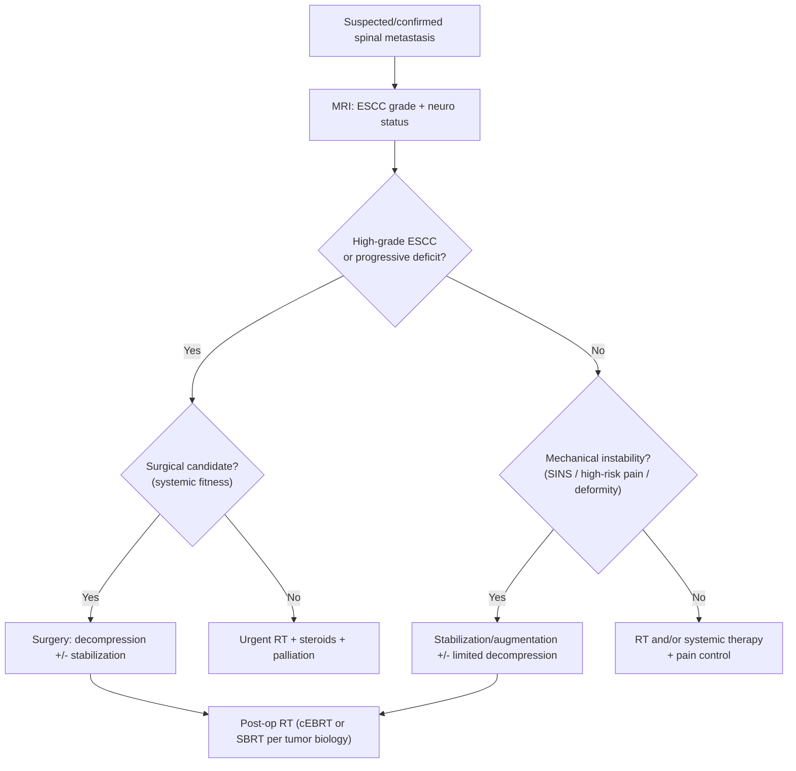

> [!summary] NOMS Review
> 
> - **NOMS** (**Neurologic–Oncologic–Mechanical–Systemic**) = framework for choosing **surgery vs radiation vs systemic/palliation**.
> 
> - Suspect ESCC in cancer pt with **back pain persistent in recumbency**; SEM occurs in **≈10%** of all cancer patients.
> 
> - **Best test:** **STAT MRI**; if delayed and ESCC suspected, start **dexamethasone**.
> 
> - **Dexamethasone (DMZ)** relieves pain in **~85%**; suggested **10 mg IV/PO q6h ×72 h → 4–6 mg q6h** (optimal dose unknown).
> 
> - **>80% block** or **rapid neurologic progression** → **emergency treatment ASAP** (surgery or XRT).
> 
> - Typical ESCC XRT: **30–40 Gy / 10 fractions** over **7–10 d**, field **2 levels above/below**.
> 
> - Surgery indications include **instability**, **radioresistant/progressing tumor**, **bone compression/deformity**, **unknown primary needing tissue**, **rapid deterioration**.
> 
> - Surgery usually not helpful if **total paralysis >8 h** or **nonambulatory >24 h**; consider **survival ≤3–4 mo** and **multilevel disease** as relative contraindications.
> 
> - Patchell RCT: **surgery + XRT** improved ambulation vs **XRT alone** (e.g., **84% vs 57% ambulatory after treatment**).
>  

## Definitions & Scope

- **NOMS:** decision framework for spinal metastases integrating:
    - **Neurologic** (ESCC grade + neuro deficit), **Oncologic** (tumor biology/radiosensitivity), **Mechanical** (instability), **Systemic** (fitness/prognosis).
- **SEM / ESCC / MSCC:**
    - **SEM** = spinal epidural metastases
    - **ESCC** = epidural spinal cord compression
    - **MSCC** = metastatic spinal cord compression.
- **Anatomic nuance:**
    - Conus medullaris and cauda equina mets are commonly considered together as **ESCC** (no outcome difference above vs below conus).

## Epidemiology

| SEM / ESCC epidemiology & key facts | Value                                                          |
| ----------------------------------- | -------------------------------------------------------------- |
| Occurs in cancer patients           | ≈10% develop SEM at some time                                  |
| Common primaries                    | Lung, breast, GI, prostate, melanoma, lymphoma (≈80% of cases) |
| Typical compartment                 | 96–98% epidural; 2–4% intradural; 1–2% intramedullary          |
| Most common region                  | Thoracic 50–60%                                                |
| Most common presenting symptom      | Pain up to 95%                                                 |
## NOMS Framework

- **Recognize**: cancer + **recumbent/night back pain** ± radicular pain ± neuro deficit → assume ESCC until ruled out.
- **Stratify (NOMS)**:
    - **N:** ESCC grade + neuro status
    - **O:** radiosensitivity/systemic options
    - **M:** instability (SINS)
    - **S:** performance status/prognosis

| NOMS domain       | What to assess                                   | Treatment implications                     |
| ----------------- | ------------------------------------------------ | ------------------------------------------ |
| **N: Neurologic** | Neuro deficit + ESCC grade on MRI                | Decompression vs RT alone                  |
| **O: Oncologic**  | Histology, radiosensitivity, systemic options    | cEBRT vs SBRT vs systemic therapy          |
| **M: Mechanical** | Instability (SINS), deformity, fracture          | Stabilization/augmentation ± decompression |
| **S: Systemic**   | Performance status, comorbidity, life expectancy | Surgical candidacy vs palliation           |
![[Neurosurgery/Spine/_resources/NOMS_framework.resources/IMG_0832.PNG|700]]

## Diagnosis & Workup

### Clinical suspicion & triage

- **Dx:** ESCC/SEM in any cancer pt with **back pain persistent in recumbency** ± neuro deficits.
- **Best test:** **STAT MRI** spine (CT if MRI unavailable).
- **Rule-out:** spinal epidural abscess, epidural hematoma, degenerative disc herniation/cauda equina syndrome, primary spinal tumor, vertebral fracture.
- **Key imaging:** 
	- MRI for epidural tumor/cord compression
	- CT for osseous anatomy and planning (include ≥2 levels above/below involved level).
- **Red flag:** rapid progression (hours–days) of cord compression symptoms (e.g., **urinary urgency**, **ascending numbness**) → immediate evaluation (Group I).
- **Pitfall:** mild signs (e.g., isolated Babinski) still require admission and evaluation within 24 h (Group II).
### Neurologic assessment

- Focused exam:
    - Motor (MRC), sensory level, long-tract signs, rectal tone/perianal sensation, bladder function; document baseline ambulatory status.
- Functional grading:
    - Prefer standardized scoring (e.g., **ASIA impairment scale**) for serial exams; presenting neuro status is prognostic.
- Conus vs cauda equina pattern (localization when imaging delayed):
    - Key distinguishing features summarized in Tables & Scales.

| Conus vs cauda equina (metastases) | Conus medullaris                                               | Cauda equina                                                            |
| ---------------------------------- | -------------------------------------------------------------- | ----------------------------------------------------------------------- |
| Pain                               | Rare; when present usually bilateral/symmetric perineum/thighs | Often prominent; severe radicular in perineum/thighs/legs/back/bladder  |
| Sensory                            | Saddle; bilateral/symmetric; sensory dissociation              | Saddle; typically no sensory dissociation; may be unilateral/asymmetric |
| Motor                              | Symmetric; not marked; fasciculations may occur                | Asymmetric; more marked; atrophy may occur; fasciculations rare         |
| Autonomic                          | Prominent early                                                | Late                                                                    |
#### Bilsky Grading (neurological)

| Bilsky ESCC grade | MRI description                                     | Typical NOMS relevance                        |
| ----------------: | --------------------------------------------------- | --------------------------------------------- |
|                 0 | Bone-only disease (no epidural tumor)               | RT/systemic; assess stability                 |
|                1a | Epidural impingement without thecal sac deformation | RT-based if stable and no myelopathy          |
|                1b | Thecal sac deformation without cord abutment        | RT-based if stable; monitor neuro             |
|                1c | Cord abutment without cord compression              | RT vs surgery depends on histology/stability  |
|                 2 | Cord compression with residual CSF visible          | Often needs decompression for durable control |
|                 3 | Cord compression with no CSF around cord            | Urgent decompression if surgical candidate    |
![[Neurosurgery/Spine/_resources/NOMS_framework.resources/IMG_2192.PNG|212]]![[Pasted image 20260217160336.png|300]]
### SINS Grading (mechanical)

| SINS component             | Scoring (points)                                                                     | Notes                                                           |
| -------------------------- | ------------------------------------------------------------------------------------ | --------------------------------------------------------------- |
| Location                   | Junctional (3);  Mobile spine (2);  Semi-rigid (1);  Rigid (0)              | Junctional:  - occiput–C2 - C7–T2 - T11–L1 - L5–S1  |
| Pain                       | **Mechanical pain** (3);  Occasional non-mechanical (1);  Pain-free lesion (0) | Mechanical = movement/load pain,  improves with rest/bracing |
| Bone lesion quality        | Lytic (2);  Mixed (1);  Blastic (0)                                            |                                                                 |
| Alignment                  | Subluxation/translation (4);  De novo deformity (2);  Normal (0)               |                                                                 |
| Vertebral body collapse    | >50% (3);  <50% (2);  No collapse + >50% body  (1);  None (0)               |                                                                 |
| Posterolateral involvement | Bilateral (3);  Unilateral (1);  None (0)                                      | Facet/pedicle/costovertebral involvement                        |

| SINS total | Stability interpretation | Practical action                                              |
| ---------: | ------------------------ | ------------------------------------------------------------- |
|        0–6 | Stable                   | Nonoperative stabilization;  RT/systemic as appropriate    |
|       7–12 | Potentially unstable     | Spine surgery consultation;  consider bracing/augmentation |
|      13–18 | Unstable                 | Stabilization surgery if feasible                             |

> [!NOTE]- SINS components
> ![[Neurosurgery/Spine/_resources/NOMS_framework.resources/IMG_2193.PNG|300]]

![[Pasted image 20260217160832.png|700]]
### Imaging

- MRI:
    - Identify epidural mass, cord/cauda compression, level(s), and soft-tissue component.
- Plain films:
    - Whole-spine x-rays: abnormal in **67–85%** (screen for bony disease/levels).
- CT:
    - If time permits, CT through involved levels + ≥2 levels above/below for bony collapse/retropulsion and instrumentation planning.
- Myelography (when MRI unavailable/contraindicated):
    - Epidural lesion: "hourglass" deformity (incomplete block) or "paintbrush" effect (complete block).

### Staging / primary workup

- High-yield primaries:
    - Lung, breast, GI, prostate, melanoma, lymphoma account for **≈80%** of cases.
- Bone scan:
    - Abnormal in **≈66%** of patients with spine mets (time permitting).
- Tissue diagnosis:
    - **Indication:** unknown primary and no prior tissue diagnosis (CT-guided biopsy often feasible).

## Spinal metastasis features

### Osteolytic vs osteoblastic

Osteoblastic
- Prostate cancer (most common, 62-90% osteoblastic lesions
- Small cell lung cancer
- Carcinoid tumors
- Hodgkin lymphoma
- Medulloblastoma
- Breast cancer (15-20% have osteoblastic or mixed lesions)

Osteolytic
- Non-small cell lung cancer (40% develop bone metastases)
- Renal cell carcinoma (20-35% develop bone metastases)
- Thyroid cancer (mostly osteolytic with reactive bone formation)
- Multiple myeloma
- Melanoma
- Non-Hodgkin lymphoma
- Breast cancer (predominantly osteolytic in 56-85% of cases)

Mixed Lesions
- Breast cancer (most commonly demonstrates mixed
- Lung carcinoma (15% mixed)
- Prostate cancer (15-24% mixed)
- Gastrointestinal cancers
- Squamous cell carcinomas
### Radiosensitivity

> [!NOTE]- Radiosensitivity summary
> ![[Neurosurgery/Spine/_resources/NOMS_framework.resources/IMG_2194.PNG|500]]

Radiosensitive Tumors
- Hematological malignancies (lymphoma, multiple myeloma)
- Breast cancer
- Prostate cancer
- Small cell lung cancer

Radioresistant Tumors
- Renal cell carcinoma
- Thyroid cancer
- Non-small cell lung cancer
- Melanoma
- Sarcoma
- Colon carcinoma
## Management

### Immediate management (suspected ESCC)

> [!checklist]
> 
> - Stabilize + prevent neurologic decline 
>   - **Indication:** suspected ESCC 
>   - **Timing:** immediately
> 
> -  Neuro exam + document ambulation + bladder status (baseline)
> 
> -  **Dexamethasone (DMZ)** 
> 
> -  **STAT MRI** (CT if MRI unavailable)
> 
> -  Analgesia + early mobilization plan/bracing as appropriate
> 
> -  Early multidisciplinary planning: spine surgery + radiation oncology + medical oncology
>  

| Urgency & steroid strategy                     | Guidance                                                                                     |
| ---------------------------------------------- | -------------------------------------------------------------------------------------------- |
| **>80% block** or rapid progression of deficit | **Emergency treatment ASAP** (surgery or XRT)                                                |
| If treating with XRT in the above scenario     | Continue **DMZ 24 mg IV q6h ×2 days**, then taper during XRT (≈2 wks)                        |
| **<80% block**                                 | Treat on "routine" basis                                                                     |
| If treating with XRT with <80% block           | Continue **DMZ 4 mg IV q6h**, taper during treatment as tolerated                            |
| Steroid effect & suggested baseline dosing     | Pain relief in ~85%; suggested **10 mg IV/PO q6h ×72 h → 4–6 mg q6h** (optimal dose unknown) |
### NOMS-directed definitive treatment

- Treat ESCC using NOMS domains 
	- **Indication:** confirmed metastatic spinal lesion 
	- **Timing:** same admission
- **Neurologic (N):**
    - Low-grade ESCC without myelopathy: RT (conventional or SBRT) if oncologically appropriate.
    - High-grade ESCC and/or progressive neuro deficit: consider surgical decompression to preserve/restore function, then RT (if candidate).
- **Oncologic (O):**
    - **Radiosensitive** tumors (e.g., lymphoma, myeloma)
	    - often RT-first; surgery generally reserved for instability or diagnostic/structural indications.
    - **Radioresistant** tumors (e.g., renal cell, melanoma)
	    - favor SBRT when feasible; decompression may be needed to allow safe RT dose delivery.
- **Mechanical (M):**
    - Instability → **stabilization** (instrumented fixation and/or vertebral augmentation) regardless of ESCC grade.
    - Posterior fusion after RT may improve pain/stability in selected cases.
- **Systemic (S):**
    - Consider prognosis, comorbidity, and ability to tolerate surgery
    - Expected survival ≤3–4 months is a relative contraindication to major surgery.

### Radiation therapy

- Tx: External beam radiation therapy (XRT) 
	- **Indication:** epidural lesion without surgical indication or as adjunct to surgery 
	- **Timing:** based on block/neurologic tempo
- **Tx:** Biopsy then XRT 
	- **Indication:** no neurologic compromise and no bony instability (typical pathway).
- Typical regimen: **30–40 Gy / 10 fractions** over **7–10 days**, field **2 levels above/below** lesion.
- Comparative effectiveness:
    - XRT is "usually as effective as laminectomy" with fewer complications; surgery reserved for specific indications.
- Urgency:
    - **>80% block** or rapid progression → **emergency** treatment ASAP.

| XRT for epidural lesion | Value                                                                                                       |
| ----------------------- | ----------------------------------------------------------------------------------------------------------- |
| Typical regimen         | **30–40 Gy** in **10 treatments** over **7–10 d**                                                           |
| Field                   | Ports extend **2 levels above and below** lesion                                                            |
| Comparative note        | XRT usually as effective as laminectomy with fewer complications; surgery reserved for specific indications |
### Surgery 

- **Tx:** Decompression and/or stabilization 
	- **Indication:** see Table (surgical indications) 
	- **Contraindication:** see Table (contraindications)
- Operative strategy:
    - Favor approaches directed at tumor location with stabilization when vertebral body involvement is significant; simple laminectomy can be destabilizing and less effective.
    - Laminectomy alone: instability occurs in **~9%** without stabilization.
- Outcomes:
    - Patchell RCT: surgery + XRT improved ambulation vs XRT alone (see table).
- **Contraindication:** surgery usually not recommended if **total paralysis >8 h** or **nonambulatory >24 h** (minimal chance of recovery).

| Patchell RCT: XRT alone vs surgery+XRT                    | XRT alone | Surgery + XRT |
| --------------------------------------------------------- | --------: | ------------: |
| Ambulatory after treatment                                |       57% |           84% |
| Days ambulatory after treatment                           |        13 |           122 |
| Ambulatory after treatment if nonambulatory pre-treatment |       19% |           62% |
| Mean survival (days)                                      |       100 |           126 |

| Surgical indications                           | Considerations                                                                                                               |
| ---------------------------------------------- | ---------------------------------------------------------------------------------------------------------------------------- |
| Unknown primary/no tissue diagnosis            | CT-guided needle biopsy may be an option                                                                                     |
| Spinal instability                             | Surgical stabilization indicated                                                                                             |
| Deficit from deformity/bone compression        | e.g., collapse with retropulsed bone                                                                                         |
| Radioresistant tumor or progression during XRT | Trial often ≥48 h unless rapid deterioration                                                                                 |
| Recurrence after maximal XRT                   | Consider surgery                                                                                                             |
| Rapid neurologic deterioration                 | Consider surgery                                                                                                             |
| Surgery usually not helpful                    | Total paralysis >8 h or nonambulatory >24 h                                                                                  |
| **Contraindication:** relative                 | Very radiosensitive tumor not previously radiated; expected survival ≤3–4 mo; multilevel disease; unable to tolerate surgery |
### Medical / supportive therapy

- Steroids (dexamethasone/DMZ) 
	- **Indication:** suspected/confirmed ESCC | **Pitfall:** may mask lymphoma
    - Pain relief in ~**85%**; see dosing table.
    - **Pitfall:** steroids may temporarily mask lymphoma on imaging and at surgery.
- Systemic therapy 
	- **Indication:** systemic disease control (oncology-led)
    - Chemotherapy is generally ineffective for SEM-related cord compression.
- Bone-targeted therapy 
	- **Indication:** reduce skeletal-related events
    - Bisphosphonates reduce vertebral compression fractures by **≈50%**.

## Outcomes

| Outcomes / complications                                 | Data                                                                 |
| -------------------------------------------------------- | -------------------------------------------------------------------- |
| Deterioration in pain/continence/ambulation              | Laminectomy alone 26%; laminectomy+XRT 20%; XRT alone 17%            |
| Spinal instability after laminectomy w/out stabilization | 9%                                                                   |
| Pain control                                             | Surgery alone 36%; surgery+XRT 67%; XRT alone 76%                    |
| Wound problems                                           | 11% (further complicated by radiation)                               |
| Mortality                                                | 5–6% after laminectomy; ≈10% after anterior approach + stabilization |
| Chemotherapy                                             | Ineffective for SEM                                                  |
| Bisphosphonates                                          | Reduce VCF risk by ≈50%                                              |

## Pitfalls & Red Flags

> [!warning]
> 
> - **Red flag:** 
> 	- new/progressive cord compression symptoms (hours–days) (e.g., **urinary urgency**, **ascending numbness**) → immediate evaluation and treatment pathway.
> 	- **>80% block** or **rapid neurologic deterioration** → **emergency** surgery/XRT ASAP.
> 	- New sphincter dysfunction in suspected ESCC → treat as neurologic emergency until proven otherwise.
> 
> - **Pitfall:** 
> 	- mislabeling infection as metastasis; **spinal epidural abscess can mimic SEM** → consider labs/clinical context and obtain tissue when indicated.
> 	- Steroids can temporarily mask **lymphoma** on imaging/at surgery—balance diagnostic yield vs neurologic preservation.
> 	- Decompressive laminectomy without stabilization in significant anterior vertebral body disease → iatrogenic instability (≈9% reported).

## Self test

> [!question] Self-Test
> 
> - Q1. List the 4 NOMS domains and the key decision each informs.
> 
> - Q2. Best initial test for suspected ESCC?
> 
> - Q3. Suggested dexamethasone regimen for ESCC and one major pitfall?
> 
> - Q4. What "degree of block" threshold triggers emergency treatment ASAP?
> 
> - Q5. List 4 indications for surgery for spinal metastases.
> 
> - Q6. Name 2 situations where surgery is usually not helpful/contraindicated.
> 
> - Q7. Typical  XRT schedule and field design for epidural lesion.
> 
> - Q8. Patchell RCT: ambulatory-after-treatment rates for XRT alone vs surgery+XRT?
> 
>
>  

### Answer key

- Q1) N: ESCC/neuro deficit; O: radiosensitivity/systemic options; M: instability (SINS); S: fitness/prognosis. 
- Q2) STAT MRI spine. 
- Q3) Pain relief ~85%; suggested 10 mg IV/PO q6h ×72 h then 4–6 mg q6h; pitfall: may mask lymphoma. 
- Q4) >80% block or rapid progression. 
- Q5) Tissue dx needed/unknown primary; instability; bone compression/deformity; radioresistant/progression on XRT; recurrence after maximal XRT; rapid deterioration. 
- Q6) Total paralysis >8 h; nonambulatory >24 h; survival ≤3–4 mo (relative); multilevel lesions. 
- Q7) 30–40 Gy in 10 fractions over 7–10 d; ports 2 levels above/below. 
- Q8) 57% vs 84%.

