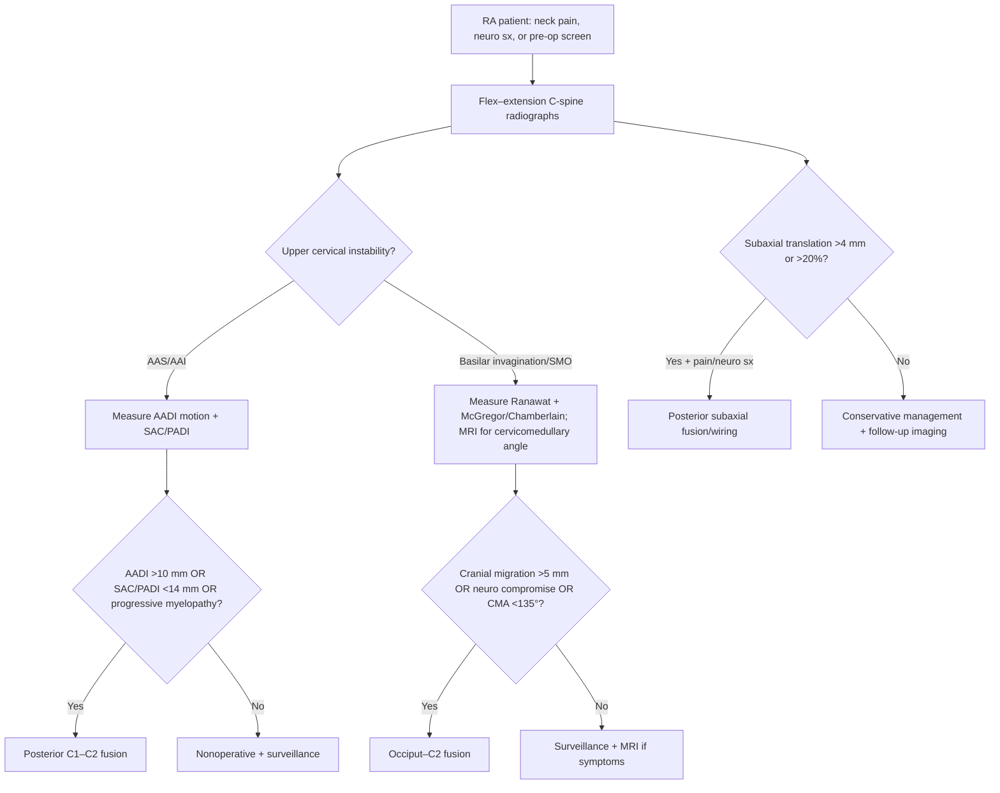

> [!summary] Rheumatoid cervical spondylitis review
> 
> - **3 patterns**: **atlantoaxial subluxation (50–80%)**, **basilar invagination/SMO (40%)**, **subaxial subluxation (20%)**
>     
> - **Best screening test** for instability: **c-spine flexion–extension radiographs**
>     
> - **Best test** for cord/brainstem compression + pannus: **MRI**
>     
> - **AADI motion** on flex–ex: **>3.5 mm** = instability; **>10 mm** = **surgical indication**
>     
> - **SAC/PADI**: **<14 mm** = **surgical indication** (↑ neurologic injury risk)
>     
> - **Basilar invagination**: **Ranawat C1–2 index <15 mm (men) / <13 mm (women)** supports cranial settling
>     
> - **McGregor/Chamberlain**: dens tip **>4.5 mm above** line supports basilar invagination
>     
> - **Cervicomedullary angle <135° (MRI)** → **impending neurologic impairment** → **occiput–C2 fusion**
>     
> - **Subaxial subluxation**: **>4 mm or >20%** translation = cord compression; **cervical height index <2.0** predicts neuro compromise
>     

![[Neurosurgery/Spine/_resources/Rheumatoid_cervical_spondylitis.resources/image.8.png|700]]
## Definitions & Scope

- Definition: Cervical spine instability due to rheumatoid arthritis (RA) with pannus, bony erosion, and ligamentous laxity
- Core entities:
    - Atlantoaxial subluxation/instability (==AAS/AAI==)
    - Basilar invagination (aka superior migration of odontoid (==SMO==); often grouped with cranial settling/vertical subluxation)
    - Subaxial subluxation (==SAS==)
- Clinical importance:
    - Often missed and may be asymptomatic
    - Risk of cervical myelopathy and cervicomedullary/brainstem compression
    - Airway/intubation risk with cervical instability (avoid provocative neck positioning)

| Pattern                                       | Prevalence | Mechanism                                       | Imaging metric                                             | Operation                            |
| --------------------------------------------- | ---------: | ----------------------------------------------- | ---------------------------------------------------------- | ------------------------------------ |
| Atlantoaxial subluxation (AAS/AAI)            |     50–80% | Pannus → transverse ligament + dens destruction | **AADI motion**, **SAC/PADI**                              | **Posterior C1–C2 fusion**           |
| Basilar invagination (SMO / cranial settling) |        40% | Occiput–C1–C2 erosion → cranial dens migration  | **Ranawat index**, **McGregor/Chamberlain**, **CMA (MRI)** | **Occiput–C2 fusion**                |
| Subaxial subluxation (SAS)                    |        20% | Pannus + facet/Luschka instability              | **Translation (mm / %)**, **cervical height index**        | **Posterior subaxial fusion/wiring** |
## Overview

- Epidemiology
    - Cervical spine involvement is common in RA; screening is frequently overlooked
- Patterns of instability
    - AAS/AAI: ==pannus== → transverse ligament + dens destruction → C1–C2 instability
    - Basilar invagination/SMO: occiput–C1–C2 ==erosion== → cranial migration of dens
    - SAS: pannus + facet/Luschka joint instability → multilevel translation
- Diagnosis
    - Dx: radiographic instability on flex–extension x‑rays + neurologic assessment
    - Best test: flex–extension radiographs (screen) + MRI (cord/brainstem, pannus)
    - Key measurements: AADI, SAC/PADI, Ranawat index, McGregor/Chamberlain, cervicomedullary angle, subaxial translation, cervical height index
- Management
    - Surgical goal: prevent neurologic progression (reversal of deficits not guaranteed)
    - Procedures: posterior C1–C2 fusion, occiput–C2 fusion ± C1 posterior arch resection, posterior subaxial fusion/wiring
- Prognosis/complications
    - Worse recovery expected with advanced ==Ranawat class== (esp. IIIb)
    - Pseudarthrosis ~10–20% after fusion 

### Ranawat class

| Ranawat class | Functional/neurologic status                                        |
| ------------- | ------------------------------------------------------------------- |
| **I**         | **Neurologically intact**                                           |
| **II**        | **Subjective weakness** with **hyperreflexia** and **dysesthesias** |
| **IIIa**      | **Objective paresis** + long-tract signs; **ambulatory**            |
| **IIIb**      | **Quadriparesis** with inability to **walk** or **feed self**       |

![[Neurosurgery/Spine/_resources/Rheumatoid_cervical_spondylitis.resources/image.4.png|500]]

## Diagnosis & Workup

- Dx: RA + suspected cervical involvement (neck pain, neuro symptoms, pre-op screening) with radiographic evidence of AAS/AAI, basilar invagination/SMO, and/or SAS
- Best test:
    - Screening/instability: flexion–extension cervical radiographs
    - Neural compression/pannus: MRI
- Rule-out:
    - Non‑RA cervical myelopathy etiologies (degenerative cervical spondylotic myelopathy, OPLL, tumor, infection)
    - Non-spinal causes of gait dysfunction (peripheral neuropathy, inflammatory myopathy)
- Key imaging:
    - Flex–extension lateral radiographs
        - Measure AADI (motion between flex–ex)
        - Measure SAC/PADI (space for cord behind dens)
        - Assess subaxial translation (mm and %)
    - Lateral skull base/CVJ radiographic lines
        - Ranawat C1–2 index
        - McGregor's line, Chamberlain's line, McRae's line
    - MRI
        - Pannus/retro‑odontoid soft tissue
        - Cord/brainstem compression, cervicomedullary angle
    - CT (± CTA)
        - Bony anatomy + pre-op planning (including vertebral artery course for C1–C2 instrumentation)

|Imaging|Best for|Key exam takeaway|
|---|---|---|
|Flex–extension C-spine radiographs|Instability (dynamic)|Static lateral films can **miss/underestimate** AAI; measure **AADI** motion + **SAC/PADI**|
|MRI C-spine/CVJ|Cord/brainstem compression, pannus|Use to quantify **myelopathy risk** and assess **cervicomedullary angle**|
|CT (± CTA)|Bony anatomy; instrumentation planning|Consider for **C1–C2 fixation planning** and vertebral artery anatomy|

### Imaging metrics

| Measurement                      | How measured (1-line)                             |                Abnormal cutoff (exam) | Interpretation                                     |
| -------------------------------- | ------------------------------------------------- | ------------------------------------: | -------------------------------------------------- |
| **AADI (static)**                | C1 anterior arch ↔ anterior dens on lateral x‑ray |                             **>3 mm** | Suggests AAI (adult)                               |
| **AADI motion (flex–ex)**        | Difference in AADI between flexion and extension  |                           **>3.5 mm** | Dynamic instability                                |
| **AADI motion (alar ligament)**  | Motion threshold on flex–ex                       |                             **>7 mm** | Suggests alar disruption                           |
| **AADI motion (surgery)**        | Motion threshold on flex–ex                       |                            **>10 mm** | **Surgical indication**                            |
| **SAC/PADI**                     | Posterior dens ↔ anterior C1 posterior arch       |                            **<14 mm** | **Surgical indication** (↑ neurologic injury risk) |
| **Ranawat C1–2 index**           | C2 pedicle center → line through C1 arches        | **<15 mm (men)** / **<13 mm (women)** | Cranial settling / vertical subluxation            |
| **McGregor line**                | Hard palate → caudal occiput curve                |            Dens tip **>4.5 mm above** | Basilar invagination                               |
| **Chamberlain line**             | Hard palate → posterior foramen magnum            |            Dens tip **>4.5 mm above** | Basilar invagination                               |
| **Cervicomedullary angle (MRI)** | Angle at CVJ on sagittal MRI                      |                             **<135°** | Impending neurologic impairment                    |
| **Subaxial translation**         | Vertebral body listhesis (mm or %)                |                 **>4 mm** or **>20%** | Cord compression risk                              |
| **Cervical height index**        | Vertebral body height/width ratio                 |                              **<2.0** | Predicts neurologic compromise (high sensitivity)  |
| **Redlund–Johnell (optional)**   | Inferior C2 body → McGregor line                  | **<34 mm (men)** / **<29 mm (women)** | Supports cranial settling                          |

![[Neurosurgery/Spine/_resources/Rheumatoid_cervical_spondylitis.resources/image.3.png|300]]

![[Neurosurgery/Spine/_resources/Rheumatoid_cervical_spondylitis.resources/image.png|600]]

![[Neurosurgery/Spine/_resources/Rheumatoid_cervical_spondylitis.resources/image.1.png|600]]

![[Neurosurgery/Spine/_resources/Rheumatoid_cervical_spondylitis.resources/image.2.png|600]]
## Management

- Treat RA systemically (medical) + address cervical instability (surgical/non-surgical) 
	- **Indication:** based on instability pattern + neurologic risk 
	- **Timing:** escalate with **progressive neurologic deficit**
- **Perioperative essentials (exam):**
    - Airway precautions (neutral alignment; consider awake/FOI approach) 
	    - **Indication:** known/suspected AAI/BI 
	    - **Pitfall:** neck extension during intubation
    - Medication review (steroids/DMARDs/biologics) 
	    - **Indication:** infection/wound-healing risk optimization 
	    - **Timing:** pre-op planning with rheumatology/anesthesia

| Procedure                                 | Indication (high-yield)                                                   | Key pearl                                                     |
| ----------------------------------------- | ------------------------------------------------------------------------- | ------------------------------------------------------------- |
| Posterior **C1–C2 fusion**                | **AADI motion >10 mm** and/or **SAC/PADI <14 mm**; progressive myelopathy | Stabilization may allow **pannus regression**                 |
| **Occiput–C2 fusion ± C1 arch resection** | AAS + basilar invagination; irreducible compression                       | Posterior arch resection can provide posterior decompression  |
| Posterior subaxial fusion/wiring          | **>4 mm or >20%** SAS with intractable pain or neuro symptoms             | Often multilevel; consider concomitant upper cervical disease |
### Atlantoaxial subluxation (AAS/AAI)

- Nonoperative (observation/medical optimization; consider immobilization) 
	- **Indication:** **stable** AAS without high-risk radiographic thresholds or neuro deficits 
	- **Timing:** surveillance with serial imaging
- Posterior C1–C2 fusion 
	- **Indication:** **AADI motion >10 mm** and/or **SAC/PADI <14 mm** (even without deficits), **progressive myelopathy** 
	- **Timing:** urgent if progressive neuro deficit
- Occiput–C2 fusion ± C1 posterior arch resection 
	- **Indication:** **AAS + basilar invagination/SMO** and/or irreducible compression requiring posterior decompression 
	- **Timing:** urgent if cord/brainstem compromise
- Odontoidectomy (rare; staged/secondary)
	- **Indication:** persistent **anterior** cord compression from pannus **after** posterior fusion fails to decompress 
	- **Pitfall:** premature anterior decompression when instability not addressed
### Basilar invagination (SMO / cranial settling)

- Occiput–C2 fusion 
	- **Indication:** **progressive cranial migration (>5 mm)**, **neurologic compromise**, or **cervicomedullary angle <135° (MRI)**
	- **Timing:** urgent with brainstem/cord findings
- Anterior odontoid resection (transoral/anterior retropharyngeal)
	- **Indication:** **brainstem compromise** with irreducible anterior compression (selected cases) 
	- **Timing:** typically paired with stabilization strategy
### Subaxial subluxation (SAS)

- Posterior fusion and wiring/instrumented stabilization 
	- **Indication:** **>4 mm or >20%** subaxial translation with **intractable pain** or **neurologic symptoms** 
	- **Timing:** urgent with progressive myelopathy

## Pitfalls & Red Flags

> [!warning]
> 
> - **Pitfall:** 
> 	- relying on **neutral** lateral radiographs only (dynamic AAI can be missed)
> 	- using **AADI alone** (can "pseudostabilize" with cranial settling); include **SAC/PADI** and cranial settling indices
> 	- unrecognized instability before anesthesia; avoid **neck extension** during intubation
> 	- delayed surgery in advanced **Ranawat IIIb** (lower likelihood of neurologic recovery)
> 
> - **Red flag:** 
> 	- **progressive myelopathy** (gait decline, hand clumsiness, hyperreflexia, long-tract signs)
> 	- symptoms of **cervicomedullary compression** (new weakness, bulbar dysfunction, drop attacks)
> 	- imaging thresholds met (**AADI >10 mm**, **SAC/PADI <14 mm**, **CMA <135°**, significant SMO) even if minimally symptomatic
> 
> - **Complication:** 
> 	- fusion failure/**pseudarthrosis** (reported **~10–20%**)

## Self-test

> [!question] Self‑Test
> 
> - Q1: Name the **3 classic cervical instability patterns** in RA and their approximate frequencies.
> 
> - Q2: What is the **best screening study** for RA cervical instability?
> 
> - Q3: Define **AADI motion** thresholds for (a) instability, (b) alar ligament disruption, (c) surgical indication.
> 
> - Q4: What **SAC/PADI** cutoff is a **surgical indication**?
> 
> - Q5: List **3 radiographic criteria** supporting **basilar invagination/SMO**.
> 
> - Q6: What **MRI angle** suggests impending neurologic impairment at the CVJ?
> 
> - Q7: What subaxial translation thresholds suggest cord compression risk in RA?
> 
> - Q8: What does a **cervical height index <2.0** predict?
> 
> - Q9: Best operation for **AAS + basilar invagination**?
> 
> - **Answer key**
> 
>     - A1: **AAS/AAI (50–80%)**, **basilar invagination/SMO (40%)**, **SAS (20%)**
> 
>     - A2: **Flexion–extension cervical radiographs**
> 
>     - A3: **>3.5 mm** instability; **>7 mm** alar disruption; **>10 mm** surgical indication
> 
>     - A4: **SAC/PADI <14 mm**
> 
>     - A5: **Ranawat index <15 mm (men) / <13 mm (women)**; dens **>4.5 mm above McGregor**; dens **>4.5 mm above Chamberlain** (± **McRae line** assessment)
> 
>     - A6: **Cervicomedullary angle <135°**
> 
>     - A7: **>4 mm** or **>20%** subaxial translation
> 
>     - A8: High likelihood of **neurologic compromise** (very high sensitivity)
> 
>     - A9: **Occiput–C2 fusion ± C1 posterior arch resection**
>  

