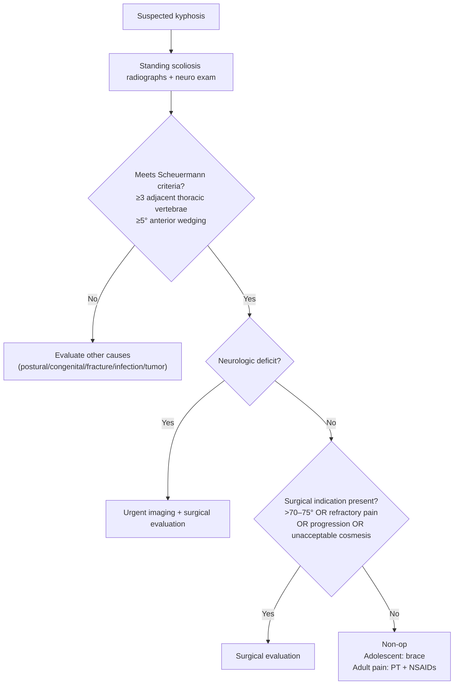

> [!summary] Scheuermann's Kyphosis Review
> 
> - **Dx:** structural thoracic kyphosis with **≥5° anterior wedging** of **≥3 adjacent thoracic vertebrae**.
> 
> - Adolescents often present for **cosmesis**; deformity may be misread as "**slouching**".
> 
> - Adults more often present with **pain**.
> 
> - **Best test:** **standing scoliosis radiographs** (full-length PA/lateral).
> 
> - **Key imaging:** **multi-level anterior wedge deformities**, **endplate irregularities**, **Schmorl nodes**.
> 
> - **Tx:** 
> 	- adolescents—**bracing** unless meeting surgical criteria; adults—**PT + NSAIDs**.
> 	- operative indication:** **curve >70–75°**, **unacceptable cosmesis**, **refractory pain**, **progression**, or **neurologic deficit**.
> 
> - **Pitfall:** labeling a rigid structural curve as "postural" and missing progression.
> 
> - **Red flag:** **neurologic deficit** in a kyphotic patient → urgent evaluation for cord/root compromise.
>  

## Definitions 

- Scheuermann's kyphosis (juvenile kyphosis)
    - Definition: ==anterior wedging ≥5° of ≥3 adjacent thoracic vertebral bodies==.
    - Common associated radiographic findings: ==Schmorl nodes==, endplate irregularities/narrowing.

## High‑Yield Outline

- Epidemiology
    - Adolescents: 
	    - typical age; 12-17 years
	    - presentation often driven by ==cosmetic deformity==.
    - Adults: presentation often driven by ==pain==.
    - 5% (0.8-8%) of general population; male predominance
- Location: Thoracic spine (75%)
- Pathophysiology
	- undetermined etiology
	- possible contributors: 
		- discordant vertebral endplate mineralization and ossification during growth (genetic?)
			- disproportional vertebral body growth; wedge-shaped vertebral bodies that lead to kyphosis
- Associations
	- scoliosis (50%)
	- schmorl nodes
	- limbus vertebrae
	- spondylolisthesis (secondary to compensatory lumbar lordosis)
- Diagnosis
    - Structural kyphosis meeting ==vertebral wedging criteria== on radiographs.
- Workup 
    - Standing scoliosis radiographs + neurologic exam.
    - MRI: role controversial; selective use when clinical concern (e.g., neurologic findings).
- Treatment 
    - Adolescents: ==bracing== unless meeting surgical criteria.
    - Adults: nonsurgical pain management (==PT, NSAIDs==).
    - Surgery: based on degree, symptoms, progression, and neuro status.

## Diagnosis & Workup

- Dx: structural kyphosis with radiographic criteria.
- Best test: standing ==scoliosis x-rays== (full-length PA/lateral).
- Rule-out:
    - Postural kyphosis (flexible curve).
    - Congenital kyphosis (segmentation/formation anomalies).
    - Infection / tumor (night pain, systemic symptoms, destructive lesions).
    - Compression fracture (trauma/osteoporosis).
    - Inflammatory spondyloarthropathy (e.g., ankylosing spondylitis).
- Key imaging:
    - Standing films: multi-level anterior wedging, ==endplate irregularities, Schmorl nodes==.
    - MRI (controversial):
        - Consider if neurologic deficit, atypical pain pattern, or concern for alternate pathology.
- Key differentiator
    - Scheuermann: rigid structural curve + vertebral wedging criteria.
    - Postural: correctable with active extension/supine positioning

### Key findings

#### Wedge-shaped vertebrae
![[Pasted image 20260221123734.png|400]]

#### Anterior wedging 
anterior wedging >/= 5 degrees in 3+ adjacent vertebral bodies.

 ![[Pasted image 20260221125214.png|300]]

#### Schmorl's Nodes
spinal disc herniation into adjacent vertebrae

![[Pasted image 20260221124111.png|500]]

![[Pasted image 20260221124141.png|500]]
### Diagnostic criteria

| Item                            | High-yield content                                            |
| ------------------------------- | ------------------------------------------------------------- |
| Diagnosis                       | Anterior wedging ≥5° of ≥3 adjacent thoracic vertebral bodies |
| Typical radiographic associates | Endplate irregularities, Schmorl nodes                        |
### Differential diagnosis

| Condition                        | Key distinguishing features                           | Key imaging clue                                                                      |
| -------------------------------- | ----------------------------------------------------- | ------------------------------------------------------------------------------------- |
| Scheuermann's kyphosis           | Rigid structural kyphosis                             | ≥3 adjacent vertebrae with ≥5° anterior wedging, Schmorl nodes, endplate irregularity |
| Postural kyphosis                | Flexible;  corrects with extension                 | No fixed multi-level wedge pattern                                                    |
| Congenital kyphosis              | Early onset;  progression;  may have neuro risk | Vertebral formation/segmentation anomaly                                              |
| Compression fracture             | Trauma/osteoporosis;  acute pain                   | Focal wedge fracture, marrow edema on MRI                                             |
| Infection / tumor                | Constitutional symptoms, night pain, neuro decline    | Destructive lesion, paraspinal mass, epidural disease                                 |
| Inflammatory spondyloarthropathy | Inflammatory back pain pattern;  stiffness         | Syndesmophytes/sacroiliitis (context-dependent)                                       |

> [!High-yield]
> 
> - Rigid kyphosis + **≥3 consecutive vertebrae** each with **≥5° anterior wedging** = **Scheuermann's** until proven otherwise.
> 
> - Adults with "new" kyphosis + focal pain: always consider **fracture, infection, tumor** (don't anchor on a childhood diagnosis).
>  

## Management

- Non-operative
    - Adolescents
        - Tx: ==brace therapy==.
        - Indication: adolescent with Scheuermann's kyphosis not meeting surgical criteria.
    - Adults
        - Tx: ==physical therapy + NSAIDs==.
        - Indication: pain without operative indications.
- Operative
    - Indication:
        - ==Curves >70–75°==
        - Unacceptable ==cosmetic== appearance
        - Refractory ==pain==
        - ==Progressive== kyphosis
        - Neurologic ==deficit==
- Timing:
    - timely referral for deformity evaluation
    - neurologic deficit is urgent.

> [!Kyphosis severity based management]
> 
> - less than 50°: conservative, stretching, postural changes
> - 50 to 75°: brace
> - more than 75°: surgery
> 

| **Tx**            | **Indication**                                                                                       | **Contraindication**                        | **Timing**                                                        |
| ----------------- | ---------------------------------------------------------------------------------------------------- | ------------------------------------------- | ----------------------------------------------------------------- |
| Bracing           | Adolescents with Scheuermann's kyphosis **without** operative criteria                               | Poor tolerance/nonadherence (practical)     | During growth; monitor progression                                |
| PT + NSAIDs       | Adults with pain, no operative criteria                                                              | NSAID contraindications (GI/renal/CV risk)  | Trial with reassessment                                           |
| Surgery           | **>70–75°**, **unacceptable cosmesis**, **refractory pain**, **progression**, **neurologic deficit** | Patient-specific (comorbidity/optimization) | **Urgent** if neuro deficit; otherwise elective deformity pathway |

> [!checklist] Approach algorithm 
> 
> - Confirm structural kyphosis on **standing lateral** radiograph.
> 
> - Apply **Dx criteria** (≥3 adjacent thoracic vertebrae with ≥5° anterior wedging).
> 
> - Perform **neurologic exam**.
> 
> - If **neurologic deficit** → **urgent** advanced imaging and surgical evaluation.
> 
> - If adolescent and no operative indication → **brace** + monitor progression.
> 
> - If adult pain predominant → **PT + NSAIDs**; reassess for alternate causes if atypical features.
> 
> - If **curve >70–75°**, **refractory pain**, **progression**, or **unacceptable cosmesis** → surgical evaluation.
>  

## Pitfalls & Red Flags

> [!warning]
> 
> - **Pitfall:** 
> 	- calling a rigid structural kyphosis "postural" and failing to obtain **standing scoliosis radiographs**.
> 	- ignoring **progression**; serial assessment matters when growth remains.
> 
> - **Red flag:** 
> 	- **neurologic deficit** (myelopathy/radiculopathy) in a kyphotic patient → **urgent** evaluation.
> 	- disproportionate pain, night pain, fever/weight loss → **Rule-out:** infection/tumor.
> 	- acute worsening pain after trauma (even minor) → **Rule-out:** compression fracture.
>  

### Self-test

> [!question] Self‑Test
> 
> 1. What is the **radiographic definition** of Scheuermann's kyphosis?
> 
> 2. What are the most typical presenting complaints in **adolescents vs adults**?
> 
> 3. What is the **best initial test** for diagnosis and baseline assessment?
> 
> 4. List the classic **radiographic findings** besides vertebral wedging.
> 
> 5. Give the main **surgical indications**, including the key **curve threshold**.
> 
> 6. Name 4 important **rule-out diagnoses** for adolescent kyphosis.
> 
> 7. When is **MRI** most justified in suspected Scheuermann's kyphosis? (clinical trigger)
> 
> 
> **Answer key**
> 
> - 1. **≥5° anterior wedging** of **≥3 adjacent thoracic vertebral bodies**.
> 
> - 2. Adolescents: **cosmesis/progressive kyphosis ("slouching")**; Adults: **pain**.
> 
> - 3. **Standing scoliosis radiographs** (full-length PA/lateral).
> 
> - 4. **Endplate irregularities** and **Schmorl nodes** (± endplate narrowing).
> 
> - 5. **>70–75°**, **unacceptable cosmesis**, **refractory pain**, **progressive kyphosis**, **neurologic deficit**.
> 
> - 6. Postural kyphosis; congenital kyphosis; compression fracture; infection; tumor; inflammatory spondyloarthropathy (any 4).
> 
> - 7. **Neurologic deficit** or atypical features suggesting alternate pathology.
>  
