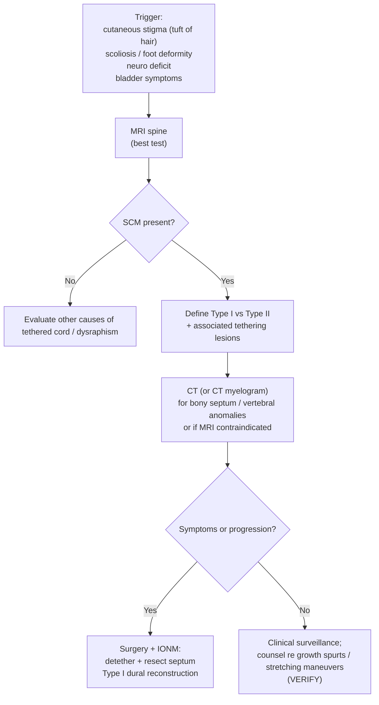

> [!summary] Spinal cord malformation review
> 
> - Spinal cord malformation (SCM) = congenital ==double spinal cord==; classify as Type I vs Type II (Pang)
> 
> - ==Type I SCM==: 2 dural tubes + rigid osseocartilaginous/==bony== septum; often termed ==diastematomyelia==
> 
> - ==Type II SCM==: 1 dural tube + ==fibrous== median septum; sometimes termed ==diplomyelia==
> 
> - Cutaneous stigmata (esp. hypertrichosis/tuft of hair) suggest ==occult dysraphism==; present in ~2/3 of Type I
> 
> - Symptoms are usually from ==tethering== → progressive deficit, pain, scoliosis/foot deformity, bladder dysfunction; worsens with stretching maneuvers
> 
> - Best test: MRI spine; add CT/CT myelogram to define a bony septum and vertebral anomalies
> 
> - Tx: surgical untethering + septum resection with IONM; reconstitute dura as a single tube in Type I
> 
> - DO NOT cut the tethered filum before removing the median septum (cord can retract against the septum)
>  

## Definitions & Scope

- **Split cord malformation (SCM):** congenital malformation with a **duplicated/split spinal cord** sharing a common embryologic etiology
- **Type I SCM:** 2 hemicords in **2 dural tubes**, separated by a **dural-sheathed rigid osseocartilaginous (bony) septum** (often called **diastematomyelia**)
- **Type II SCM:** 2 hemicords in **1 dural tube**, separated by a **nonrigid fibrous median septum** (sometimes called **diplomyelia**)
- **Embryology concept:** abnormal adhesions between **ectoderm** and **endoderm** → **notochord split** → cord cleft/duplication
- **Scope:** occult spinal dysraphism; symptoms usually from associated **tethered cord** and/or vertebral anomalies

| Feature                 | Type I SCM (often called diastematomyelia)                                                                                                         | Type II SCM (sometimes called diplomyelia)                             |
| ----------------------- | -------------------------------------------------------------------------------------------------------------------------------------------------- | ---------------------------------------------------------------------- |
| Dural anatomy           | Two dural tubes                                                                                                                                    | Single dural tube                                                      |
| Cord anatomy            | 2 hemicords, each with its own central canal and pia                                                                                               | 2 hemicords; each gives rise to nerve roots                            |
| Median septum           | Rigid osseocartilaginous (==bony==) septum; dural-sheathed; extradural                                                                             | Nonrigid ==fibrous== median septum                                     |
| Spine findings at split | Spine abnormality at split (e.g., absent disc, dorsal hypertrophic bone where "spike" attaches)                                                    | Usually no spine abnormality at split level                            |
| Common associations     | Overlying skin lesions in ~2/3 (nevi, hypertrichosis/tuft of hair, lipoma, dimple, hemangioma); orthopedic foot deformity (neurogenic high arches) | Usually spina bifida occulta in lumbosacral region                     |
| Tx principle            | Untether + remove bony septum + reconstitute dura as a single tube; do not cut filum before spur removal                                           | Untether at spina bifida occulta; occasionally detether at split level |

![[Neurosurgery/Spine/_resources/Diastematomyelia__Diploymyelia.resources/image.png|300]]
## Outline

- **Pathophysiology**
    - SCM encompasses **diastematomyelia** and **diplomyelia**; treat based on **Type I vs Type II anatomy**
    - Symptoms typically due to **tethering** at the split and/or lumbosacral dysraphism
- **Presentation**
    - **Cutaneous stigmata:** **hypertrichosis/tuft of hair**, nevi, dimples, lipoma, hemangioma
    - Neuro/ortho: leg weakness/sensory change, gait issues, scoliosis, **cavovarus/high arches**, pain, **neurogenic bladder**
    - Deterioration may be triggered by **growth spurts** (child) or **stretching maneuvers/trauma** (adult)
- **Workup**
    - **MRI spine** to define SCM type and associated tethering lesions
    - **CT or CT myelogram** to characterize **bony septum** and vertebral abnormalities (operative planning)
- **Management**
    - **Tx:** surgical **untethering + septum resection** (bony/fibrous) with **IONM**
    - **Type I:** remove **bony septum** + reconstruct dura to **single dural tube**
    - **Type II:** untether at **spina bifida occulta** level; occasionally address the split

| Finding                      | Childhood tethered cord                                                         | Adult tethered cord                                                                          |
| ---------------------------- | ------------------------------------------------------------------------------- | -------------------------------------------------------------------------------------------- |
| Pain                         | Uncommon; usually back/legs (not perianal/perineal)                             | ==Present in 86%==; often perianal/perineal; diffuse/bilateral; may be shock-like            |
| Foot deformities             | Common early; progressive cavovarus/==club foot==                               | Not seen                                                                                     |
| Progressive spinal deformity | Common; progressive scoliosis                                                   | Uncommon (<5%)                                                                               |
| Motor deficits               | Common; gait abnormality/regression of gait training                            | Often presents as leg weakness                                                               |
| Urological symptoms          | Common; continuous dribbling, delayed toilet training, recurrent UTIs, enuresis | Common; frequency/urgency, incomplete emptying, stress/overflow incontinence                 |
| Trophic ulcerations          | Relatively common (lower extremities)                                           | Rare                                                                                         |
| Cutaneous stigmata           | Present in 80–100%                                                              | Present in <50%                                                                              |
| Aggravating factors          | ==Growth spurts==                                                               | ==Trauma==; maneuvers stretching conus; lumbar spondylosis, disc herniation, spinal stenosis |
## Diagnosis & Workup

### Clinical suspicion

- **Dx:** suspect SCM in patients with:
    - **Midline cutaneous stigmata** over spine (esp **hypertrichosis/tuft of hair**)
    - Congenital scoliosis or progressive foot deformity (**cavovarus/high arches**)
    - Progressive lower-extremity neurologic deficits or gait regression
    - Bladder symptoms consistent with **tethered cord syndrome**
### Imaging

- **Best test:** **MRI spine** (include conus/lumbosacral region)
- **Rule-out:** additional occult dysraphism contributing to tethering:
    - Spina bifida occulta, thickened filum, lipoma, dermal sinus tract, syrinx
- **Key imaging:**
    - MRI: identifies **Type I vs Type II**, conus level, tethering, associated soft-tissue lesions
    - CT (or **CT myelogram**): defines **osseocartilaginous/bony septum**, canal/vertebral anomalies; alternative when MRI contraindicated

| Modality         | Best for                                                                  | Key limitations / pearls                      |
| ---------------- | ------------------------------------------------------------------------- | --------------------------------------------- |
| **MRI spine**    | Defining SCM type, conus level, tethering lesions, soft-tissue dysraphism | First-line; include conus/lumbosacral region  |
| **CT spine**     | Characterizing **bony septum** + vertebral anomalies (operative planning) | Complementary to MRI, especially Type I       |
| **CT myelogram** | CSF space delineation when MRI contraindicated; septum visualization      | Invasive; use when MRI not possible/equivocal |

> [!Review]
> 
> - **Best next step** for midline hypertrichosis + neuro/ortho findings: **MRI spine**
> 
> - **Type I SCM**: expect vertebral anomalies at split; **Type II SCM**: look for **lumbosacral spina bifida occulta**
> 
> - Pre-op planning for rigid spur: add **CT** to define bony anatomy
>  

### Baseline functional assessment (pre-op planning)

- **Dx adjuncts:** document:
    - Neuro exam (strength, reflexes, sensory), gait, orthopedic deformity (scoliosis, foot)
    - Urologic status (continence, UTIs, retention); consider urodynamics if symptomatic (**VERIFY**)
## Management

### Indications & goals

- **Tx:** **Surgery** with **IONM** (untether + septum excision)
- **Indication:**
    - Progressive neurologic deficit or pain attributable to tethering
    - Progressive scoliosis or neurogenic foot deformity (e.g., **cavovarus/high arches**)
    - Bladder dysfunction consistent with tethered cord syndrome
- **Contraindication:**
    - Relative: uncontrolled infection, uncorrected coagulopathy, inability to tolerate anesthesia
- **Timing:**
    - Symptomatic/progressive disease: **early elective** detethering
    - Rapid deterioration: **expedite** operative management
- **Goal:** relieve **tethering** and remove the mechanical tether
    - **Type I:** excise **rigid bony septum** + reconstruct dura into **single dural tube**
    - **Type II:** detether at **spina bifida occulta** level; treat split level selectively

### Operative essentials

> [!checklist] Split Cord Malformation — OR Checklist
> 
> - **IONM:** SSEPs/MEPs + free-running EMG; map roots when anatomy is distorted
> 
> - Exposure: laminectomy/laminoplasty over split; **start at normal anatomy and work toward the defect**
> 
> - Septum management:
> 
>     - **Bony septum**: **always extradural**; drill/excise completely to free hemicords
> 
>     - **Fibrous septum**: divide/excise as needed to untether
> 
> - Dura:
> 
>     - **Type I:** remove septum and **reconstitute dura as a single tube**
> 
> - **Filum:** **DO NOT** cut a **tethered filum** until **after** the **median septum** is removed
> 
> - Closure: watertight dural repair; minimize dead space (reduce CSF leak/pseudomeningocele)
>  

### Decision pathway

### Post-op & follow-up

- **Complication:** CSF leak/pseudomeningocele, wound infection, neurologic worsening, retethering, spinal deformity (post-laminectomy kyphosis in children)
- **Pitfall:** incomplete spur excision or no dural tube reconstruction (Type I) → persistent tethering/recurrence
- Surveillance:
    - Repeat neuro/uro/ortho assessments; monitor scoliosis progression
    - Re-image if new deficits or recurrent tethered cord symptoms
## Pitfalls & Red Flags

> [!warning]
> 
> - **Pitfall:** using "diastematomyelia vs diplomyelia" instead of **Type I vs Type II SCM** anatomy → wrong operative plan
> 
> - **Pitfall:** incomplete imaging (missed secondary tethering lesion, esp **lumbosacral spina bifida occulta** in Type II)
> 
> - **Pitfall:** **cutting the filum first** in Type I → cord retraction against septum
> 
> - **Pitfall:** failing to remove the **bony septum** and reconstruct dura into **single tube** (Type I) → persistent tethering/retethering
> 
> - **Red flag:** progressive motor/sensory deficit, gait regression, worsening scoliosis/foot deformity
> 
> - **Red flag:** new bladder/bowel dysfunction or recurrent UTIs
> 
> - **Red flag:** dermal sinus/skin breakdown or signs of infection over lesion
>  

## Self-test

> [!question] Self‑Test
> 
> - Define **Type I vs Type II SCM** by **dural anatomy** and **septum**
> 
> - Which cutaneous finding is most classically associated with SCM on exam?
> 
> - What is the **best test** for SCM? When do you add **CT/CT myelogram**?
> 
> - In **Type I SCM**, what are the key operative steps after exposure?
> 
> - Why should the **tethered filum** not be cut until after the **median septum** is removed?
> 
> - Which SCM type is usually associated with **spina bifida occulta** in the lumbosacral region?
> 
> - List 3 features that distinguish **adult vs childhood** tethered cord syndrome
> 
> - Name 3 major postoperative complications to monitor for after SCM detethering
>  

> [!answer] Answer Key
> 
> - **Type I SCM:** **2 hemicords**, each with its own **central canal + pia**, each in a **separate dural tube**, separated by a **dural‑sheathed rigid osseocartilaginous (bony) median septum**; often called **diastematomyelia** 
> 
> 
> - **Type II SCM:** **2 hemicords** within a **single dural tube**, separated by a **nonrigid fibrous median septum**; sometimes called **diplomyelia**; usually **no spine abnormality at split**, but usually **spina bifida occulta (lumbosacral)** 
>     
> - **Cutaneous finding (classic):** **hypertrichosis (tuft of hair)** 
>     
> - **Best test:** **MRI spine** (Best test); **Add CT/CT myelogram:** define **bony septum/vertebral anomalies** (esp **Type I**) or if **MRI contraindicated/limited** 
>     
> - **Type I SCM — key operative steps (after exposure):** **detether cord** → **remove bony median septum** → **reconstitute dura as a single tube**; **start at normal anatomy and work toward defect** (distortion/rotation common) 
>     
> - **Filum timing:** **DO NOT** divide tethered filum **until after** septum removal → avoids **cord retraction up against septum** 
>     
> - **SCM type associated with lumbosacral SBO:** **Type II** (Tx: **untether at SBO level** ± at split)
>     
> - **Adult vs childhood tethered cord — 3 distinguishing features:** 
>     
>     - **Pain:** childhood **uncommon**; adult **present in 86%**, often **peri‑anal/perineal**, **diffuse/bilateral**
>         
>     - **Foot deformities:** childhood **common early** (progressive **cavovarus/club foot**); adult **not seen**
>         
>     - **Urological pattern:** childhood **continuous dribbling/delayed toilet training/UTIs/enuresis**; adult **frequency/urgency/incomplete emptying/stress or overflow incontinence**
>         
> - **Post‑op complications to monitor after SCM detethering (3):**
>     
>     - **CSF leak / pseudomeningocele** (post‑op CSF leak reported **15%** in untethering context)
>         
>     - **Bladder function change** (post‑op bladder changes **not uncommon**) 
>         
>     - **Retethering / recurrence**, esp after early childhood untethering and during **adolescent growth spurt** 
>         

