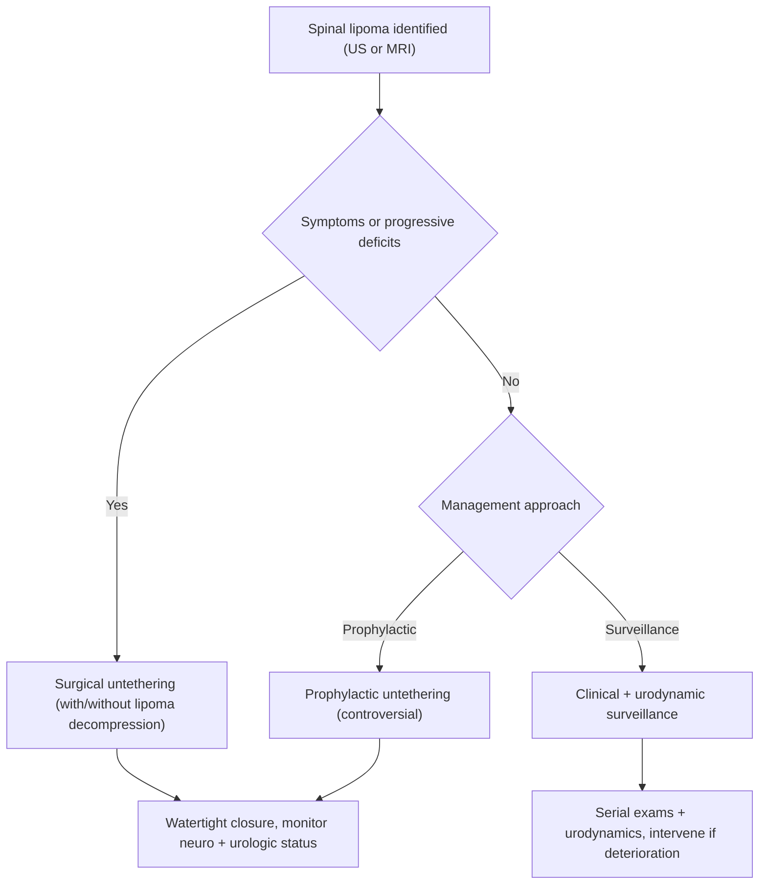

> [!summary] Spinal lipomas review
> 
> - **Incidence ~1/4000 live births**; **most frequent** Occult spinal dysraphism; **F=M**
> 
> - Distribution: **conus lipoma ~75%**, **filum terminale lipoma ~20%**, **intradural subpial ~5%**
> 
> - Conus lipoma: **dorsal cord** (medial to Dorsal root entry zone), **dura deficient ~90%** → continuity with subcutaneous fat
> 
> - Filum terminale lipoma: **truly occult** (no skin stigmata), **thickened filum**, incidental **~1% of MRIs**
> 
> - Cutaneous clues: subcutaneous lipoma **60–90%**, angioma **~20%**, **hairy patch/dermal sinus/dimple/appendage**
> 
> - **Best test:** MRI (**T1 bright** fat; confirm with fat-sat); evaluate associated dysraphism + Hydromyelia
> 
> - Symptomatic tethering → **surgical untethering**; asymptomatic lesions → **surveillance vs prophylactic untethering** (controversial)
> 
> - Conus lipoma surgery outcomes: ~**20% wound/CSF issues**, **5% acute neuro worsening**, **20% delayed retethering**
>  

## Definitions & Scope

- **Definition:** Spinal lipoma = lipomatous dysraphic malformation that can tether the Spinal cord/Conus medullaris/Filum terminale (occult dysraphism spectrum)
- **Epidemiology:** **~1/4000** live births; **F = M**; most frequent occult dysraphic malformation
- **Major anatomic groups:** intradural subpial (intramedullary), filum terminale lipoma, conus lipoma (incl. Lipomyelocele, Lipomyelocystocele, Lipomyelomeningocele)
- **Primary clinical syndrome:** [[Tethered cord syndrome]] (neuro + urologic + orthopedic manifestations)

## Outline

### Classification

#### Core types 
| Entity                                     | Approx frequency | Typical location/anatomy                                                                                    | Key associations/pearls                                                                                                    |
| ------------------------------------------ | ---------------: | ----------------------------------------------------------------------------------------------------------- | -------------------------------------------------------------------------------------------------------------------------- |
| Intradural subpial (intramedullary) lipoma |          **~5%** | Dorsal within cord with exophytic component; may mimic intramedullary tumor; often cervical/cervicothoracic | May have widened canal with deficient posterior arch; may be purely intradural; can be dormant for years                   |
| Filum terminale lipoma (fatty filum)       |         **~20%** | Thickened filum terminale; may have asymmetric dural attachment or duplication                              | **Truly occult** (no cutaneous stigmata); incidental **~1%** of MRIs; below **S2** relates to secondary neurulation        |
| Conus lipoma                               |         **~75%** | Lipoma from **dorsal surface** of cord, medial to dorsal root entry zone                                    | **Dura deficient ~90%** → continuity with subcutaneous fat; includes lipomyelocele/lipomyelocystocele/lipomyelomeningocele |

#### Conus lipoma subtypes
| Conus subtype        | Defining anatomy                                                                                                                                          | Key pearls                                                                                                              |
| -------------------- | --------------------------------------------------------------------------------------------------------------------------------------------------------- | ----------------------------------------------------------------------------------------------------------------------- |
| Lipomyelocele        | Placode–lipoma interface lies **within spinal canal**                                                                                                     | Tethering lesion; terminal placode remains in canal                                                                     |
| Lipomyelocystocele   | Terminal cord splayed by cystic dilatation of central canal; ependyma-lined sac plugged by lipoma                                                         | Consider associated central canal dilation/hydromyelia spectrum                                                         |
| Lipomyelomeningocele | Terminal placode herniates **outside canal**; large ventral SAS (cord typically tethered dorsally); asymmetric tethering; placode rotates as it herniates | Nearly all associated with **thickened filum**; variants: **dorsal** (large dural defect), **transitional**, **caudal** |
### Embryogenesis

- **Intradural/conus lipomas:** premature disjunction theory (**McLone & Naidich**) → early separation of cutaneous vs neural ectoderm → **paraxial mesenchyme herniates into folding neural tube lumen** → fat prevents complete closure
- **Filum terminale lipomas:** structures **below S2** arise via **secondary neurulation** (retrogressive differentiation) of caudal cell mass; mechanism incompletely understood; can associate with perineal anomalies (imperforate anus, [[VACTERL]], Caudal regression syndrome)
### Pathology

- Lipoma = mature adipocytes in dense fibrous stroma
- May contain striated muscle, epithelial cells, bone, neural tissue
- Can enlarge with generalized fat deposition states
### Clinical

- **Cutaneous stigmata**
- **Orthopedic manifestations:** muscle imbalance from tethering; deformities
- **Urologic manifestations:** incontinence/UTIs
- **Neurologic manifestations:** motor/sensory deficits, pain; may be progressive with growth

| Domain             | Typical findings                                                         | Testable details                                                                     |
| ------------------ | ------------------------------------------------------------------------ | ------------------------------------------------------------------------------------ |
| Cutaneous stigmata | Hairy patch, dermal sinus tract, dimple, appendage; subcutaneous lipoma  | Subcutaneous lipoma **60–90%**; angioma **~20%**; mostly evident in infancy          |
| Orthopedic         | Equinovarus/clubfoot, leg-length discrepancy, hip subluxation, scoliosis | Scoliosis **~10%**; due to muscle imbalance from tethered cord                       |
| Urologic           | Bowel/bladder **incontinence**, recurrent UTI                            | Urodynamics: detrusor-sphincter dyssynergia, flaccid bladder, detrusor hyperreflexia |
| Neurologic         | Motor/sensory deficits, pain                                             | Can be progressive; correlate with tethering severity                                |

![[Neurosurgery/Spine/_resources/Spinal_lipomas.resources/image.3.png|300]]
### Imaging
| Modality             | Role                                              | Key imaging                                                                                                                                      |
| -------------------- | ------------------------------------------------- | ------------------------------------------------------------------------------------------------------------------------------------------------ |
| Plain XR             | Bony screening                                    | Bifid spinous process; widened spinal canal                                                                                                      |
| Ultrasound (infants) | Initial exam when posterior elements not ossified | Very echogenic lesion; screening for tethering anatomy                                                                                           |
| MRI                  | Definitive classification + associated anomalies  | Fat **T1 bright** (confirm with fat-sat); evaluate associated dysraphism + hydromyelia; conus position may show limited change after detethering |
![[Neurosurgery/Spine/_resources/Spinal_lipomas.resources/image.2.png]]

### Subpial/Intradural (Intramedullary) Lipoma

- High-yield summary: see [[#^table-subpial-intramedullary]]

> [!High yield]
> 
> - **Conus lipoma:** **dura deficient ~90%** → continuity with subcutaneous fat; lipoma from **dorsal cord**, medial to dorsal root entry zone
> 
> - **Filum terminale lipoma:** can be **truly occult**; incidental **~1%** of MRIs; evaluate for secondary neurulation–related anomalies (below **S2**)
> 
> - **MRI** often shows limited change in conus position after detethering → follow **clinical + urodynamic** endpoints
>  

## Diagnosis & Workup

- **Dx:** [[Spinal lipomas]] within Occult spinal dysraphism spectrum; often presents as [[Tethered cord syndrome]]
- **Best test:** MRI of spine (T1 ± fat-suppressed sequences)
- **Rule-out:** associated dysraphism (incl. dermal sinus tract), hydromyelia/central canal dilation, other spinal anomalies
- **Key imaging:** fat **T1 bright**; XR may show bifid spinous process/widened canal; infant ultrasound shows echogenic lesion (screening)

> [!checklist] Workup checklist
> 
> - Skin: look for subcutaneous lipoma, angioma, hairy patch, dermal sinus, dimple, appendage
> 
> - Neuro: motor/sensory exam; pain; progression over time
> 
> - Ortho: equinovarus/clubfoot, leg-length discrepancy, hip subluxation, scoliosis
> 
> - Urologic: continence status, recurrent UTI history; obtain baseline/serial urodynamics when indicated
> 
> - Imaging: infant spine ultrasound (initial) → MRI (definitive classification + associated anomalies); XR for bony dysraphism patterns
>  

> [!tip]
> 
> - Post–de-tethering MRI may show **little conus change**; prioritize symptom trajectory + urodynamics for follow-up endpoints
>  

## Management

- **Tx:** surgical untethering ± lipoma decompression/debulking 
- **Indication:** symptomatic tethering (neurologic deficit, pain, urologic/orthopedic dysfunction) 
- **Timing:** early once symptomatic/progressive
- **Asymptomatic lesions:** two reasonable approaches (controversial)

| Scenario                   | Strategy                                    | Rationale / trade-offs                                                                                             |
| -------------------------- | ------------------------------------------- | ------------------------------------------------------------------------------------------------------------------ |
| Symptomatic spinal lipoma  | Surgical untethering ± lipoma decompression | Goal: stop progression; established deficits may not reverse                                                       |
| Asymptomatic spinal lipoma | Clinical + urodynamic surveillance          | Natural history unclear; many remain asymptomatic for years (or forever); avoids surgery risks                     |
| Asymptomatic conus lipoma  | Prophylactic untethering (controversial)    | Surgery complication rate cited **~20%**; even after prophylactic surgery, **20–40%** may develop delayed symptoms |

`
### Lipomyelomeningocele — Surgical Untethering

- **Goals:** untether cord; identify/decompress intramedullary lipoma component that can expand and cause deficit
- **Adjuncts:** microscope; **laser (essential)**; SSEP + EMG (leg/bowel) neuromonitoring (practice varies); bladder monitoring may be technically difficult in small children
- **Post-op:** bed rest **3–4 days** with **abdominal tension bandage**; monitor wound/CSF issues and neuro/urologic status

| Phase                    | Key steps                                                                                                                                                                                                                               | Pitfalls / pearls                                                                                                                                                       |
| ------------------------ | --------------------------------------------------------------------------------------------------------------------------------------------------------------------------------------------------------------------------------------- | ----------------------------------------------------------------------------------------------------------------------------------------------------------------------- |
| Goals                    | Untether cord; identify/decompress intramedullary lipoma component                                                                                                                                                                      | Intramedullary fat can expand and contribute to deficits                                                                                                                |
| Adjuncts                 | Microscope; **laser (essential)**; SSEP + EMG (leg/bowel)                                                                                                                                                                               | Neuromonitoring practice varies; bladder monitoring may be limited by technical constraints in small children                                                           |
| Exposure                 | Prone on bolsters; midline incision; separate bulk lipoma from skin leaving enough fat for closure; define plane between lipoma and fascia circumferentially; laminotomy rostral enough to reach normal dura above intradural component | **Pitfall:** first rostral "lamina" may be fibrous posterior arch (avoid assuming normal bone)                                                                          |
| Durotomy                 | Midline dural incision starting rostrally → extend toward and circumferentially around lipoma entry into thecal sac                                                                                                                     | **Pitfall:** lateral margins = dura + lipoma + dorsal roots converge → preserve **arachnoid** deep to incision; stay slightly lateral to lipoma to protect dorsal roots |
| Lipoma handling          | Laser amputate lipoma superficial to lamina level; decompress remaining lipoma with laser                                                                                                                                               | Aim for decompression without cord interface injury                                                                                                                     |
| Intramedullary component | Options include midline myelotomy + laser removal vs limited detethering leaving fatty mass (practice variation)                                                                                                                        | Prioritize neural preservation; avoid aggressive interface manipulation                                                                                                 |
| Filum                    | If fatty filum present, divide                                                                                                                                                                                                          | Complications lower with fatty filum transection (vs complex conus surgery)                                                                                             |
| Closure/post-op          | Watertight dural closure (patch/graft if needed); watertight fascial closure; bed rest **3–4 days** with abdominal tension bandage                                                                                                      | **Pitfall:** non-watertight closure → CSF leak, wound dehiscence                                                                                                        |
### Subpial/Intramedullary Lipoma

- **Tx:** surgical debulking for significant mass effect (myelopathy/pain) 
- **Indication:** symptomatic lesion 
- **Principle:** leave cord–lipoma interface unmanipulated

- ![[Neurosurgery/Spine/_resources/Spinal_lipomas.resources/image.png|500]]

## Outcomes

| Outcome                                                    | Approx frequency | Notes                                    |
| ---------------------------------------------------------- | ---------------: | ---------------------------------------- |
| Wound problems                                             |         **~20%** | Infection, CSF leak, dehiscence          |
| Acute neurological worsening                               |          **~5%** | Immediate post-op decline                |
| Delayed worsening/retethering requiring repeat detethering |         **~20%** | Compare with natural history (uncertain) |

## Pitfalls & Red Flags

> [!warning]
> 
> - **Red flag:** new/progressive **bowel/bladder dysfunction** (incontinence, recurrent UTI) → reassess promptly with urodynamics ± MRI
> 
> - **Red flag:** progressive orthopedic deformity (worsening equinovarus, scoliosis progression) suggesting worsening tethering
> 
> - **Pitfall:** lateral durotomy at lipoma entry zone risks **dorsal root injury**; preserve **arachnoid** and stay slightly lateral to lipoma
> 
> - **Pitfall:** incomplete watertight closure → **CSF leak** and wound complications
> 
> - **Complication:** delayed neurological decline/retethering (**~20%**) → consider repeat detethering when clinically indicated
>  

## Self-Test

> [!question] Self‑Test
> 
> - What are the **three major spinal lipoma types** and their **approximate frequencies**?
> 
> - Which spinal lipoma subtype is **truly occult** with **no cutaneous stigmata**, and what is its reported **incidental MRI rate**?
> 
> - For conus lipomas, where does the lipoma typically arise relative to the dorsal root entry zone and what is the **dural deficiency rate**?
> 
> - Distinguish lipomyelocele vs lipomyelomeningocele based on the **placode–lipoma interface location**.
> 
> - List common **cutaneous stigmata** and the approximate frequency of subcutaneous lipoma and angioma.
> 
> - Name 3 **urodynamic patterns** seen with these lesions.
> 
> - What is the **best test** and what MRI signal characteristic is most diagnostic?
> 
> - What are the key **complication rates** after conus lipoma surgery (wound/CSF, acute neuro worsening, delayed retethering)?
> 
> - During durotomy, what anatomic convergence creates the major risk for **dorsal root injury**, and what is the protective technique?
> 
> - For subpial/intramedullary lipoma debulking, what interface should be **left unmanipulated**?
>  

> [!checklist] **Self‑Test — Answer Key**
> 
> - **Three major spinal lipoma types + frequencies**
>     
>     - **Conus lipoma**: **~75%**
>         
>     - **Filum terminale lipoma (fatty filum)**: **~20%**
>         
>     - **Intradural subpial (intramedullary) lipoma**: **~5%**
>         
> - **Truly occult subtype + incidental MRI rate**
>     
>     - **Filum terminale lipoma** (no cutaneous stigmata)
>         
>     - Incidental finding in **~1% of all MRIs**
>         
> - **Conus lipoma: origin vs DREZ + dural deficiency rate**
>     
>     - Arises from **dorsal surface of the cord**, **medial to the DREZ**
>         
>     - **Dura deficient in ~90%** (lipoma continuous with subcutaneous fat)
>         
> - **Lipomyelocele vs lipomyelomeningocele (placode–lipoma interface)**
>     
>     - **Lipomyelocele**: interface **within the spinal canal**
>         
>     - **Lipomyelomeningocele**: terminal placode **herniates outside the canal**
>         
> - **Cutaneous stigmata + frequencies**
>     
>     - Stigmata: **hairy patch**, **dermal sinus**, **dimple**, **appendage**, **subcutaneous lipoma**, **angioma**
>         
>     - **Subcutaneous lipoma**: **~60–90%**
>         
>     - **Angioma**: **~20%**
>         
> - **Three urodynamic patterns**
>     
>     - **Detrusor-sphincter dyssynergia (DSD)**
>         
>     - **Flaccid bladder**
>         
>     - **Detrusor hyperreflexia**
>         
> - **Best test + most diagnostic MRI signal**
>     
>     - **Best test:** **MRI**
>         
>     - Most diagnostic feature: **fat is bright on T1** (T1 hyperintense)
>         
> - **Complication rates after conus lipoma surgery**
>     
>     - **~20%** wound problems (infection/CSF leak/dehiscence)
>         
>     - **~5%** acute neurological worsening
>         
>     - **~20%** delayed neurological worsening requiring repeat detethering
>         
> - **Durotomy: where dorsal root injury risk occurs + protection**
>     
>     - Risk zone: **lateral margins of the lipoma entry**, where **dura + lipoma + dorsal nerve roots meet** at nearly the same point
>         
>     - Protective technique: **preserve intact arachnoid** deep to dural incision and **stay slightly lateral to the lipoma** to protect dorsal roots
>         
> - **Subpial/intramedullary lipoma debulking: what to leave alone**
>     
>     - Leave the **cord–lipoma interface** **unmanipulated**
>