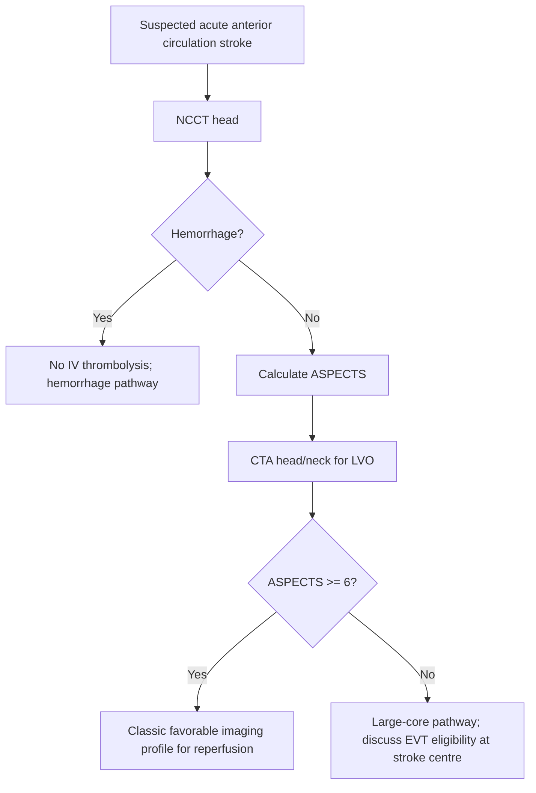

---

> [!summary] Quick Review
> 
> - **ASPECTS** = **Alberta Stroke Program Early CT Score** for early ischemic change in **MCA territory**.
> 
> - Start at **10**; subtract **1 point** for each involved ASPECTS region.
> 
> - **10** = no visible early ischemic change; **0** = diffuse MCA territory involvement.
> 
> - Standard imaging = **non-contrast CT head**; CTA/CTP or MRI DWI refine vessel status and core.
> 
> - Deep/ganglionic regions = **C, L, IC, I**; cortical regions = **M1–M6**.
> 
> - **ASPECTS ≥6** = classic favorable imaging profile for reperfusion trials.
> 
> - **ASPECTS 0–5** = large established core; not automatically futile in selected large-core EVT pathways.
> 
> - **Pitfall:** do **not** apply MCA ASPECTS to posterior circulation or isolated ACA infarcts.
>  

![[Pasted image 20260424111618.png|500]]

## Definitions & Scope

- **Dx:** acute ischemic change burden in suspected **anterior circulation / MCA stroke**.
- **Best test:** **NCCT head** for rapid hemorrhage exclusion + ASPECTS scoring.
- **Key imaging:** early **hypoattenuation**, **loss of gray-white differentiation**, **insular ribbon loss**, **lentiform obscuration**, **sulcal effacement**.
- **Rule-out:** intracranial hemorrhage, chronic infarct, tumor/edema mimic, seizure-related change, hypoglycemia mimic.
- **Scope limit:** ASPECTS is a **topographic score**, not a direct volume measurement.
- **Exam use:** reperfusion selection, large-core recognition, malignant MCA risk stratification.

## High-Yield Outline

- **Core principle**
    - **10 regions**, **1 point each**, subtract for early ischemic change.
- **Ganglionic level**
    - **C**, **L**, **IC**, **I**, **M1**, **M2**, **M3**.
- **Supraganglionic level**
    - **M4**, **M5**, **M6**.
- **Classic interpretation**
    - **8–10:** small early ischemic burden.
    - **6–7:** moderate early ischemic burden.
    - **0–5:** large core / extensive early ischemic burden.
- **Treatment relevance**
    - **ASPECTS ≥6:** classic EVT imaging threshold.
    - **ASPECTS 0–5:** selected EVT possible in large-core protocols; **VERIFY** local criteria.
- **Neurosurgical relevance**
    - Low ASPECTS + dense deficit + declining consciousness = malignant MCA surveillance.

## Diagnosis & Workup

- **Dx:** suspected acute MCA ischemic stroke with early ischemic CT changes.
- **Best test:** **NCCT head** immediately; calculate ASPECTS before reperfusion decision.
- **Key imaging:** compare both hemispheres for subtle asymmetry.
- **Rule-out:** hemorrhage first; extensive established infarct is a reperfusion hazard.
- **Pitfall:** old infarct should **not** be scored as acute ASPECTS loss.

> [!checklist] ASPECTS Scoring Approach
> 
> - Confirm scan is **non-contrast CT** and exclude hemorrhage.
> 
> - Identify **ganglionic level**: caudate, lentiform, internal capsule, insula.
> 
> - Score **C, L, IC, I, M1, M2, M3**.
> 
> - Identify **supraganglionic level** above basal ganglia.
> 
> - Score **M4, M5, M6**.
> 
> - Start at **10** and subtract **1** for each region with acute ischemic change.
> 
> - Report as **ASPECTS X/10** with side and vascular territory.
>  

## Management

- **Tx:** ASPECTS informs reperfusion eligibility; it does **not** replace clinical severity, time last-known-well, CTA, or perfusion imaging.
- **Tx:** IV alteplase **0.9 mg/kg**, max **90 mg**, **10% bolus**, remainder over **60 min** if eligible.
- **Contraindication:** hemorrhage on CT = **no IV thrombolysis**.
- **Pitfall:** extensive ischemic change, including **>1/3 MCA territory hypodensity**, is a thrombolysis concern in classic criteria.
- **Tx:** EVT for disabling LVO with favorable imaging; classic early-window criteria use **ASPECTS ≥6**.
- **Tx:** low ASPECTS **3–5** may still be considered for EVT in selected large-core pathways; **VERIFY** institutional protocol.
- **Timing:** NCCT + CTA should be performed without delaying reperfusion decisions.
- **Red flag:** falling GCS, worsening hemiplegia, vomiting, or pupillary change after large MCA infarct = urgent malignant edema assessment.
- **Tx:** malignant MCA infarction requires ICU monitoring, osmotherapy as bridge, and decompressive hemicraniectomy consideration.

## Tables & Scales

|ASPECTS Component|Level|Region|Scoring Rule|
|---|--:|---|---|
|**C**|Ganglionic|Caudate|Subtract **1** if acute ischemic change|
|**L**|Ganglionic|Lentiform nucleus|Subtract **1** if acute ischemic change|
|**IC**|Ganglionic|Internal capsule|Subtract **1** if acute ischemic change|
|**I**|Ganglionic|Insula|Subtract **1** if acute ischemic change|
|**M1**|Ganglionic|Anterior MCA cortex|Subtract **1** if acute ischemic change|
|**M2**|Ganglionic|Lateral MCA cortex|Subtract **1** if acute ischemic change|
|**M3**|Ganglionic|Posterior MCA cortex|Subtract **1** if acute ischemic change|
|**M4**|Supraganglionic|Anterior superior MCA cortex|Subtract **1** if acute ischemic change|
|**M5**|Supraganglionic|Lateral superior MCA cortex|Subtract **1** if acute ischemic change|
|**M6**|Supraganglionic|Posterior superior MCA cortex|Subtract **1** if acute ischemic change|

^table-aspects-regions

|Score|Interpretation|Exam-Relevant Implication|
|--:|---|---|
|**10**|No visible early ischemic change|Best imaging profile|
|**8–9**|Small early ischemic burden|Usually favorable for reperfusion|
|**6–7**|Moderate early ischemic burden|Classic EVT-compatible range|
|**3–5**|Large core|Selected EVT only; protocol-dependent|
|**0–2**|Very large established infarct|High hemorrhage/edema risk|

^table-aspects-interpretation

|Finding|Meaning|Common Location|
|---|---|---|
|**Insular ribbon loss**|Early MCA ischemia|Insula|
|**Lentiform obscuration**|Early deep MCA ischemia|Putamen/globus pallidus|
|**Caudate hypoattenuation**|Deep perforator/MCA involvement|Caudate head|
|**Loss of gray-white differentiation**|Cytotoxic edema|Cortex/deep nuclei|
|**Sulcal effacement**|Early swelling|Cortical MCA territory|
|**Hyperdense MCA sign**|Thrombus marker|MCA trunk/branch|

^table-early-ct-signs

|Tool|Best Use|Limitation|
|---|---|---|
|**ASPECTS**|Topographic early ischemic burden|Not a direct infarct volume|
|**CTA**|LVO detection|Does not quantify completed infarct|
|**CTP**|Core/penumbra estimation|Thresholds vary by software/protocol|
|**MRI DWI**|Sensitive infarct core detection|Slower/less available in hyperacute workflow|
|**NIHSS**|Clinical severity|Does not localize infarct core volume|

^table-aspects-vs-tests

## Pitfalls & Red Flags

> [!warning]
> 
> - **Never** delay hemorrhage exclusion to calculate ASPECTS.
> 
> - **Do not** score chronic encephalomalacia as acute ASPECTS loss.
> 
> - **Do not** use MCA ASPECTS for isolated **ACA**, **PCA**, or posterior circulation stroke.
> 
> - **Low ASPECTS is not automatically futility**; large-core EVT criteria are protocol-dependent.
> 
> - **Normal ASPECTS does not exclude LVO** in very early presentation.
> 
> - **Dense deficit + low ASPECTS + declining consciousness** = malignant MCA infarction risk.
> 
> - **Insula and lentiform nucleus** are common early-miss regions.
> 
> - **Motion artifact** and poor windowing can falsely lower the score.
> 
> - **Seizure, hypoglycemia, tumor, infection, and migraine** can mimic stroke clinically or radiographically.
>  

> [!question] Self-Test
> 
> - What does **ASPECTS** stand for?
> 
> - What is the starting ASPECTS score?
> 
> - Which **4 non-M cortical/deep abbreviations** are included in ASPECTS?
> 
> - Which ASPECTS regions are scored above the basal ganglia?
> 
> - What score range is classically favorable for EVT selection?
> 
> - What early CT sign commonly appears in the insula?
> 
> - Why is ASPECTS unreliable as a standalone treatment decision?
> 
> - What is the key red flag after a low-ASPECTS MCA infarct?
> 
> 
> **Answer Key**
> 
> - **Alberta Stroke Program Early CT Score**.
> 
> - **10**.
> 
> - **C**, **L**, **IC**, **I**.
> 
> - **M4**, **M5**, **M6**.
> 
> - **ASPECTS ≥6** in classic EVT criteria.
> 
> - **Insular ribbon loss**.
> 
> - It does **not** replace time, clinical severity, hemorrhage exclusion, CTA, perfusion/core assessment, or contraindication review.
> 
> - Declining consciousness or signs of mass effect suggesting **malignant MCA infarction**.
>  

