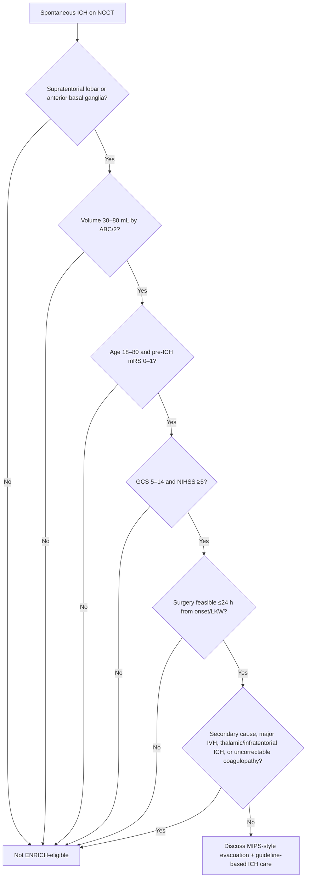

---

tags:

- neurosurgery
- vascular
- stroke
- ich
- trial
- minimally-invasive-surgery  
    aliases:
    
- ENRICH
- Early Minimally Invasive Removal of Intracerebral Hemorrhage
- MIPS for ICH
- ICH evacuation trial  
    source: ENRICH protocol and primary trial publication  
    rc_exam_domain: vascular  
    status: final

---

> [!summary] Quick Review
> 
> - **ENRICH:** early minimally invasive trans-sulcal parafascicular surgery (**MIPS**) for spontaneous supratentorial ICH.
> 
> - **Core screen:** age **18–80**, baseline **mRS 0–1**, spontaneous primary ICH, volume **30–80 mL**, **GCS 5–14**, **NIHSS ≥5**.
> 
> - **Location:** **lobar** or **anterior basal ganglia** ICH; **exclude thalamic and infratentorial** hemorrhage.
> 
> - **Timing:** intervention must be feasible **within 24 h** from symptom onset or **last-known-well**; OR goal **≤8 h** from last-known-normal in protocol. ([Frontiers](https://www.frontiersin.org/journals/neurology/articles/10.3389/fneur.2023.1126958/full "Frontiers | Early Minimally Invasive Removal of Intracerebral Hemorrhage (ENRICH): Study protocol for a multi-centered two-arm randomized adaptive trial"))
> 
> - **Rule-out:** aneurysm, AVM, vascular anomaly, Moyamoya, venous sinus thrombosis, tumor, hemorrhagic conversion.
> 
> - **Major exclusion:** IVH involving **>50% of either lateral ventricle**, irreversible anticoagulation, platelets **<75k**, INR **>1.4 after correction**. ([Frontiers](https://www.frontiersin.org/journals/neurology/articles/10.3389/fneur.2023.1126958/full "Frontiers | Early Minimally Invasive Removal of Intracerebral Hemorrhage (ENRICH): Study protocol for a multi-centered two-arm randomized adaptive trial"))
> 
> - **Primary endpoint:** **UWmRS at 180 days**; superiority threshold posterior probability **≥0.975**. ([Frontiers](https://www.frontiersin.org/journals/neurology/articles/10.3389/fneur.2023.1126958/full "Frontiers | Early Minimally Invasive Removal of Intracerebral Hemorrhage (ENRICH): Study protocol for a multi-centered two-arm randomized adaptive trial"))
> 
> - **Result:** UWmRS **0.458 vs 0.374** favoring surgery; benefit mainly attributable to **lobar ICH**, not anterior basal ganglia. ([Emory School of Medicine](https://med.emory.edu/assets/enrich-primary-paper-nejm-2024.pdf?utm_source=chatgpt.com "Trial of Early Minimally Invasive Removal of Intracerebral ..."))
>  

## Definitions & Scope

- **Dx:** acute spontaneous supratentorial intracerebral hemorrhage
- **Trial:** **ENRICH** = Early Minimally Invasive Removal of Intracerebral Hemorrhage
- **Intervention:** **MIPS** + guideline-based medical management
    - Trans-sulcal parafascicular port-based evacuation
    - BrainPath/Myriad platform in trial protocol
- **Comparator:** guideline-based medical management alone
- **Target population:** selected spontaneous ICH patients with moderate-to-severe deficit and surgically accessible clot
- **Not a trial for:**
    - Primary thalamic ICH
    - Infratentorial ICH
    - Secondary ICH
    - Devastating exam with bilateral fixed pupils/extensor posturing
    - Very mild deficit, **NIHSS <5**

## High-Yield Outline

- **Study design**
    - Multicenter, randomized, adaptive, comparative-effectiveness trial
    - Randomization by **ICH location** and **GCS**
    - Locations: **lobar** vs **anterior basal ganglia**
    - Planned adaptive enrichment by hemorrhage location
- **Key eligibility**
    - **18–80 years**
    - Historical **mRS 0–1**
    - Acute spontaneous primary ICH on CT
    - Hematoma **30–80 mL** by **ABC/2**
    - **GCS 5–14**
    - Surgery feasible **≤24 h** from onset/LKW
- **Key exclusions**
    - Secondary structural cause
    - **NIHSS <5**
    - Bilateral fixed dilated pupils
    - Extensor motor posturing
    - IVH **>50%** of either lateral ventricle
    - Primary thalamic or infratentorial hemorrhage
    - Uncorrectable anticoagulation/coagulopathy
- **Primary endpoint**
    - **Utility-weighted mRS at 180 days**
    - Superiority if posterior probability **≥0.975**
- **Exam interpretation**
    - Strongest clinical relevance: **lobar ICH**
    - **Anterior basal ganglia** subgroup did not show clear benefit
    - Use criteria as **trial-eligibility framework**, not universal operative mandate

## Diagnosis & Workup

### Initial Screen

- **Dx:** spontaneous ICH suspected clinically
- **Best test:** non-contrast CT head
- **Key imaging:** NCCT for location + volume; CTA to rule out vascular lesion when appropriate
- **Rule-out:** secondary hemorrhage before ENRICH-style surgery
- **Timing:** determine exact symptom onset or **last-known-well**
- **Baseline function:** confirm pre-ICH **mRS 0–1**
- **Severity:** document **GCS** and **NIHSS**
- **Volume:** calculate **ABC/2**, target **30–80 mL**

### ENRICH Bedside Eligibility Checklist

> [!checklist] ENRICH-Style Candidate Screen
> 
> - **Age:** 18–80 years
> 
> - **Baseline:** historical mRS 0–1
> 
> - **ICH type:** acute, spontaneous, primary ICH
> 
> - **Location:** lobar or anterior basal ganglia
> 
> - **Volume:** 30–80 mL by ABC/2
> 
> - **Exam:** GCS 5–14 and NIHSS ≥5
> 
> - **Timing:** intervention feasible within 24 h from onset/LKW
> 
> - **Exclude:** thalamic, infratentorial, major IVH, secondary cause, irreversible coagulopathy
> 
> - **Proceed:** urgent neurosurgery/stroke/neurocritical care discussion if all criteria met
>  

^algorithm-enrich-screen

### Minimum Workup Before Randomization-Equivalent Decision

|Domain|Required element|Exam relevance|
|---|---|---|
|CT|NCCT head|Confirms ICH, location, IVH, mass effect|
|Volume|ABC/2|Eligibility requires **30–80 mL**|
|Vascular|CTA/vascular imaging when indicated|Excludes aneurysm/AVM/vascular anomaly|
|Exam|GCS + NIHSS|Eligibility and prognosis|
|Function|Historical mRS|Requires **0–1**|
|Labs|CBC, INR/PTT, renal/liver profile|Screens platelets, INR, comorbidity|
|Medication|Anticoagulants/antiplatelets|Anticoagulants must be rapidly reversible|
|Goals|Code status/prognosis|Exclude comfort measures/DNR-only before randomization|

^table-enrich-workup

## Management

### Decision Pathway

^algorithm-enrich-flow

### ENRICH-Style Treatment Principles

- **Tx:** MIPS evacuation + guideline-based medical management
- **Indication:** selected acute spontaneous supratentorial ICH meeting ENRICH criteria
- **Best-supported subgroup:** **lobar ICH**
- **Timing:** surgery within **24 h** from last-known-normal; protocol OR goal **≤8 h**
- **Comparator:** guideline-based ICH medical management
- **Contraindication:** secondary ICH, thalamic/infratentorial ICH, massive IVH, irreversible coagulopathy
- **Post-op targets:** neurologic monitoring, repeat imaging, rebleeding surveillance, ICU stroke care
- **Complication:** postoperative rebleeding with neurologic deterioration occurred in **3.3%** of surgery patients in ENRICH. 
## Tables & Scales

### Inclusion Criteria

|Criterion|ENRICH threshold|
|---|---|
|Age|**18–80 years**|
|ICH type|Acute, spontaneous, primary ICH|
|Imaging|Pre-randomization head CT confirming ICH|
|Location|**Lobar** or **anterior basal ganglia**|
|Volume|**30–80 mL** by ABC/2|
|Timing|Intervention feasible **≤24 h** after symptom onset/LKW|
|GCS|**5–14**|
|Baseline function|Historical **mRS 0–1**|

^table-enrich-inclusion

### Exclusion Criteria

|Category|Exclusion|
|---|---|
|Secondary cause|Aneurysm, AVM, vascular anomaly, Moyamoya, venous sinus thrombosis|
|Structural lesion|Mass/tumor|
|Stroke mechanism|Hemorrhagic conversion of ischemic infarct|
|Recent recurrence|Recurrent recent ICH **<1 year**|
|Mild deficit|**NIHSS <5**|
|Devastating exam|Bilateral fixed dilated pupils|
|Devastating exam|Extensor motor posturing|
|IVH burden|IVH **>50%** of either lateral ventricle|
|Location|Primary thalamic ICH|
|Location|Infratentorial hemorrhage: midbrain, pons, cerebellum|
|Anticoagulation|Anticoagulants not rapidly reversible|
|Bleeding|Active retroperitoneal, GI, GU, or respiratory bleeding|
|Coagulopathy|Uncorrected coagulopathy or known clotting disorder|
|Labs|Platelets **<75,000** or INR **>1.4 after correction**|
|Anticoagulation need|Long-term anticoagulation required **<5 days** from index ICH|
|Cardiac|Mechanical heart valve|
|Comorbidity|ESRD, end-stage liver disease, life expectancy **<6 months**|
|Goals of care|No reasonable recovery expectation, DNR, comfort measures only before randomization|
|Trial logistics|Inability to consent or complete follow-up|
|Pregnancy|Positive urine/serum pregnancy test|

^table-enrich-exclusion

### Primary Outcome and Trial Results

|Outcome|Surgery/MIPS|Medical management|Interpretation|
|---|--:|--:|---|
|UWmRS at 180 days|**0.458**|**0.374**|Difference **0.084**; posterior probability **0.981**|
|Lobar subgroup difference|—|—|Difference **0.127** favoring surgery|
|Anterior basal ganglia subgroup difference|—|—|Difference **−0.013**; no clear benefit|
|30-day mortality|**9.3%**|**18.0%**|Lower early mortality in surgery group|
|Post-op rebleeding + neurologic deterioration|**3.3%**|—|Surgery-specific complication|
|Serious adverse event|**63.3%**|**78.7%**|Numerically lower with surgery|

^table-enrich-results

### Utility-Weighted mRS Mapping

|mRS|Utility weight|
|--:|--:|
|0|**1.00**|
|1|**0.91**|
|2|**0.76**|
|3|**0.65**|
|4|**0.33**|
|5|**0.00**|
|6|**0.00**|

^table-uwmrs

### Location-Based Exam Takeaway

|ICH location|ENRICH eligibility|Trial signal|
|---|---|---|
|Lobar|Included|**Primary beneficial subgroup**|
|Anterior basal ganglia|Included|No clear benefit signal|
|Thalamic|Excluded|Not ENRICH candidate|
|Cerebellar|Excluded|Not ENRICH candidate|
|Brainstem|Excluded|Not ENRICH candidate|
|Large IVH burden|Excluded if **>50%** of either lateral ventricle|Not ENRICH candidate|

^table-location-enrich

## Pitfalls & Red Flags

> [!warning] Pitfalls & Red Flags
> 
> - **Pitfall:** treating ENRICH as "all supratentorial ICH should be evacuated"; trial criteria were narrow.
> 
> - **Pitfall:** including **thalamic ICH**; primary thalamic hemorrhage was excluded.
> 
> - **Pitfall:** missing vascular/tumor etiology; secondary ICH was excluded.
> 
> - **Pitfall:** applying lobar benefit directly to **anterior basal ganglia** hemorrhage.
> 
> - **Red flag:** bilateral fixed dilated pupils or extensor posturing → excluded, poor prognosis.
> 
> - **Red flag:** IVH occupying **>50%** of either lateral ventricle → excluded.
> 
> - **Red flag:** INR **>1.4 after correction** or platelets **<75k** → excluded.
> 
> - **Red flag:** anticoagulation that cannot be rapidly reversed → excluded.
> 
> - **Pitfall:** delaying referral until outside the **24 h** treatment window.
> 
> - **Pitfall:** using GCS alone; **NIHSS <5** was excluded despite otherwise favorable criteria.
>  

> [!exam] Pearls
> 
> - **Best one-line criterion:** "18–80, mRS 0–1, lobar/anterior BG spontaneous ICH, 30–80 cc, GCS 5–14, NIHSS ≥5, ≤24 h, no secondary cause/coagulopathy."
> 
> - **Most testable exclusion:** thalamic/infratentorial hemorrhage, major IVH, secondary cause, uncorrectable coagulopathy.
> 
> - **Most testable nuance:** ENRICH's positive result was driven mainly by **lobar ICH**.
> 
> - **Best test:** NCCT for diagnosis/volume; CTA when secondary vascular cause must be excluded.
>  

> [!question] Self-Test
> 
> 1. What ICH volume range qualified for ENRICH?
> 
> 2. What baseline mRS was required?
> 
> 3. What GCS range was eligible?
> 
> 4. What two supratentorial locations were included?
> 
> 5. Which deep ICH location was specifically excluded?
> 
> 6. What IVH threshold excluded patients?
> 
> 7. What platelet and INR cutoffs excluded patients?
> 
> 8. What was the primary endpoint?
> 
> 9. Which location subgroup drove the positive result?
> 
> 10. What was the maximum treatment window from onset/LKW?
> 
> 
> **Answer key**
> 
> 1. **30–80 mL**
> 
> 2. **mRS 0–1**
> 
> 3. **GCS 5–14**
> 
> 4. **Lobar** and **anterior basal ganglia**
> 
> 5. **Primary thalamic ICH**
> 
> 6. IVH **>50% of either lateral ventricle**
> 
> 7. Platelets **<75,000**; INR **>1.4 after correction**
> 
> 8. **Utility-weighted mRS at 180 days**
> 
> 9. **Lobar ICH**
> 
> 10. **≤24 h** from symptom onset or last-known-well
>  

